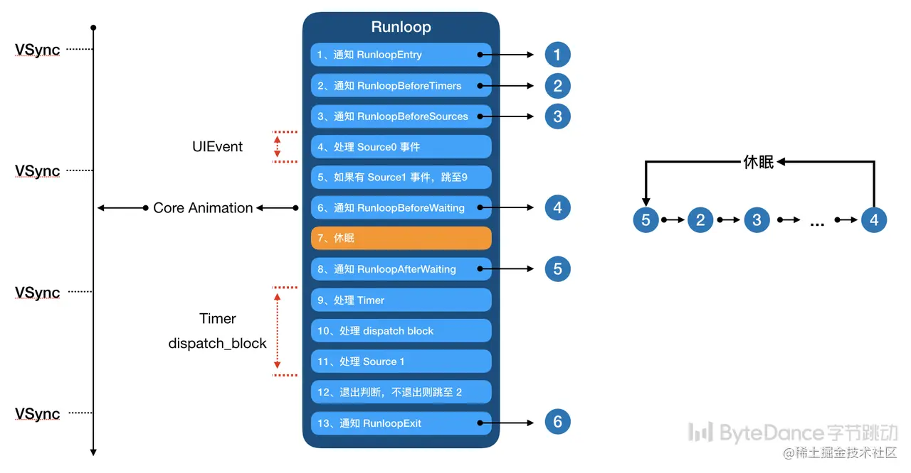
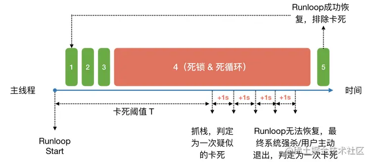
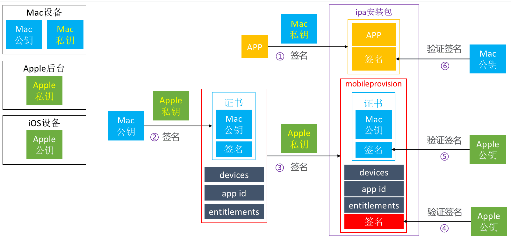
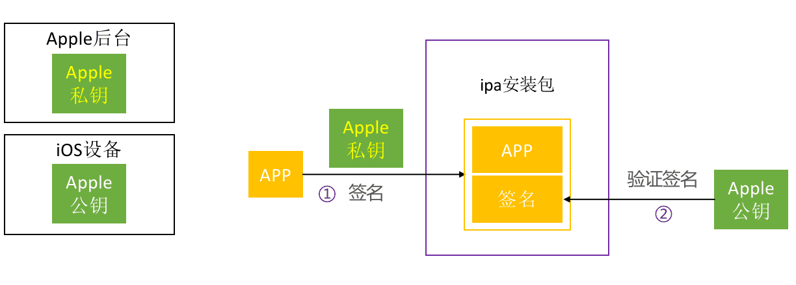

### 目录

* <a href="#layoutSubviews什么时候调用">layoutSubviews什么时候调用</a>
* <a href="#Xcode中的workspace">Xcode中的workspace、xcodeproj、target、schema的关系 </a>
* <a href="#malloc和free">malloc和free</a>
* <a href="#静态库.a和.framework">静态库.a和.framework</a>
* <a href="#异步渲染原理 && setNeedsDisplay">异步渲染原理 && setNeedsDisplay</a>
* <a href="#直播相关协议">直播相关协议</a>
* <a href="#渲染图片怎么优化">渲染图片怎么优化</a>
* <a href="#数组越界为什么会崩溃">数组越界为什么会崩溃</a>
* <a href="#解决网络请求依赖关系">解决网络请求依赖关系</a>
* <a href="#崩溃与监控">崩溃与监控</a>
* <a href="#OOM">OOM</a>
* <a href="#H.264和H.265">H.264和H.265</a>
* <a href="#dSYM是什么">dSYM是什么</a>
* <a href="#iOS单元测试">iOS单元测试</a>
* [APP启动&优化](https://github.com/longpf/longpfNote/blob/master/iOS/interview/note2.md#app启动优化)
* <a href="#iOS签名机制">iOS签名机制</a>
* <a href="#UIView,CALayer,响应者链相关">UIView,CALayer,layer的模型层和展示层,响应者链相关</a>
* <a href="#dispatch_once"> dispatch_once</a>


### 详情


<a id="layoutSubviews什么时候调用"></a>

<font color=#FF4500>
### layoutSubviews什么时候调用
</font>

```
init初始化不回触发
addSubView会触发
改变view的大小会触发,改变origin不回触发
改变子view的大小会触发,改变子view的origin不回触发
改变bounds会触发
旋转实测没触发(网上说触发),只是控制器self.view触发
setNeedsDisplay(使当前的layout无效,标记待刷新)会触发
```
*  如果调用layoutIfNeeded并且已被标记为待刷新,不回等到runloop结束,会立即刷新

<a id="Xcode中的workspace"></a>
<font color=#FF4500>
### Xcode中的workspace、xcodeproj、target、schema的关系 
</font>

[https://zhuanlan.zhihu.com/p/52130048](https://zhuanlan.zhihu.com/p/52130048)

* Target: 工程中最小可编译单元,每一个target对应一个编译输出,这个输出可以是一个链接库,一个可执行文件或者一个资源包.它定义了这个输出怎么被build的所有细节. 平时Build Settings，Build Phases 中配置的各种选项，大部分都是对应到指定的 target 的
	 * 编译选项,比如使用的编译器,目标平台,flag,头文件搜索路径等等
	 * 哪些源码或者资源文件会被编译打包,哪些静态库,动态库会被链接
	 * build时前置依赖,执行脚本文件
	 * build生成目标的签名, Capabilities等属性
* 每次我们在 Xcode 中 run/test/profile/analyze/archive 时，都必须指定一个 target
* 工程中的 targets 有时候会共享很多代码、资源，这些相似的 targets 可能对应同一个应用的不同版本，比如 iPad 版和 iPhone 版，或者针对不同市场的版本
* Project: 就是一个xcode工程,它管理这个工程下的targets集合以及他们的源码,引用的资源,framework等
* Project是管理资源的容器,单独无法被编译.只有有一个target.也可以对project进行配置,包括基本信息和编译选项,会应用到所有targets中, 如果单个target有自己的配置,会覆盖project配置
* Workspace: 当一个target被多个不同的项目依赖,或者project之间相互引用,这时需要把projects放到相同层级上来,管理他们的容器就是Workspac. 不参与任何编译链接过程
	 * xcode中projects,记录他们在finder中的引用位置
	 * 一些用户界面的自定义信息(窗口位置,顺兴,偏好等)
* Scheme: 针对一个指定的target,scheme定义了build这个target时使用的配置选项,执行的任务,环境参数等.可以理解为一个工作流或者蓝图.scheme中预设六个主要的工作流: Build,Run,Test,Profile,Ananlyze,Archive.
* Scheme 中最重要的一个配置是选择 target 的 build configuration，对每一个 project，会有两个默认的 build configuration：debug 和 release,可以自己新增
* 每个 configuration 对应了 build target 时不同的参数集，比如宏，编译器选项，bundle name 等等
* Scheme 还可以设置
	 * 环境变量（Environment Variables）
	 * runtime，内存管理，日志，帧率检测等调试选项(加载时间)
	 * App 执行时的系统语言、模拟的定位坐标、国家等环境参数
	 * 启动时设置给 UserDefaults 的参数

<a id="malloc和free"></a>
<font color=#FF4500>
### malloc和free
</font>

* 详细:[https://www.huaweicloud.com/articles/baea6198b9bbe8da4875c09f081edd21.html](https://www.huaweicloud.com/articles/baea6198b9bbe8da4875c09f081edd21.html)
* 申请内存后必须坚持是否分配成功(堆)
* 不允许在未分配的内存上调用free，标准明确指出,连续释放两次crash
* 释放后最后置NULL指针
* 申请后最好强转类型,可以躲过一些编译检查
*  free释放的事指向的内存,指针没有释放,只不过指针指向的内容是未定义的,垃圾内存.为什么? 如果被free的内存已被分配,且处于被分配的中间

	```
	 +- New pointer    +- Old pointer
	 v                 v
	+------------------------------------+
	|                  <Dodgy bit>       |
	+------------------------------------+
	```
* 可以定义类似myFree函数解决多次释放 {free(p),p = NUL}
*  大多数实现分配的存储空间比要求的要稍微大一些,额外的空间就管理信息(分配块的长度,下一个分配块的指针等待).一般用结构体存储

	```
	 struct mem_control_block { 
	 	int is_available; //一般来说应该是一个可用空间的首地址，但这里英文单词却显示出空间是否可用的一个标记
     	int size; //这是实际空间的大小  
     	};
	```
* 为什么free的时候不传size? 有一个地址簿记录着已分配的

<a id="静态库.a和.framework"></a>
<font color=#FF4500>
### 静态库.a和.framework
</font>

* 库: 共享代码的方式.一般分为静态库和动态库.
* 静态库: 编译的时候会直接拷贝一份到目标程序里,这段代码在目标程序里就不会改变了.好处没有外部依赖,直接可以运行,缺点增大目标程序体积.有多份冗余拷贝
* 动态库: 链接时不复制.运行时由系统加载到内存,工程序使用.系统只加载一次,多个程序共用.有点不影响目标程序体积.缺点: 性能上的损失,依赖外部环境. 自己开发的静态库还是动态库都要复制到目标程序,所以苹果又把这个交友embeded framework.
* 静态库形式: a.  和 .framework
* 动态库形式: 系统.framework   .dylib .tbd
* 系统的.framework是动态库,我们自己建立的是静态库
* .a是一个纯二进制文件. .framework还有资源文件
* .a不能直接使用,需要.h配合.  .framework可以直接使用
* .a + .h + .sourceFile = .framework
* 为什么使用静态库: 共享代码,程序模块化.三方sdk
* 注意: category 需设置other linker flags. 还可能没加载. 需要手动设置方法调用


<a id="异步渲染原理 && setNeedsDisplay"></a>
<font color=#FF4500>
### 异步渲染原理 && setNeedsDisplay
</font>

*  调用[UIView setNeedsDisplay]不回立马发送对应视图的绘制工作,调用后回调用同名方法 [view.layer setNeedsDisplay],并在view上标记为待刷新. 当runloop将要结束的时候才会调用[CALyer display]进入仕途真正绘制工作
*  setNeedsDisplay, setNeedsLayout都是异步执行
	 * setNeedsDisplay会自动调用drawRect,这样可以拿到UIGraphicsGetCurrentContext
	 * setNeedsLayout(会是当前layout无效)会默认调用layoutSubViews,当想调整子视图布局的时候调用setNeedsLayout
	 * layoutSubViews方便数据计算, drawRect方便视图绘制
*  异步绘制绘制
	* 自定义CALyer给view.
	* [CALyer display]的时候在子线程去绘制生成位图,绘制包括计算ctframer,ctline,ctrun,drawLine等
	* 将绘制好的位图,切到主线程复制给view.content
*  setNeedsLayout可能会多次被调用,所以异步绘制需要一个atomicInt自增来防止上一次无效的绘制. setNeedsLayout调用一次自增一次.在上一次异步绘制的开始,生成image,切主线程赋值layer.content的时候都要比对这个自增数,如果自增数变化,证明中间调用setNeedsLayout了,取消当前(上一次)处理流程

<a id="直播相关协议"></a>
<font color=#FF4500>
### 直播相关协议
</font>

* webrtc(Web Real-Time Communication): 是一个支持网页浏览器进行实时语音对话或视频对话技术,不借助中间媒介的情况下,建立点对点连接(Peer-to-Peer),pc上chrome支持比较好,底部c++实现,提供浏览器相关的API以外，还能在IOS、Android、Mac、Linux、Windows全平台上运行.
 * webrtc通过信令服务器交换彼此的媒体描述信息(sdp),包括数据格式(h264,vp8),以及网络地址(host地址,公网地址,turn服务器地址).交换后选择合适的音视频格式已经网络地址通信
 * webrtc客户端之间建立网络连接的过程叫做ice
  * 位于同一局域网,或者都位于公网,采用直连
  * 位于不同局域网,双方本地网络地址不可直接访问,位于不同NAT后面,需要NAT穿透(打洞),(NAT局域网地址到公网地址技术)
  * 通过服务器中转
 * webrtc涉及到的协议比较多,其中信令负分没有具体规定,通常使用tcp,包括http,websock等,媒体协商使用sdp协议,音视频传输通常使用udp,主要协议如下
  * SDP,描述媒体信息,通过信令进行交换
  * STUN, ice交互使用
  * DTLS,音视频加密传输使用
  * RTP和RTCP(基于udp,增加时间戳和序号保证数据顺序),音视频内容传输和反馈(拉流)
* hls: (HTTP Live Streaming)协议播放直播流
 * 基于http文件下载,引入.m3u8文件,里面对应若干ts文件,ts文件里面粗放真正视频数据.m3u8文件只是存放了一些ts文件的配置信息和路径.当视频播放时,m3u8是动态改变的,h5中video标签会解析这个文件,找到对应ts文件播放, 一般为了加快速度,.m3u8放在web服务器,ts文件放在cdn
 * 流程: http请求m3u8的url,服务端返回一个m3u8的播放列表,列表实时更新,一般一次给出6段数据的url.客户端解析m3u8的播放列表,再按序请求每一段的url,获取ts数据流.
 * 假设列表包含5个ts文件,每个ts文件5s那么延迟就是25s,主播需要将视频录制好上传上去,还有延迟.如果缩短ts时长,将会加大服务器压力
* 音视频采集:
 * 摄像头--> AVCaptureSession-->原始视频数据--->x264编码--->h.264数据
 * 麦克风--> AVCaptureSession-->原始音频流-->faac编码--->aac数据
 * 对编码后的音,视频进行组装封包flv,mp4
 * 建立rtmp推送到Nginx服务器
* ffmpeg是一套编码库
* rtmp:  Real Time Messaging Protocol,视频直播协议,基于flash无法在ios浏览器播放,实时性比hls更好,一般使用推流,基于长连接tcp
* 目前公司存在两种直播方式,一种是传统的主播基于rtmp(基于ffmpeg实现)推流到cdn的直播形式,另一种是基于webrtc的主播间互动并推流到cdn,比如两人连麦,多人连麦.  当主播从房间直播切到连麦业务,目前推2路流,一路房间直播流,一路连麦数据流.存在流量浪费,如果网络不好,rtmp的效果较差,而webrtc的优秀抗弱网能力则可以解决
* 线上用户观看直播都是使用rtmp从cdn拉流，大约有10多秒的延时，如果主播采用webrtc推流，则用户侧也可采用webrtc拉流，可将延时缩减到1秒以内，提高用户主播互动的实时性


<a id="渲染图片怎么优化"></a>
<font color=#FF4500>
### 渲染图片怎么优化
</font>

* `imageNamed:`可以缓存已经加载的图片,使用时,先在系统缓存中寻找图片,如果没有从Bundle找.当渲染到屏幕时才解码图片,并将解码的图片保留到缓存,收到内存警告释放缓存.`imageWithContentsOfFile`不缓存,只加载.
* png压缩是对像素做索引存储,jpg是保存亮度,减少像素.解码后的图片会大很多
* SDWebImage下载图片后或者从硬盘取的缓存图片会在子线程解码图片并保存图片,避免重复解码, 并在主线程回调赋值给imageview.使用函数`CGBitmapContextCreate`
* SDWebImage如果options设置`SDWebImageDownloaderScaleDownLargeImages`重采样,会触发重采样,一般用向下采样.将图片裁剪成imageview大小.减少内存.
* 如果图片很大解密可能crash.
	* 服务端不要下发很大的图
	* 使用CATiledLayer将大图分解成小图显示
	* 将大图缩放指定大小


<a id="数组越界为什么会崩溃"></a>
<font color=#FF4500>
### 数组越界为什么会崩溃
</font>

内存越界崩溃根源一般是下面两种情况: 

* 权限问题-访问了没有相应权限的地址,一般读越界引起的崩溃都是这种.多数写越界也会直接或间接引起这种问题
* 代码执行出错- 执行了非法的代码或者由于数据错误引起的代码执行异常


<a id="解决网络请求依赖关系"></a>
<font color=#FF4500>
### 解决网络请求依赖关系
</font>

```objective-c
1. NSOperation的addDependecy,缺点不好保证请求1回调的时候去请求2
2. 请求1的回调中,执行请求2. 
3. dispatch_group
	dispatch_group_async(group_t, concurentQueue, ^{// 请求1});
    dispatch_group_notify(group_t, dispatch_get_main_queue(), ^{// 请求2});
4. dispatch_barrier_async
	dispatch_async(concurent_t, ^{// 请求1});
    dispatch_barrier_async(concurent_t, ^{// 请求2});
5. 信号量
	dispatch_semaphore_t sem_t = dispatch_semaphore_create(0);
    dispatch_async(concurent_t, ^{dispatch_semaphore_signal(sem_t);});
    dispatch_async(concurent_t, ^{dispatch_semaphore_wait(sem_t, DISPATCH_TIME_FOREVER);
        // 请求2开始});
```

<a id="崩溃与监控"></a>

<font color=#FF4500>
### 崩溃与监控
</font>

#### 常见的崩溃

* 普通类型
	* NSInvalidArgumentException **非法参数**,比如传入nil
	* NSRangeException 下标越界
	* NSGenericException for循环中修改元素

* KVO
	 * 移除未注册的观察者
	 * 重复移除观察者
	 * 添加了观察者,单没有实现`observeValueForKeyPaht...`
	 * 添加/移除keypath为nil
* 多线程, 同时修改文件/ 子线程刷新UI
* 野指针
* NSTimer, 需要invalidate
* NSNotification dealloc的没有释放
* 方法未找到 `unrecognized selector sent to instance`
	 

#### 崩溃类型

**两大类: mach异常(系统BSD层转化为Signal信号) 和 oc异常**

* **可捕获的** : 数组越界,多线程,kvo,野指针

	**野指针**（访问一个已删除的内存区域,这种不太好定位，因为已经被释放，可以考虑使用僵尸对象的方式进行监控，具体做法是在dealloc前，将该对象的isa指针指向一个目标类，实现后续的消息转发，目标类中所有的方法都采用NSException抛出异常，辅助定位。需要重写他的retain、release、autorelease、retaincount方法，在这里面抛出异常，只针对该对象有效。该文件需要设置为mrc的，-fno-objc-arc不然重写这些方法报错）, 这种方式对象没有释放,只能用在开发环境. hook的对象是NSObject

*  **不可捕获的** : 大内存OOM,主线程卡死/watchdog


#### 可捕获类型的监控方式

通过signal和exceptionHandler(oc层面)

signal监控

```cpp
void registerSignalHandler(void) {
    signal(SIGSEGV, handleSignalException);
    signal(SIGFPE, handleSignalException);
    signal(SIGBUS, handleSignalException);
    signal(SIGPIPE, handleSignalException);
    signal(SIGHUP, handleSignalException);
    signal(SIGINT, handleSignalException);
    signal(SIGQUIT, handleSignalException);
    signal(SIGABRT, handleSignalException);
    signal(SIGILL, handleSignalException);
}
void handleSignalException(int signal) {
    NSMutableString *crashString = [[NSMutableString alloc]init];
    void* callstack[128];
    int i, frames = backtrace(callstack, 128);
    char** traceChar = backtrace_symbols(callstack, frames);
    for (i = 0; i <frames; ++i) {
        [crashString appendFormat:@"%s\n", traceChar[i]];
    }
    //这里写入crashString到你的日志文件
    NSLog(crashString);
}
```

exception

```objective-c
- (void)reg {
	NSUncaughtExceptionHandler *handle = NSGetUncaughtExceptionHandler();
	if(handle != VPUPHandleException) {
	    //说明当前APP已经被注册过“未捕获异常句柄事件”。
	    _previousHandle = handle;
	}
	//注册。我自己的定义的函数指针。
	NSSetUncaughtExceptionHandler(&handle);
}
    void VPUPHandleException(NSException *exception)
{
    if (!exception){
        return;
    }
    
    NSArray *stackArray = [exception callStackSymbols];   // 异常的堆栈信息
    NSString *reason = [exception reason];                // 出现异常的原因
    NSString *name = [exception name];                    // 异常名称
}
```

#### 崩溃的信号类型

崩溃报告里面经常看到: 
`Exception Type:        EXC_BAD_ACCESS (SIGSEGV)`
表示`EXC_BAD_ACCESS`这个异常会通过SIGSEGV信号发现问题

常见的类型: 

Exception Type | Signal | 描述
----|-----|-----
`EXC_BAD_ACCESS`| SIGSEGV|一般是非法内存访问错误，比如访问了已经释放的野指针，或者C数组越界
`EXC_BAD_ACCESS`| SIGBUS | 非法地址，意味着指针所对应的地址是有效地址，但总线不能正常使用该指针。通常是未对齐的数据访问所致
`EXC_BAD_INSTRUCTION`| SIGILL|非法指令。 是当一个进程尝试执行一个非法指令时发送给它的信号
`EXC_ARITHMETIC `| SIGFPE|错误的算术操作


### 不可捕获的崩溃

不可捕获的崩溃,信号为SigKill,常见的为卡死watchdog和OOM

**卡死监控/看门狗**

>watchdog崩溃定义: 在iOS平台上,app如果在启动,退出或者响应系统事件时因为耗时过长触发系统保护机制,最终导致进程被强制结束的这种异常定义为watchdog类型的崩溃, watchdog崩溃就是卡死崩溃

卡顿检查原理: 

主线程绝大部分计算或者绘制任务都是以runloop为单位的周期性被执行,单次循环超过16ms就会导致ui卡顿



* 注册runloop声明周期事件的观察者
* 在runloop生命周期回调之间检测耗时,一旦检测到除休眠阶段之外的任意一个阶段耗时超过阈值,触发卡顿判定并且记录当时的调用栈
	* afterWaiting=>beforeTimers
	* beforeTimers=>beforeSources 
	* beforeSources=>beforeWaiting
* 在合适的时机上报平台

完整流程如下图




**常见卡死问题**

* 多线程死锁
* 子线程占用锁资源执行耗时操作(写操作)

**相关阅读**: [https://juejin.cn/post/6937091641656721438](https://juejin.cn/post/6937091641656721438)


<a id="OOM"></a>
<font color=#FF4500>
### OOM
</font>

* Out Of Memory,指的是当前用户使用内存过高,被系统强制终止,是由于 iOS 的 Jetsam 机制造成的一种“另类” Crash，它不同于常规的 Crash，通过 Signal 捕获等 Crash 监控方案无法捕获到 OOM 事件
* 分为FOOM和BOOM
* 往往OOM比普通crash要多
* Jetsam强杀是通过SIGKILL,SIGKILL的原因有:
	* App 更新了版本
	* App 发生了崩溃
	* 用户手动退出
	* 操作系统更新了版本
	* App 切换到后台之后进程终止
	* **WatchDog 崩溃**:如果我们的应用程序对一些特定的UI事件（比如启动、挂起、恢复、结束）响应不及时，Watchdog 会把我们的应用程序干掉，并生成一份响应的 crash 报告
	* 后台启动
	* XCTest/UITest 等自动化测试框架驱动
	* 应用 exit 主动退出

#### 定位OOM

已有方案:


**FaceBook的排除法**

每次启动判断上一次进程终止的原因,
 
* App 更新了版本
* App 发生了崩溃
* 用户手动退出
* 操作系统更新了版本
* App 切换到后台之后进程终止

但是存在以下误判情况

* WatchDog 崩溃
* 后台启动
* XCTest/UITest 等自动化测试框架驱动
* 应用 exit 主动退出

**MLeaksFinder配合FBRetainCycleDetector**

* 先通过 MLeaksFinder 找到内存泄漏的对象，然后再过 FBRetainCycleDetector 检测该对象有没有循环引用即可
* 确定: 只适用于存在于vc相关的oc对象的内存监控

MLeaksFinder基本原理:

* 当一个vc被pop或dismiss的时候,这个vc和它上面的views都会很快释放
* 为基类添加一个willDealloc方法,方法内用一个弱引用指针指向self
* dismiss 之后3秒, 这个指针调用一个方法,里面有断言,如果触发则这个弱引用对象没释放

FBRetainCycleDetector原理:

* 深度优先搜索, 传入一个oc对象,递归遍历该对象的所有强引用,以检测以该对象为根结点的强引用有没有循环引用
* 需要先找到候选检测对象, 检测比较耗时

**腾讯OOMDetector**

原理:

通过Hook IOS系统底层内存分配的相关方法（包括`malloc_zone`相关的堆内存分配以及`vm_allocate`对应的VM内存分配方法），跟踪并记录进程中每个对象内存的分配信息，包括分配堆栈、累计分配次数、累计分配内存等，这些信息也会被缓存到进程内存中。在内存触顶的时候，组件会定时Dump这些堆栈信息到本地磁盘，这样如果程序爆内存了，就可以将爆内存前Dump的堆栈数据上报到后台服务器进行分析

相关优化方案:

* 堆栈回溯,系统的`backtrace_symbols`可以获取堆栈信息但比较耗时,优化后的方法在运行时只会获取堆栈函数的地址信息，在回写磁盘的时候再根据动态库的地址范围拼装成特定堆栈格式（类似Crash堆栈），后台服务器利用atos命令和符号表文件就可以还原出对应的堆栈内容
* 优先考虑锁的效率采用了OSSpinLock
* 堆栈聚类和压缩:只记录堆栈的md5,当md5对应的内存累计到阈值才记录真正的堆栈信息
* dump方案,采用mmap替代常规io直接写入,实现这样的直接映射关系后，写文件的过程进程不会有额外的文件的数据拷贝操作，避免了内核空间和用户空间的频繁切换

缺点:

对内存、CPU 等资源存在较大消耗，无法针对有内存问题的用户进行监控，只能广撒网

**字节线上 Memory Graph**

扫描进程中的所有Dirty内存（被占用内存），通过内存节点中保存的其他的节点的地址值，建立引用关系有向图，用于分析问题，采集时需要挂起所有非采集线程，获取内存节点，写入文件，然后恢复线程。

优点:

* 完整还原用户当时的内存状态。
* 通过内存节点符号和引用关系图回答内存节点为什么存活这个问题。
* 严格控制性能损耗，只有当内存占用超过异常阈值的时候才会触发分析

内存节点的获取:

* 通过 mach 内核的`vm_region_recurse/vm_region_recurse64`函数我们可以遍历进程内所有VM Region（每一块单独的虚拟内存）。
* 通过`malloc_get_all_zone`s获取libmalloc内部所有的zone，并遍历每个zone中管理的内存节点，获取 libmalloc 管理的存活的所有内存节点的指针和大小

引用关系的构建：

在虚拟内存中，如果一个内存节点引用了其它内存节点，则对应的内存地址中会存储指向对方的指针值

* 遍历一个内存节点中所有可能存储了指针的范围获取其存储的值 A。
* 搜索所有获得的节点，判断 A 是不是某一个内存节点中任何一个字节的地址，如果是，则认为是一个引用关系。
* 对所有内存节点重复以上操作

工作流程

* 后台线程定时检测内存占用，超过设定的危险阈值后触发内存分析。
* 内存分析后数据持久化，等待下次上报。
* 原始文件压缩打包。
* 上报策略


* 相关文章
	 * [https://juejin.cn/post/6990589267999195166](https://juejin.cn/post/6990589267999195166)
	 * [https://cloud.tencent.com/developer/article/1724947](https://cloud.tencent.com/developer/article/1724947)
	 * [https://juejin.cn/post/6844903749836603400#heading-5](https://juejin.cn/post/6844903749836603400#heading-5)
	 * [https://github.com/Tencent/OOMDetector](https://github.com/Tencent/OOMDetector)
	 * [https://wetest.qq.com/lab/view/367.html](https://wetest.qq.com/lab/view/367.html)
	

<a id="H.264和H.265"></a>
<font color=#FF4500>
### H.264和H.265
</font>

* h.264是一种视频压缩标准,也是一种被广泛使用的高精度视频的录制,压缩和发布格式.因其是蓝光广播的一种编码标准而注明,所有蓝光播放器都必须能解码h.264,更重要的是苹果当初抛弃adobe的vp6编码选择h264. 相比较执勤啊的编码标准有一些新特性, 如多参看帧的运动补偿, 变快尺寸运动补偿,帧内预测编码等,而使得其有更高的视频质量和更低的码率
* h.265/HEVC的编码架构大致上和h264/AVC相似,也主要包括帧内预测,帧间预测,转换,量化,去区块滤波器,熵编码等模块.编码单位来看,h264每个宏块都是固定16x16像素,h265则从8x8到64x64编码效率提高了. 帧内预测模式h264支持8个方向, h265支持33种,并提供了更好的运动补偿和食量预测
* 相同图像质量下h265编码的视频麻溜比h264减少39~44%
* 升级iOS11后,手机内存的照片不再用JPEG了, 而是HEIF,文件后缀为.heic(很小).其编码就是HEVC格式又称h.265,同事视频也用HEVC作为编码器,对应文件后缀还是.mov
* h264理论依据: 相邻几幅图片中, 一般有差别的像素有10%,亮度变化<2%,色差变化<1%.
	* I帧,关键帧,完整保留,解码时无需参考其他帧,JPEG压缩及传输
	* P帧,前向预测编码帧,表示这一帧跟之前的一个关键帧或P帧的差别,解码时候需要前帧加上本帧定义的差别生成最终画面,没有画面信息,幼教差别帧,预测帧
	* B帧,双向预测内插编码帧,要结合前一个画面和后一个画面,以及本帧数据叠加处最终画面.由前面的I/P和后面的P来预测,压缩率最高
	* 当于东变化小,一个序列可以一个I帧,后面一直P,B
	* 变化大时候,一个序列比较短,一个I,和3,4个P
* 软编码: CPU编码
* 硬编码: 显卡GPU
* 比较: 
	* 软编码: 实现直接,简单,参数调整方便,升级简单,cpu负载中,性能低,低码率通常比硬编码好一点
	* 硬编码: 性能高,部分产品再GPU硬件平台上一直了优秀的软编码算法(x264)
	* ios8之前没开发硬编码`Video ToolBox`
	* h264,h264一样的api参数不同
* 参考文章: 
	* [https://juejin.cn/post/6844903566218362893#heading-20](https://juejin.cn/post/6844903566218362893#heading-20)
	* [https://www.daimajiaoliu.com/daima/385497059900408](https://www.daimajiaoliu.com/daima/385497059900408)
	* [https://juejin.cn/post/6844903566201585672#heading-9](https://juejin.cn/post/6844903566201585672#heading-9)

	
	
<a id="dSYM是什么"></a>
<font color=#FF4500>
### dSYM是什么
</font>

* dsym: 保存按DWARF格式保存调试信息的文件
* DWARF: 是一种被众多编译器和调试器使用的用于支持源代码级别调试的调试文件格式
* dsym怎么生成的:
	 * 读取debug map
	 * 从.o文件中加载`__DWARF`
	 * 重新定位地址
	 * 将全部DWARF打包成dsym bundle
* dsym中记录的是偏移钱的函数地址
* 崩溃分析
	* 从crash日志里面获取偏移地址,找`Binary Images`的第一个地址
	* 找到`偏移前的地址 = 偏移后的地址(错误信息地址) - 偏移量`
	* `dwarfdump --lookup 偏移前的地址 TestInject.app.dSYM`定位错误代码
* [https://www.jianshu.com/p/faf0e26eb882](https://www.jianshu.com/p/faf0e26eb882)


<a id="iOS单元测试"></a>
<font color=#FF4500>
### iOS单元测试
</font>

* 项目中单元测试步骤:
	* Podfile中 `pod 'xxx' :path=> '...'`组件指向本地
	* 组件单测文件夹名称 `xxx_Test`
	* 编写测试文件`xxxxxTest.m`
	* 运行测试文件中单个测试方法,或者选中组件target进行Test
	* 真机执行上传的target,这里会将path本地的单测数据上传
	* 在鲁班平台查看单测数据

	
<a id="iOS单元测试"></a>
<font color=#FF4500>
### iOS签名机制
</font>

* 一些概念
	* 证书: 内容是公钥或者私钥 + 一些证书申请者信息(域名,组织名等) + CA对这些的签名
	* Entitlements: app的权限开关列表
	* CertificateSigningRequest: 本地公钥
	* p12: 本地私钥,可以导入到其他电脑
	* Provisioning Profile：包含了证书,Entitlements,devices等数据，并由苹果后台私钥签名的数据包

* 运行和测试打包安装的签名验证流程如下图:

	
	
	* 这一套流程主要为了保证app不被篡改
	* Mac上生成一对公私钥
	* 苹果自己有固定的一对公私钥,**私钥在苹果后台**,**公钥在每个iOS设备上**
	* 在开发者账号上传Mac公钥后,苹果用私钥对其签名,得到**证书(Mac公钥+签名信息)**
	* 开发者账号上配置好AppID后和权限后,加上上面的证书,在用苹果私钥签名一下,得到ProvisioningProfile文件,下载到本地开发使用
	* 开发编译时候用Mac的私钥对app签名,同时把上面的ProvisioningProfile文件打到包里,文件名为embedded.mobileprovision
	* iOS设备安装ipa时,用**苹果公钥验**证签名,匹配devices列表
	* 再用苹果公钥验证证书的签名,得到可用Mac公钥
	* 再用Mac公钥验证被签名的app

* AppStore的签名流程

	
	
	* 如果是AppStore下载的ipa,里面不会有mobileprovision文件
	* 验证过程如上图


<a id="UIView,CALayer,响应者链相关"></a>
<font color=#FF4500>
### UIView,CALayer,layer的模型层和展示层,响应者链相关
</font>

* CALayer作为一个跨平台框架(os x,ios)QuatzCore的类,负责mac和iphone上绘制所有显示内容.
* 而ios系统为了处理用户交互时间,用UIView封装了一次calyer, uiview本身负责处理交互事件,其持有一个layer,用来负责绘制这个view的内容.
* 我们对view的和绘制相关的属性赋值和访问的时候(frame,bakgroupdcolor等),uviiew时间上是直接调用其layer的对应属性的getter,setter

#### app如果接受到触摸事件
> I/O kit 是XNU 不同于其他操作系统的设备驱动框架(c++实现)
> SpringBoad.app 是一个系统进程，可以理解为桌面系统，可以统一管理和分发系统接收到的触摸事件。

- 系统响应阶段 
	- 指触碰屏幕，屏幕感应到触碰后，将事件交由IOKit处理。
	- IOKit将触摸事件封装成一个IOHIDEvent对象，并通过mach port传递给SpringBoad进程。
	- SpringBoard进程因接收到触摸事件，将触摸事件交给前台app进程来处理。

- APP响应阶段
	- APP进程的mach port接受到SpringBoard进程传递来的触摸事件，主线程的runloop被唤醒，触发了source1回调。
	- source1回调又触发了一个source0回调，将接收到的IOHIDEvent对象封装成UIEvent对象，此时APP将正式开始对于触摸事件的响应。
	- source0回调内部将触摸事件添加到UIApplication对象的事件队列中。事件出队后，UIApplication开始一个寻找最佳响应者的过程，这个过程又称hit-testing，另外，此处开始便是与我们平时开发相关的工作了。
	- 寻找到最佳响应者后，接下来的事情便是事件在响应链中的传递及响应了。
	- 触摸事件历经坎坷后要么被某个响应对象捕获后释放，要么致死也没能找到能够响应的对象，最终释放。至此，这个触摸事件的使命就算终结了。runloop若没有其他事件需要处理，也将重归于眠，等待新的事件到来后唤醒。

#### 事件响应链

- 加入到一个由UIApplication管理的事件队列中（FIFO,先进先出）
- UIApplication会发送事件给应用程序的主窗口UIWindow。
- 主窗口UIWindow会调用hitTest:withEvent:方法在视图(UIView)层次结构中找到一个最合适的UIView来处理触摸事件（也就是把事件传递给那个最适合的UIView）

#### 寻找流程

* 首先调用当前视图的pointInside:withEvent:方法判断触摸点是否在当前视图内
* 若pointInside:withEvent:方法返回NO，说明触摸点不在当前视图内，则当前视图的hitTest:withEvent:返回nil
* 	若pointInside:返回yes,说明在当前视图内,遍历当前视图的subviews,子视图调用pointInside,找到有没有合适的子视图,没有的话,就放回当前视图.遍历是从上到下遍历,子视图数组的顺序就是从后到前

#### 响应的过程

* 如果子视图处理该事件(touchBegin),则子视图触发touchBegin,否则将touchBegin反馈给nextResponse(父视图)
* 如果子视图有手势,则将只有touchBegin(不管是在俯视图还是子视图),没有touchEnd, 识别到了手机,将取消触摸


#### layer的模型,展示层

* presentationLayer(P), modelLayer(m)
* P只负责显示，M只负责数据的存储和获取。我们对layer的各种属性赋值比如frame，实际上是直接对M的属性赋值，而P将在每一次屏幕刷新的时候回到M的状态
* 当CAAnimation(A)加到layer上后,A就指挥P从fromValue到toValue
* A结束后,从layer上移除, P就回到了M的位置, 这就是动画结束后回到原点的现象
* 如果不设置A的toValue,layer就从fromValue到M的之间执行动画. 所以可以只设置fromValue,再设置M的值,让动画不回去. 这样做的好处是响应点和显示点一样(M和P)

#### layer动画的暂停问题

* 用到speed和timeOffset
* speed是动画speed和layerspeed的乘积
* timeOffset是第几秒


<a id="dispatch_once"></a>
<font color=#FF4500>
### dispatch_once相关
</font>

> [libdispatch源码](https://opensource.apple.com/tarballs/libdispatch/)

#### 指令重排序

* cpu最小调度单位是线程
* 一个cpu同事只能处理一个线程,单核cpu通过轮询的方式完成多线程,cpu在线程之间完成上下文切换
* 多核cpu,每个cpu也在轮询线程,只不过并发效率更高
* cpu运算速度远大于内存操作,将工作内存数据写入物理内存时,如果两个cpu写入同一个内存就会造成一个cpu等另一个cpu写入完成,这就造成cpu浪费,这种情况再单核cpu不存在的, 所以多核cpu需要指令重排
* 例如 `int a=1;int b = 2;`
	* 如果CPU1是先写入a到内存a，再写入b到内存b。
	* 那么CPU2必然也是这个顺序，这就容易造成两个CPU想同时往内存a中写入，这就需要一个CPU等待另一个写入完成，这就造成了CPU的等待浪费。
	* 但是如果线程2中指令重排序一下，变为int b = 2; int a = 1;
	* 那么CPU2就是先写入b到内存b，再写入a到内存a。
	* 这样两块CPU就可以同时写入，这才是真正的多核CPU，这就是指令重排序的目的。
	* 这样的操作只能用于b=2对a=1没有依赖的情况

* 看一下`DISPATCH_EXPECT `

	```c
	- (void)fun
	    static int onceToken;
	    if (DISPATCH_EXPECT(onceToken, 1) != 1) {
	        NSLog(@"1111");
	        onceToken = 1;
	    } else {
	        NSLog(@"2222");
	    }
	}
	```
	
	* 第一次执行fun打印1111,第二次打印2222
	* 因为static int onceToken变量模式是0
	* 第一次`DISPATCH_EXPECT`是0
	* 第二次`DISPATCH_EXPECT`是1

	
**源码分析**

```c
// once.h 简化后
// 这个内联函数会展开
DISPATCH_INLINE DISPATCH_ALWAYS_INLINE DISPATCH_NONNULL_ALL DISPATCH_NOTHROW
void
_dispatch_once(dispatch_once_t *predicate, dispatch_block_t block)
{
	// 分支预测predicate的结果为~0l, 这样if不成立,返回
	// predicate就是外面传的static onceToken,静态变量/全局变量初始化都为0
	// 所以第一个该内联函数的时候,会进入if里面, 就会调用once.c里面的dispatch_once函数
	// 进入之后会改变onceToken的值为1,表示正在处理中
	// 之后进入该内联函数的情况就会不进入if,直接返回
    if (DISPATCH_EXPECT(*predicate, ~0l) != ~0l) {
        dispatch_once(predicate, block);
    }else {
    	// 里面是do{ } while(0)
		dispatch_compiler_barrier();
	}
	// 已经确定结果, 检查预测结果
	DISPATCH_COMPILER_CAN_ASSUME(*predicate == ~0l);
}
```

```c
// once.c
// val就是onceToken, ctxt是block, func是从block取出来的函数地址
dispatch_once_f(dispatch_once_t *val, void *ctxt, dispatch_function_t func)
{
	dispatch_once_gate_t l = (dispatch_once_gate_t)val;
	if (_dispatch_once_gate_tryenter(l)) {
		return _dispatch_once_callout(l, ctxt, func);
	}
	return _dispatch_once_wait(l);
}

static void _dispatch_once_callout(dispatch_once_gate_t l, void *ctxt, dispatch_function_t func)
{
    _dispatch_client_callout(ctxt, func);
    _dispatch_once_gate_broadcast(l);
}

void _dispatch_client_callout(void *ctxt, dispatch_function_t f)
{
    _dispatch_get_tsd_base();
    void *u = _dispatch_get_unwind_tsd();
    if (likely(!u)) return f(ctxt);
    _dispatch_set_unwind_tsd(NULL);
    f(ctxt);
    _dispatch_free_unwind_tsd();
    _dispatch_set_unwind_tsd(u);
}

static inline void
_dispatch_once_gate_broadcast(dispatch_once_gate_t l)
{
    dispatch_lock value_self = _dispatch_lock_value_for_self();

    uintptr_t v;
    // 内部是os_atomic_xchg,原子操作,比较复制
    v = _dispatch_once_mark_done(l);

	// 如果done的操作是上锁的线程完成,直接返回
    if (likely((dispatch_lock)v == value_self)) return;
    // 不是的话, 进入slow里面就会crash
    _dispatch_gate_broadcast_slow(&l->dgo_gate, (dispatch_lock)v);
}

void _dispatch_once_wait(dispatch_once_gate_t dgo)
{
  dispatch_lock self = _dispatch_lock_value_for_self();
  uintptr_t old_v, new_v;
  uint32_t timeout = 1;

  for (;;) {
      os_atomic_rmw_loop(&dgo->dgo_once, old_v, new_v, relaxed, {
          if (likely(old_v == DLOCK_ONCE_DONE)) {
              os_atomic_rmw_loop_give_up(return);
          }

          new_v = old_v | (uintptr_t)DLOCK_WAITERS_BIT;
          if (new_v == old_v) os_atomic_rmw_loop_give_up(break);
      });
      if (unlikely(_dispatch_lock_is_locked_by((dispatch_lock)old_v, self))) {
          DISPATCH_CLIENT_CRASH(0, "trying to lock recursively");
      }

      _dispatch_thread_switch(new_v, 0, timeout++);

      (void)timeout;
  }
}
```

* `_dispatch_once_gate_tryenter`内部调用`os_atomic_cmpxchg`系统级别的原子操作,比较并赋值,
	* 内部将val处理厂volatile
	* 比较val与`UNLOCKED(0)`,如果是将val赋值一个数,并返回yes. val是外面的static onceToken,静态/全局变量初始化后都是0
	* 所以第一个进来的就进入到if的判断内,之后进来的val不是0,
* volatile告诉编译器不要优化取值(缓存),要从原地址取值
* 原子操作就是不可分割的操作,要不不执行,要么全不执行完成
* `_dispatch_once_wait`内部是一个空的for循环不停的检查val的状态是不是DONE完成,如果完成则退出
* `_dispatch_once_callout`
	* 一是callout执行block的方法调用`f(ctxt);`
	* 一个是broadcast,里面先将val用原子操作置成DONE,然后判断一下当前线程是不是之前上锁的线程,如果是返回,不是就crash

