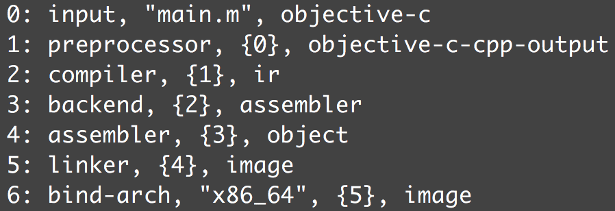

> 相关阅读: [https://www.jianshu.com/p/7f283c080271](https://www.jianshu.com/p/7f283c080271)
>
> mach-o链接: [https://www.jianshu.com/p/2f04e54a58d3](https://www.jianshu.com/p/2f04e54a58d3)
> [https://juejin.cn/post/6844903912198127623#heading-5](https://juejin.cn/post/6844903912198127623#heading-5)
>  
> app编译过程:[https://acefish.github.io/15538518127841.html](https://acefish.github.io/15538518127841.html)
> 
> dsym: [https://cloud.tencent.com/developer/article/1822554](https://cloud.tencent.com/developer/article/1822554)


## LLVM

* LLVM项目 是模块化,可重用的编译器 以及 工具链技术的合集
* 传统的编译器架构,比如gcc编译器

	
	
	
	* 前端: 词法分析,语法分析,语义分析, 生成中间代码IR
	* 优化器: 中间代码的优化
	* 后端: 生成机器代码

	
* LLVM架构

	
	
	* 不同的前后端使用统一的中间代码IR
	* 如果需要支持一种新语言,只需实现一个新前端
	* 如果需要支持一个新的硬件,只需实现一个新的后端
	* GCC的前端后端耦合在一起,如果支持一种新语音或者新平台,很麻烦

	
* 广义的LLVM是整个LLVM架构,狭义的指的是优化阶段和生成机器码的后端
	
	
### clang

* clang是llvm的一个子项目,是llvm架构的前端
* clang对比gcc的优点:
	* 编译快
	* 生成的ast占用内存小
	* 模块化,复用性,扩展性好

	
## OC源文件的编译过程

*  编译过程的命令行`$ clang -ccc-print-phases main.m`

	
	
* 详细过程
	
	
	
	
#### 预处理
	
* 预处理.查看预处理结构命令`$ clang -E main.m`,预处理都做了什么?
	*  宏定义替换
	*  文件包含,将import,include这种的.h文件包含进来,如果.h里面包含其他的.h,递归包含进来
	*  删除注释,变成空行
	*  添加行号和文件名表示,用于编译错误/警告显示以及编译器产生调试用的行号信息
	*  条件编译, 根据条件编译不同分支
	
	```c
	#ifdef X
	A
	#else
	B
	#endif
	
	#ifndef
	#else
	#endif
	```
	* 编译预处理指令

	```c
	#define
	#indef
	#import
	#include
	#warning 产生一个编译警告
	#error 产生一个编译错误
	```

* 预处理,总体来说就是对编译预处理指令的处理
	
#### 词法分析

* 词法分析,将代码切分成token, `clang -fmodules -E -Xclang -dump-tokens main.m`
* 这些token分为下面4个类型:
	* 关键字: if,else,while,for
	* 标识符: 变量名
	* 字面量: 值,数字,字符串
	* 特殊符号: 加减乘除,括号
* 每一个都标记了在对应源码中的位置,对于宏是展开之前的位置

	

	


#### 语法分析,语义分析,生成AST

* `$ clang -fmodules -fsyntax-only -Xclang -ast-dump main.m`

* 语法分析: 对token做词句分析, 判断类型,生成节点(Nodes),并记录相关信息
* 语义分析: 检查返回值,变量是否之前已经定义,变量是否初始化等,如果没有错误就会将token组成语义,生成clang节点(Nodes),然后将这些节点按照层级构成AST

	
	
	

* 节点主要分成：Type(类型)，Decl(声明)，Stmt(陈述)，其他的都是这三种的派生


#### 静态分析

* 一旦编译器把源码生成了语法树,就可以做分析处理,找出代码中的错误
* 类型检查: 可以检测某个对象是否包含方法,函数
* clang完成代码的标记,解析,分析后就会生成LLVM代码,IR

#### IR代码生成

* CodeGen负责将语法树从顶至下遍历,翻译成LLVM IR,IR是前端输出,是后端的输入,桥接前后端
* IR有3中表示形式,本质上是等价的,text文本格式,memory内存格式,bitcode二进制格式

#### 中间代码优化

* Xcode的编译设置里面也可以设置优化级别-O1,-O3,-Os对应着不同的入参，有比如类似死代码清理，内联化，表达式重组，循环变量移动这样的 Pass

	> 函数内联化: 一个简单的函数f,在调用f的地方直接展开f

* Pass就是LLVM系统转化和优化的工作的一个节点，每个节点做一些工作，这些工作加起来就构成了LLVM整个系统的优化和转化


#### 生成字节码

Xcode7中默认生成bitcode就是这种的中间形式存在，开启了bitcode，那么苹果后台拿到的就是这种中间代码，苹果可以对bitcode做一个进一步的优化，如果有新的后端架构，仍然可以用这份bitcode去生成


#### 生成相关汇编

* `clang -S -fobjc-arc main.m -o main.s`

#### 生成目标文件

* 汇编器是将汇编代码转变成机器可以执行的指令，每一个汇编语句几乎都对应一条机器指令
* 这些都是一些.o文件


### 链接生成最终的可执行文件

* 链接的主要内容就是把各个模块之间相互引用的部分都处理好，使得各个模块之间能够正确地衔接
* 从原理上来讲，链接器的工作无非就是把一些指令对其他符号地址的引用加以修正
* 链接过程主要包括了地址和空间分配、符号决议和重定位 等这些步骤。（符号可以理解为函数名和变量名)
* lld链接器是LLVM的一个子项目，旨在为LLVM开发一个内置的，平台独立的链接器，去除对所有第三方链接器的依赖
* 静态链接是把目标文件（一个或多个）和需要的静态库链接成可执行文件。
* 动态链接是在可执行文件装载、运行时进行的文件的链接。

#### 两部链接

* 1. 空间与地址分配:

	扫描所有的输入目标文件,并且换的他们各个段的长度,属性和位置信息. 将输入的目标文件符号表中的所有符号定义和符号引用收集起来(就是收集函数和变量定义与引用),统一放在一个全局符号表中,这一步中,连接器能够获得所有输入目标文件的段的长度,将他们合并,计算出输出文件中各个段合并后的长度和位置,并简历映射关系

* 2. 符号解析与重定位
	
	链接器在完成地址与空间分配后,就可以确定所有符号的虚拟地址,可以根据符号的地址对每一个需要重定位的指令进行修正

* 链接器是怎么知道a模块里哪些指令要被调整. 事实上a.o里,有一个重定位表保存这些与重定位相关的信息.而且每个section的section_64的head的reloff(重定位表里的便宜)和nreloc(几个需要重定位的符号),让链接器知道a模块那个section里的指令需要调整

### dwarf 和 dSYM

* dwarf:是一种源码调试信息的记录格式
* dSym指的是 Debug Symbols。也就是调试符号，我们常常称为符号表文件。
* dwarf 与 dSYM 的生成:

	

* 在汇编产生的目标文件中，包含着 dwarf 信息，如果我们在 Debug 模式下打包且选择了Debug Information Format 为DWARF，那么最终的 App Mach-O 文件中则会包含 dwarf 信息。
* 如果我们在 Release 模式下打包且选择了Debug Information Format 为DWARF with dSYM File ，那么则会通过 dsymutil 根据 mach-o 文件中的 dwarf 信息生成 dSYM 文件，然后通过 strip 命令去除掉 mach-o 中的调试符号化信息，以减少包体积以及不必要的源码隐私泄漏。
* 对于静态库，不会生成 dSYM 文件，即使设为DWARF with dSYM File

## 插件开发流程

* 下载LLVM,clang
* 安装cmake和ninja
* 编译安装ninja
* cmake生成xcode项目
* 在clang/tools/新建new-plugin文件夹,在CMakeList.txt中添加插件名
* 在新文件夹在添加CMakeList.txt关联插件,newPlugin.cpp编写插件