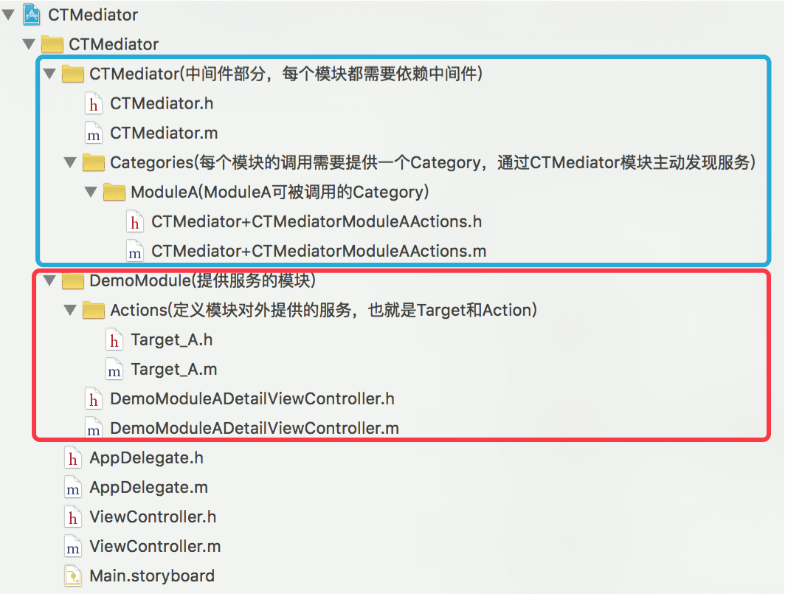
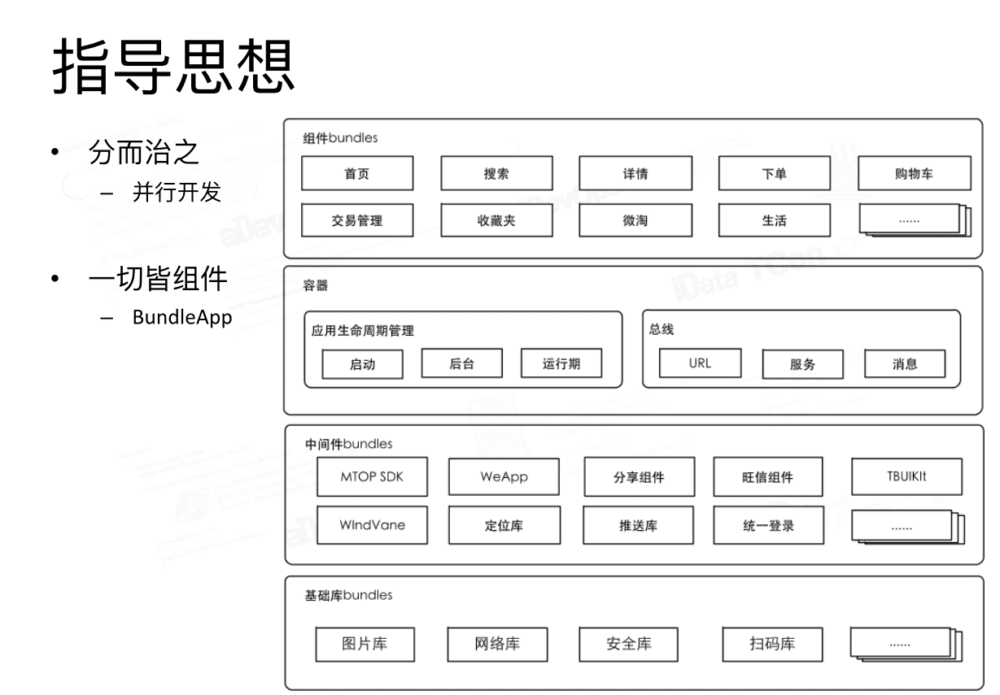

# 组件化

主要来自刘小壮的文章
[https://www.cnblogs.com/oc-bowen/p/5885476.html](https://www.cnblogs.com/oc-bowen/p/5885476.html)
加一些自己的东西

### 目录

* <a href="#为什么要组件化?">为什么要组件化?</a>
* <a href="#组件化带来的好处">组件化带来的好处</a>
* <a href="#大体结构">大体结构</a>
* <a href="#MGJRouter">MGJRouter </a>
* <a href="#casatwy组件化方案">casatwy组件化方案</a>
* <a href="#简单比较">简单比较</a>
* <a href="#组件化架构设计">组件化架构设计</a>
* <a href="#用过的架构">用过的架构</a>
* <a href="#其他问题">其他问题</a>
 
<a id="为什么要组件化?"></a>

### 为什么要组件化?

* 业务模块间划分不清除,模块之间耦合度很大,非常难维护
* 所有模块代码都编写在一个项目中,测试某个模块或功能,需要编译运行整个项目


<a id="组件化带来的好处"></a>

### 组件化带来的好处

* 业务划分更加清晰,新人接手更加容易,可以按组件分配开发任务
* 项目可维护性更强,提高开发效率
* 更好排查问题,某个组件出现问题,直接对组件进行处理
* 开发测试过程中,可以只编译自己那部分代码,不需要编译整个项目代码

<a id="大体结构"></a>

### 大体结构

各模块对中间层产生耦合关系,中间层不对其他模块发送耦合

进行组件化开发后,可以把每个组件当做一个独立的app,每个组件可以采取不同的架构,例如分别使用MVVM、MVC、MVCS等架构


<a id="MGJRouter"></a>

### MGJRouter

蘑菇街通过MGJRouter实现中间层,进行组件间的消息转发.实现的大致思路是: 在提供服务的组件中提前注册block，然后在调用方组件中通过URL调用block.

架构设计图


* MGJRouter是个单列,里面维护者一个"RUL->block"的注册表.通过url找到服务方的block,由router进行执行block.
* 在服务方组件中提供一个接口类,类似之前项目每个模块的XXXAPP类,在XXXAPP类中进行注册.
* 一个问题,就是存在硬编码的url(urlencode因为中文和一些字符不在url的标准规范中)和参数不明确的问题.蘑菇街是通过开发一个web,来管理所有url和参数.安卓,ios用一套
* 基础组件: 蘑菇街将网络请求,缓存,数据处理等功能也当做组件,划分为基础组件卫浴业务组件的下层
* router解决参数不明确问题还可以对router的类增加分类来实现.每个组件对应一个分类,分类方法中明确参数


#### Protocol方案的中间件

为了解决url硬编码和参数不明确的问题,蘑菇街推出Protocol方案.Protocol方案由两部分组成，进行组件间通信的ModuleManager类以及MGJComponentProtocol协议类.

* ModuleManager维护一张映射表,表有之前的"URL->block"变成"Protocol -> Class.
* Protocol中定义服务方可以调用的方法.需要在接口类中提前注册

实例代码

```objective-c
// 协议
@protocol MGJUserProtocol
- (NSString *)getUserName;
@end
// 服务方注册
[ModuleManager registerClass:MGJUserImpl forProtocol:@protocol(MGJUserProtocol)];
// 调用方调用
Class cls = [[ModuleManager sharedInstance] classForProtocol:@protocol(MGJUserProtocol)];
id userComponent = [[cls alloc] init];
NSString *userName = [userComponent getUserName];
```


#### 内存问题

上述两个方案的内存问题.

* block注册方式: block本身不回真用多少内存.block执行时才会去创建block里面用到的对象.block执行后就执行release
* 协议方式: 里面存的是class(类对象的地址)和协议的映射,非通过runtime动态生成的类,在app启动的时候就通过runtime加载了.这里存的是类对象的地址,不会占用很大地址

<a id="casatwy组件化方案"></a>

### casatwy组件化方案

#### 整体架构

casatwy组件化方案分为两种调用方式，远程调用和本地调用，对于两个不同的调用方式分别对应两个接口

* 远程调用通过AppDelegate代理方法传递到当前应用后，调用远程接口并在内部做一些处理，处理完成后会在远程接口内部调用本地接口，以实现本地调用为远程调用服务
* 本地调用由performTarget:action:params:方法负责，但调用方一般不直接调用performTarget:方法。CTMediator会对外提供明确参数和方法名的方法，在方法内部调用performTarget:方法和参数的转换


#### 实现思路

* 对于服务方组件来说,每个组件都提供一个或多个Target类,相当对外提供的服务类.CTMediator通过runtime主动发现服务
* 在Target中的所有Action方法，都只有一个字典参数，所以可以传递的参数很灵活，这也是casatwy提出的去Model化的概念。在Action的方法实现中，对传进来的字典参数进行解析，再调用组件内部的类和方法
* 每个组件创建一个CTMediator的分类,减少CTMediator类的代码量
* 在调用某一个组件时,该组件不需要知道CTMediator,这么看该组件与CTMediator不耦合.但该组件如果掉别的组件的话还是需要CTMediator来操作


#### 实现分析

[CTMediator demo](https://github.com/casatwy/CTMediator)





* `Target_A`就相当于之前router里面的XXXAPP服务类
* `Target_A`实例会在CTMediator中动态生成.NSClassFromString,alloc.然后实例通过performSelector调用`Target_A`服务类的方法
* performSelector时需要提前知道`Target_A`的方法名.所以应该有ModuleA的开发人员来实现CTMediator+ModuleA
* 从casatwy的Demo中也可以看出，其组件ModuleA的Target命名为`Target_A`，被调用的Action命名为`Action_nativeFetchDetailViewController:`,这样很好的将组件相关和组件内部代码进行了划分

<a id="组件化架构设计"></a>

### 组件化架构设计

* 主工程负责集成所有组件,每个组件都是一个单独的工程
* 组件的划分需要注意组件粒度，粒度根据业务可大可小,根据业务划分出来的属于业务组件，对于一些多个组件共同的东西，例如网络、数据库之类的，应该划分到单独的组件或基础组件中。对于图片或配置表这样的资源文件，应该再单独划分一个资源组件，这样避免资源的重复性
* 服务方组件对外提供服务，由中间件调用或发现服务，服务对当前组件无侵入性，只负责对传递过来的数据进行解析和组件内调用的功能。需要被其他组件调用的组件都是服务方，服务方也可以调用其他组件的服务
* 可以多个组件单独的并行开发,中间件负责处理所有组件之间的调度，在所有组件之间起到控制核心的作用
* 假设以后某个业务发生大的改变，需要对相关代码进行重构，可以在单个组件进行重构。组件化架构降低了重构的风险

#### 组件集成


* 在主项目中集成组件主要分为两种方式——源码和framework，但都是通过CocoaPods来集成
* 集成framework的方式，可以加快编译速度，而且对每个组件的代码有很好的保密性


<a id="简单比较"></a>

### 简单比较

* 在MGJRouter方案中，是通过调用OpenURL:方法并传入URL来发起调用。鉴于URL协议名等固定格式，可以通过判断协议名的方式，使用配置表控制H5和native的切换，配置表可以从后台更新，只需要将协议名更改一下即可

	```cpp
	mgj://detail?id=123456
	http://www.mogujie.com/detail?id=123456
	```
* 假设native组件出现严重的bug,在后台配置文件中原有的本地url换成h5的url
* casatwy方案和蘑菇街Protocol方案，都提供了传递明确类型参数的方法


<a id="用过的架构"></a>

### 用过的架构

之前公司用的架构跟博主所用比较接近


* 架构设计是：层级架构+组件化架构
* 组件化架构处于层级架构的最上层，也就是业务层
* 充分利用组件化架构的优势，对项目组件间进行解耦
* 在上层和下层的调用中，下层的功能组件应该对外开放一个接口类，在接口类中声明所有的服务，实现上层调用当前组件的一个中转，上层直接调用接口类。这样做的好处在于，如果下层发生改变不会对上层造成影响，而且也省去了部分Router转发的工作
* 需要注意只能上层对下层依赖，下层对上层不能有依赖，下层中不要包含上层业务逻辑应该将其下沉到下层中
* 项目很多没必要拆分的这么彻底


### 简单了解淘宝架构




#### 总线设计


URL可以请求也可以接受返回值，和MGJRouter差不多。URL路由请求可以被解析就直接拿来使用，如果不能被解析就跳转H5页面。这样就完成了一个对不存在组件调用的兼容，使用户手中比较老的版本依然可以显示新的组件


#### bundle app


Bundle即App，容器即OS

淘宝提出Bundle App的概念，可以通过已有组件，进行简单配置后就可以组成一个新的app出来

<a id="其他问题"></a>

### 其他问题

* 组件间通信: 投屏业务加到直播间.
	* 场景描述
		* 点击投屏按钮弹出设备搜索
		* 在投屏成功展示控制面板时请求superview,直播间提供
		* 切换直播间销毁控制面板
	* 解决方法:
		* 直播间初始化后,如果router注册投屏回调,以直播间的hash作为key,block作为value
		* 控制面板需显示时,根据key找到block
		* 执行block传递superview,并返回一个移除控制面板的block
		* 直播间销毁移除注册

		```objective-c
		// 简化写法
		getSuperviewBlock = ^(removeBlock(^passSuperviewBlock)(UIView *superview)){
			removeBlock removeblock = passSuperviewBlock(superview);
		};
		// 投屏组件需要supervie时
		getSuperviewBlock()
		```