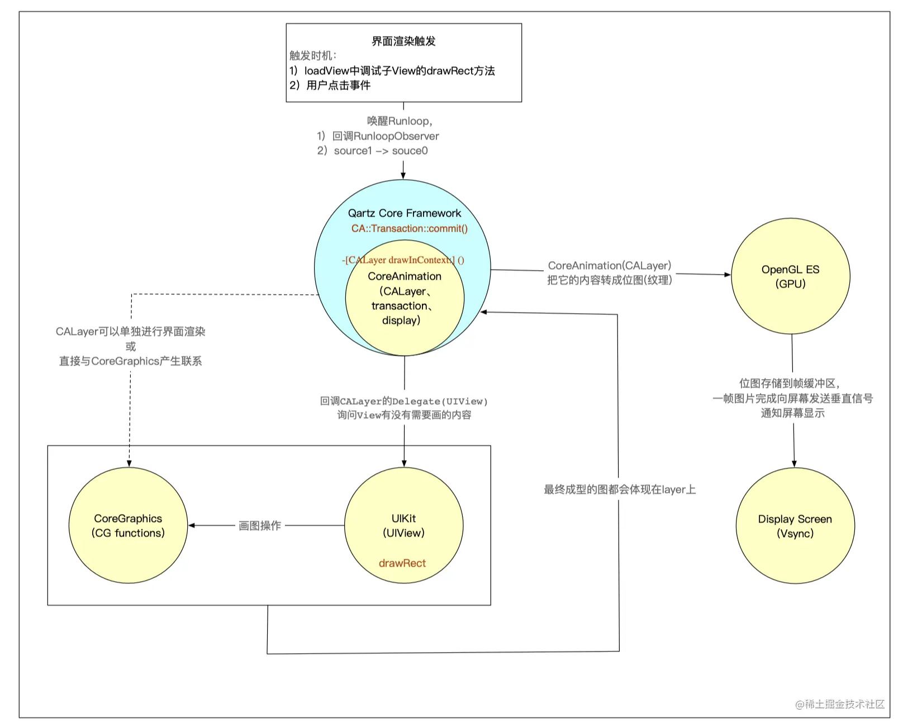
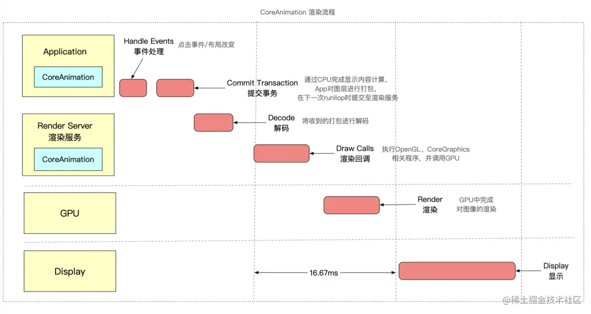

> 推荐阅读
> [https://juejin.cn/post/7002390363902066724](https://juejin.cn/post/7002390363902066724)
> [https://juejin.cn/post/6955353870906163236](https://juejin.cn/post/6955353870906163236)
> [https://juejin.cn/post/6844904178817449998#heading-20](https://juejin.cn/post/6844904178817449998#heading-20)
> 

## 总的渲染流程

如下图所示

* 触发渲染的方式有两种:
	* 通过loadView中子View的drawRect方法触发,会回调CoreAnimation中监听Runloop的BeforeWaiting的RunloopObserver，通过RunloopObserver来进一步调用CoreAnimation内部的CA::Transaction::commit()，进而一步步走到drawRect方法
	* 用户点击事件触发, 通过主线程的runloop中注册的source1回调一个IOEvent,并在下一个runloop里由source0转发给UIAppication的时间队列,在事件队列中调用CoreAnimation内部的CA::Transaction::commit();方法，进而一步一步的调用drawRec
	* 最终都会走到CoreAnimation中的CA::Transaction::commit()方法，从而来触发UIView和CALayer的渲染
* commit()中创建CATrasaction，然后进一步调用 CALayer drawInContext:()
* 在drawRect:方法里可以通过CoreGraphics函数或UIKit中对CoreGraphics封装的方法进行画图操作
* 如果有drawRect这些方法,则会cpu来负责绘制,这时候Core Animation会创建一块内存用于绘制
* 将绘制好的位图交由CALayer，由OpenGL ES 传送到GPU的帧缓冲区
* 等屏幕接收到垂直信号后，就读取帧缓冲区的数据，显示到屏幕上

## CoreAnimation

CoreAnimation绘制流水线如下:

* 如果不是drawRect方式绘制,则进行gpu绘制
* cpu提交transaction到Render Server进程,里面有视图信息,层级信息
* Render Server对收到的数据解码,执行opengl等相关程序,并调用gpu进行渲染
* GPU中通过顶点着色器、片元着色器完成对显示内容的渲染，将结果存入帧缓存区
* GPU通过帧缓存区、视频控制器等相关部件，将其显示到屏幕上

## 渲染总结

总结一下流程: 

* CoreAnimation注册在runloop中的监听到loadView中子view的drawRect 或者 用户事件触发 
* 最终走到CoreAnimation中的CA::Transaction::commit()
* 然后询问view或layer有没有drawRect相关绘制操作
* 如果有则cpu,开一块内存绘制成位图放在layer上,通过opengl传到gpu缓冲区等待显示
* 如果没有, 则将Transaction提交给render server,render server通过opengl调用gpu去绘制,gpu通过顶点找时期,片元找色器对内容渲染,缓存,等待同步信号显示到屏幕上

## 离屏渲染

* 与普通情况下 GPU 直接将渲染好的内容放入 Framebuffer 中不同，需要先额外创建离屏渲染缓冲区 Offscreen Buffer，将提前渲染好的内容放入其中，等到合适的时机再将 Offscreen Buffer 中的内容进一步叠加、渲染，完成后将结果切换到 Framebuffer 中
* 从上面的流程来看，离屏渲染时由于 App 需要提前对部分内容进行额外的渲染并保存到 Offscreen Buffer，以及需要在必要时刻对 Offscreen Buffer 和 Framebuffer 进行内容切换，所以会需要更长的处理时间（实际上这两步关于 buffer 的切换代价都非常大）
* 一些特殊效果需要使用额外的 Offscreen Buffer 来保存渲染的中间状态，所以不得不使用离屏渲染。比如阴影、圆角.layer.mask.要利用额外的内存空间对中间的渲染结果进行保存，因此系统会默认触发离屏渲染
* 而第二种情况，为了复用提高效率而使用离屏渲染一般是主动的行为，是通过 CALayer 的 shouldRasterize 光栅化操作实现的。Render Server 会强制将 CALayer 的渲染位图结果 bitmap 保存下来，这样下次再需要渲染时就可以直接复用，从而提高效率
* 如果 layer 不能被复用，则没有必要打开光栅化
* 如果 layer 不是静态，需要被频繁修改，比如处于动画之中，那么开启离屏渲染反而影响效率
* 离屏渲染缓存内容有时间限制，缓存内容 100ms 内如果没有被使用，那么就会被丢弃，无法进行复用
* 离屏渲染缓存空间有限，超过 2.5 倍屏幕像素大小的话也会失效，无法复用

**圆角的离屏渲染:**

* 只设置了view.layer.cornerRadius不处触发离屏渲染, 当设置view.layer.masksToBounds = true需要叠加裁剪,会触发避免圆角离屏渲染
* 换资源,直接使用带圆角的图片再增加一个和背景色相同的遮罩 mask 覆盖在最上层
* 用贝塞尔曲线绘制闭合带圆角的矩形，在上下文中设置只有内部可见，再将不带圆角的 layer 渲染成图片，添加到贝塞尔矩形中。这种方法效率更高，但是 layer 的布局一旦改变，贝塞尔曲线都需要手动地重新绘制，所以需要对 frame、color 等进行手动地监听并重绘。
* 重写 drawRect:，用 CoreGraphics 相关方法，在需要应用圆角时进行手动绘制。不过 CoreGraphics 效率也很有限，如果需要多次调用也会有效率问题3.5 触发离屏渲染原因的

**总结总结一下**

下面几种情况会触发离屏渲染：

* 1. 使用了 mask 的 layer (layer.mask)
* 2. 需要进行裁剪的 layer (layer.masksToBounds / view.clipsToBounds)
* 3. 设置了组透明度为 YES，并且透明度不为 1 的 layer (layer.allowsGroupOpacity/layer.opacity)
* 4. 添加了投影的 layer (layer.shadow*)
* 5. 采用了光栅化的 layer (layer.shouldRasterize)
