## 目录

* <a href="#面向对象0">面向对象问题</a> , <a href="#面向对象1">面向对象知识点</a> 
* <a href="#KVO0">KVO问题</a> , <a href="#KVO1">KVO知识点</a> 
* <a href="#KVC0">KVC问题</a> , <a href="#KVC1">KVC知识点</a> 
* <a href="#Category0">Category问题</a> , <a href="#Category1"> Category知识点</a> 
* <a href="#Block0">Block问题</a> , <a href="#Block1">Block知识点</a>
* <a href="#Runtime0">Runtime问题</a> , <a href="#Runtime1">Runtime知识点</a>
* <a href="#RunLoop0">RunLoop问题</a> , <a href="#RunLoop1">RunLoop知识点</a>
	* [经典的--深入理解RunLoop](https://blog.ibireme.com/2015/05/18/runloop/)
	* <a href="#RunLoop休眠的实现原理">RunLoop休眠的实现原理</a> 
	* <a href="#runloop与AutoreleasePool">runloop与AutoreleasePool</a> 
	* <a href="#runloop与事件响应">runloop与事件响应</a> 
	* <a href="#runloop与手势识别">runloop与手势识别</a> 
	* <a href="#runloop与界面更新">runloop与界面更新</a> 
	* <a href="#runloop与定时器">runloop与定时器</a> 
	* <a href="#runloop与GCD">runloop与GCD</a> 
	* <a href="#runloop与网络请求">runloop与网络请求</a> 
* <a href="#多线程0">多线程问题</a> , <a href="#多线程1">多线程知识点</a>
* <a href="#内存管理0">内存管理问题</a> , <a href="#内存管理1">内存管理知识点</a>
* <a href="#性能优化0">性能优化问题</a> , <a href="#性能优化1">性能优化知识点</a>
	* <a href="#启动优化">app启动&优化</a>
* <a href="#设计模式与架构0">设计模式与架构</a> , <a href="#设计模式与架构1">设计模式与架构</a>


<a id="面向对象0"></a>

### 面向对象

* **一个NSObject对象占用多少内存？**
 
	系统分配了16个字节给NSObject对象（通过`malloc_size`,runtime.h头文件函数获得）,oc对象的allocwithzone:的内部分配内存的时候,会按照16的倍数分配,方便操作系统分配内存.这个可以看libmalloc源码,[https://opensource.apple.com/tarballs/](https://opensource.apple.com/tarballs/)
	
	但NSObject对象内部只使用了8个字节的空间（64bit环境下，可以通过`class_getInstanceSize`函数获得）.`class_getInstanceSize`获得NSObject实例对象的成员变量所占用的大小8.转成C++后是一个`NSObject_IMPL`的结构体,这个结构体中只有一个isa的成员变量,是一个指针.如果一个类继承NSObject并且有一个long类型的成员变量,那么用`class_getInstanceSize`获取到的为16字节.如果不是long是int类型,还是16.因为结构体对齐.8+4=12然后在对齐.他和sizeof的区别:sizeof是运算符,一编译就会生成一个常数,他传入的参数是类型.`class_getInstanceSize`传入的是一个对象,是程序运行时的

*  **对象的isa指针指向哪里？**

	* instance对象的isa指向class对象
	* class对象的isa指向meta-class对象
	* meta-class对象的isa指向基类的meta-class对象

* **OC的类信息存放在哪里？**
	* 对象方法、属性、成员变量、协议信息，存放在class对象中
	* 类方法，存放在meta-class对象中
	* 成员变量的具体值，存放在instance对象

<a id="KVO0"></a>

### KVO

* **iOS用什么方式实现对一个对象的KVO？(KVO的本质是什么？)**

	利用RuntimeAPI动态生成一个子类，并且让instance对象的isa指向这个全新的子类
当修改instance对象的属性时，会调用Foundation的`_NSSetXXXValueAndNotify`函数,这个是在NSKVONotificatingXXX这个中间类的set方法中触发,这个函数会调用下面方法

	willChangeValueForKey:

	父类原来的setter

	didChangeValueForKey:
	内部会触发监听器（Oberser）的监听方法( observeValueForKeyPath:ofObject:change:context:）
	
* **如何手动触发KVO？**

	手动调用willChangeValueForKey:和didChangeValueForKey:(这个会检查willChange...有没有调用)
	
* **直接修改成员变量会触发KVO么？**
	
	不会触发KVO. 

<a id="KVC0"></a>

### KVC

* **通过KVC修改属性会触发KVO么？**
	
	会触发KVO.即使只声明成员变量,没有setter方法.也会触发.说明`setValue:forKey:`内部会做willChangeValueForKey:和didChangeValueForKey:
	
* **KVC的赋值和取值过程是怎样的？原理是什么？**

	<a href="#__kvc">看下面KVC原理</a>

<a id="Category0"></a>

* **setValue:forKey: 和setObject**

	* 对与可变字典,setValue会调用setObject.当value为nil的时候会清除这对key-value调用removeObject:forkey
	* setObject:当value为nil的时候会crash
	* setvalue是NSObject(NSKeyValueCoding),key只能是NSString
	

### Category

* **Category的使用场合是什么？**

	一个类拆解模块...

* **Category的实现原理**

	Category编译之后的底层结构是struct category_t，里面存储着分类的对象方法、类方法、属性、协议信息
	
	在程序运行的时候，runtime会将Category的数据，合并到类信息中（类对象、元类对象中）
	
* **Category和Class Extension的区别是什么？**

	Class Extension在编译的时候，它的数据就已经包含在类信息中
	
	Category是在运行时，才会将数据合并到类信息中

* **Category中有load方法吗？load方法是什么时候调用的？load 方法能继承吗？**

	有load方法
	
	load方法在runtime加载类、分类的时候调用
	
	load方法可以继承，但是一般情况下不会主动去调用load方法，都是让系统自动调用

* **load、initialize方法的区别什么？它们在category中的调用的顺序？以及出现继承时他们之间的调用过程？**

	* 调用方式
		* load是根据函数地址直接调用
		* initialize是通过objc_msgSend调用
	* 调用时刻
		* load是runtime加载类,分类的时候调用(只调用一次)
		* initialize是类第一次接受到消息的时候调用.每一个类只会initilaize一次(父类的initialize可能会被调用多次)
	* load,initialize调用用顺序?
	* load:
		* 先调用类的load,先编译的类,优先调用load,调用子类的load之前会先调用父类的load
		* 再调用分类的load.先编译的分类,有限调用load
	* initialzie
		* 先初始化父类,再初始化子类(可能最终调用的是父类的initialize方法)

* **Category能否添加成员变量？如果可以，如何给Category添加成员变量？**

	如果是类,写一个属性,编译器在编译的时候会自动声明setter和getter方法声明和实现.还会添加一个成员变量
	
	如果是分类,他只会自动添加setter和getter方法的声明
	
	不能直接给Category添加成员变量，但是可以间接实现Category有成员变量的效果


<a id="Block0"></a>

### Block


* **block的原理是怎样的？本质是什么？**

	封装了函数调用以及调用环境的OC对象 

* **__block的作用是什么？有什么使用注意点？**

	<a href="#__block修饰符">看下面</a>

* **block的属性修饰词为什么是copy？使用block有哪些使用注意？**

	block一旦没有进行copy操作，就不会在堆上
	
	使用注意：循环引用问题

* **block在修改NSMutableArray，需不需要添加__block？**

	不需要.
	
	```objective-c
	NSMutableArray *array = [NSMutableArray array];
	dispatch_block_t block = ^{
		[array addObject:@1];
	};
	```
	
<a id="Runtime0"></a>	

### Runtime


* **讲一下 OC 的消息机制**

	OC中的方法调用其实都是转成了`objc_msgSend`函数的调用，给receiver（方法调用者）发送了一条消息（selector方法名）
	
	`objc_msgSend`底层有3大阶段
消息发送（当前类、父类中查找）、动态方法解析、消息转发

* **消息转发机制流程**

	<a href="#__objc_msgSend">看下面</a>
	
* **什么是Runtime？平时项目中有用过么？**

	OC是一门动态性比较强的编程语言，允许很多操作推迟到程序运行时再进行
	OC的动态性就是由Runtime来支撑和实现的，Runtime是一套C语言的API，封装了很多动态性相关的函数
	平时编写的OC代码，底层都是转换成了Runtime API进行调用

	具体应用
	
	 * 利用关联对象（AssociatedObject）给分类添加属性
	 *	遍历类的所有成员变量（修改textfield的占位文字颜色、字典转模型、自动归档解档）
	* 交换方法实现（交换系统的方法）
	* 利用消息转发机制解决方法找不到的异常问题
	......


<a id="RunLoop0"></a>	

### RunLoop

* **讲讲 RunLoop，项目中有用到吗？**

	* <a href="#__线程保活">线程保活</a>

* **runloop内部实现逻辑？**

	<a href="#__runloop逻辑02">看下面</a>

* **runloop和线程的关系？**

	<a href="#__RunLoop与线程">看下面</a>

* **timer 与 runloop 的关系？**

	

* **程序中添加每3秒响应一次的NSTimer，当拖动tableview时timer可能无法响应要怎么解决？**

	

* **runloop 是怎么响应用户操作的， 具体流程是什么样的？**

	source1会捕捉事件,将事件封装成event queue,分发给source0处理

* **说说runLoop的几种状态**

	<a href="#__CFRunLoopObserverRef">看下面</a>

* **runloop的mode作用是什么？**

	<a href="#__CFRunLoopModeRef">看下面</a>


<a id="多线程0"></a>

### 多线程

* 下面的代码的打印结果是什么?

	
	
	不用添加port,perform...afterDelay:就是一个timer,先perform在run
	
* 下面的代码的打印结果是什么?

	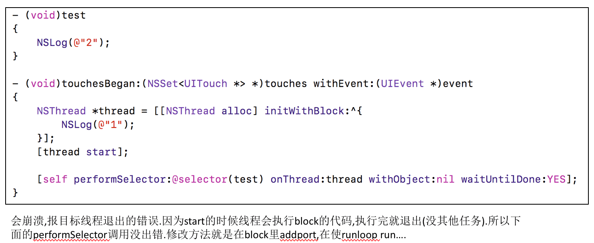
	
	
* **你理解的多线程？**

* **iOS的多线程方案有哪几种？你更倾向于哪一种？**

	<a href="#iOS中的常见多线程方案">下面-iOS中的常见多线程方案</a>

* **你在项目中用过 GCD 吗？**

* **GCD 的队列类型**

	<a href="#GCD的队列">GCD的队列</a>
	
* **说一下 OperationQueue 和 GCD 的区别，以及各自的优势**

* **线程安全的处理手段有哪些？**

	<a href="#iOS中的线程同步方案">iOS中的线程同步方案</a>	
* **OC你了解的锁有哪些？在你回答基础上进行二次提问；**

	* 追问一：自旋和互斥对比？
	* 追问二：使用以上锁需要注意哪些？
	* 追问三：用C/OC/C++，任选其一，实现自旋或互斥？口述即可！

	<a href="#自旋锁、互斥锁比较">自旋锁、互斥锁比较</a>
	

<a id="内存管理0"></a>
	
### 内存管理

* **使用CADisplayLink、NSTimer有什么注意点？**

	循环引用,不准时问题.具体<a href="#定时器">看下面</a>

* **介绍下内存的几大区域**

	<a href="#iOS程序的内存布局"></a>
	
* **思考以下2段代码能发生什么事？有什么区别？**

	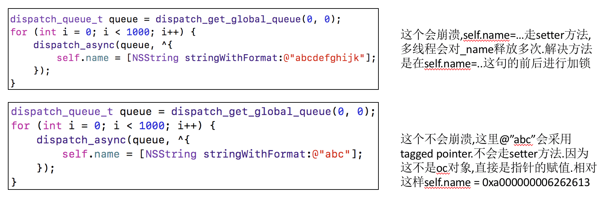

* **讲一下你对 iOS 内存管理的理解**

* **ARC 都帮我们做了什么？** 

	LLVM + (Runtime 相互协作)(不确定准确)
	
	自动生成`__strong`修饰符,利用LLVM编译器自动生成retain,release,autorelease这种内存管理的代码.比如大括号结束时加上release. 
	
	带来了weak修饰符
	
	像弱引用则需要runtime支持,需要运行时,清除弱引用对象.(不确定)
  
* **weak指针的实现原理**

	将弱引用存到散列表中,当对象销毁时,取出当前对象对应弱引用表,把弱引用存储的对象给清除掉
	
	[https://www.jianshu.com/p/1d99e1505f03](https://www.jianshu.com/p/1d99e1505f03)	

1. 当给一个weak属性赋值时,会根据被赋值对象地址为key,当前指针的地址为value在全局的weak表中注册一条记录,如果注册表中当前指针之前指向了一个旧的对象.那么先把之前的那条删除,再添加新的.weak表key是对象地址,value是数组或是hash表.当指针个数小于4的时候是数组
2. 当weak指向的对象销毁时,64位的isa指针中有一位标记是否存在weak指针,如果存在,会用改对象当做key去weak表中查找记录,如果有记录,会对所有指向该对象的指针置nil
3. 可见使用weak时,在赋值与对象销毁的过程中会产生很多的额外操作,在对性能有极限要求的地方可以考虑使用__unsafe_unretained,当然是不影响使用的前提下.(比如YYCache源码中,作者在实现链表的next和pre指针时,就用__unsafe_unretained来代替weak)

* **autorelease对象在什么时机会被调用release**
	
	非@autorelease{}时跟runloop有关
	
	<a href="#Runloop和Autorelease">看下面</a>
	
	自己声明的@autorelease{}在}结束就会走`__AtAutoreleasePool`的析构函数就会走objc_autoreleasePoolPop


* **方法里有局部对象， 出了方法后会立即释放吗** 

	这个要看出了方法的时候llvm编译器为对象生成的是release方法,还是autorelease方法.如果是release就是立即释放.如果是autorelease方法就不会立即释放


<a id="性能优化0"></a>

### 性能优化

你在项目中是怎么优化内存的？

优化你是从哪几方面着手？

列表卡顿的原因可能有哪些？你平时是怎么优化的？

遇到tableView卡顿嘛？会造成卡顿的原因大致有哪些？

<a id="设计模式与架构0"></a>

### 设计模式与架构

讲讲 MVC、MVVM、MVP，以及你在项目里具体是怎么写的？

你自己用过哪些设计模式？

一般开始做一个项目，你的架构是如何思考的？


<a id="面向对象1"></a>

## 面向对象

### OC的本质

* 我们平时编写的Objective-C代码，底层实现其实都是C\C++代码
* 将Objective-C代码转换为C\C++代码

	`xcrun  -sdk  iphoneos  clang  -arch  arm64  -rewrite-objc  OC源文件  -o  输出的CPP文件`

	`如果需要链接其他框架，使用-framework参数。比如-framework UIKit`
	
### OC对象的本质


### 常用LLDB指令

```
memory read/数量,格式,字节数 内存地址 
memory read 可以简写成x

格式
x是16进制，f是浮点，d是10进制
字节大小
b：byte 1字节，h：half word 2字节
w：word 4字节，g：giant word 8字节

x/3xg 0x1007284a0 是读取0x1007284a0开始的3段8字节的16进制数据
```

xcode实时查看内存数据,Debug->Debug Workflow ->View Memory

### OC对象获取信息注意点

* 下面代码获取的是class对象不是meta-class对象

	```objective-c
	Class objectClass = [[NSObject class]class];
	```

* 下面两个函数,方法的区别

	```objective-c
	<objc/runtime.h>
	object_getClass(id _Nullable obj)  //传入一个对象,返回isa指向的Class
	objc_getClass(const char * _Nonnull name) //传入一个字符串,返回一个类对象.不回返回一个元类对象.
	- (Class)class{
		return self->isa;	
	}
	+ (Class)class{
		return self;
	}
	这两个返回的就是类对象
	```
	
* 判断是否是元类对象

	```objective-c
	class_isMetaClass(); //传入一个对象,可以是实例对象,可以是类对象
	```
	

### isa

#### 对象isa指向


#### isa,superclass总结


#### 实例,类,元类关系图

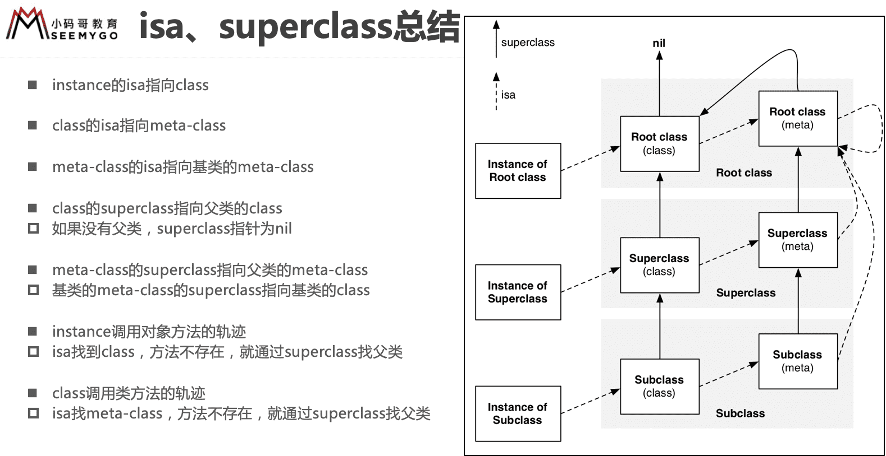


### Class的结构

#### isa 指针

isa在64位之前是直接指向class或meta-class,64位之后要`&ISA_MASK`

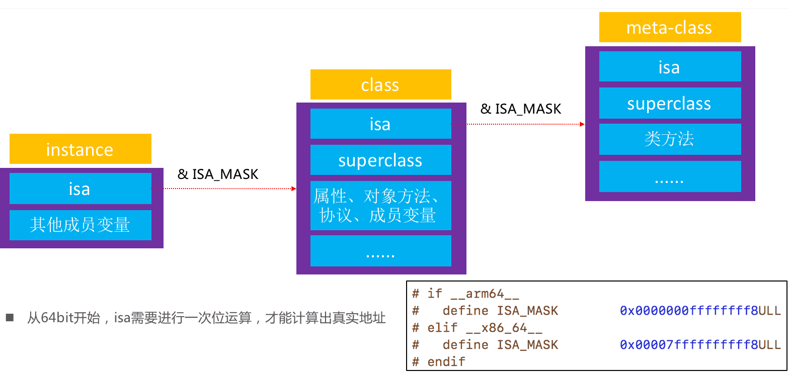

#### objc4源码

* 类对象和元类对象都是Class类型,是一个`struct objc_class`

	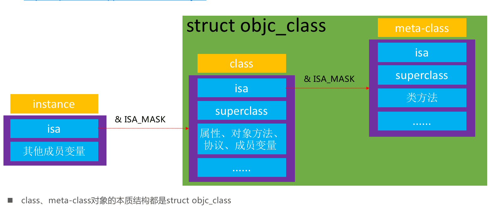

* `struct objc_class`的结构

	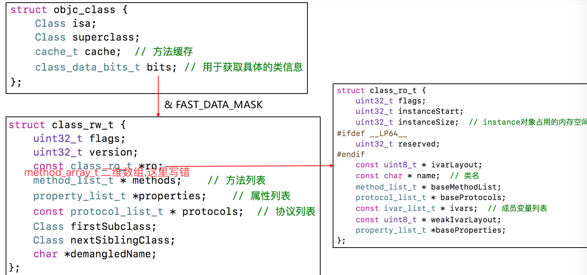


<a id="KVO1"></a>

### KVO

* 未使用KVO监听的对象


* 使用了KVO监听的对象


* 怎么看setAge:调用的是_NSSetIntValueAndNotify
	
	```objective-c
	// 在self.person添加监听后,获取self.person的setAge:的方法实现
	NSLog(@"%p",[self.person methodForSelector:@selector(setAge:)]); //0x1069189e4
	// 打断点在lldb中输入p (IMP)0x1069189e4 
	// 输出 (IMP) $1 = 0X00000001069189E4 (Foundation `_NSSetIntValueAndNotify`)
	```

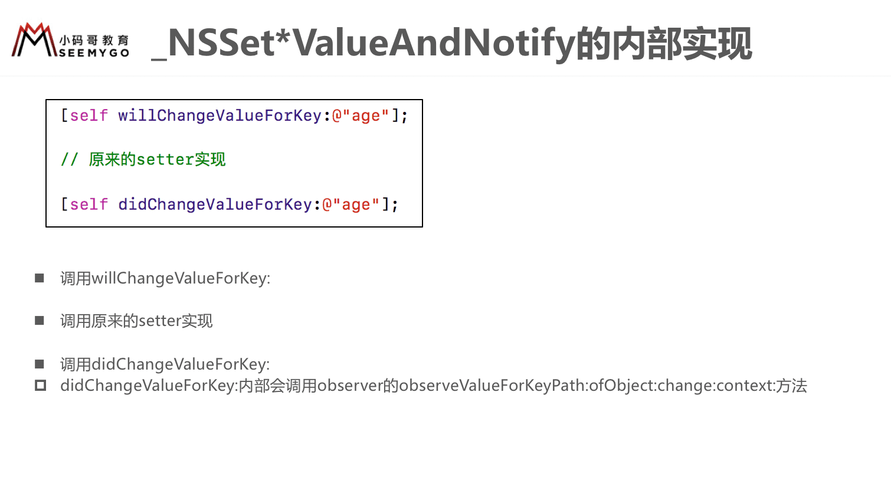


<a id="KVC1"></a>

<a id="__kvc"></a>

### KVC

* key-value coding 键值编码 常见api

	```objective-c
	常见的API有
	- (void)setValue:(id)value forKeyPath:(NSString *)keyPath;
	- (void)setValue:(id)value forKey:(NSString *)key;
	- (id)valueForKeyPath:(NSString *)keyPath;
	- (id)valueForKey:(NSString *)key; 
	```
	
#### setValue:ForKey:原理
	


#### valueForKey:原理


<a id="Category1"></a>

### Category


* 分类的方法,协议,属性是程序运行时加载的

#### category的底层结构


#### Category的加加载处理过程


#### Category方法存放,load方法


### +load方法


### +initialize方法


### 关联对象

* 默认情况下，因为分类底层结构的限制，不能添加成员变量到分类中。但可以通过关联对象来间接实现

* 关联对象提供了以下API

	```objective-c
	添加关联对象
	void objc_setAssociatedObject(id object, const void * key,
	                                id value, objc_AssociationPolicy policy)
	
	获得关联对象
	id objc_getAssociatedObject(id object, const void * key)
	
	移除所有的关联对象
	void objc_removeAssociatedObjects(id object)
	```

* objc_AssociationPolicy

	
	
* key的常见用法

	```objective-c
	// 存全局变量的地址,如果不希望外界修改可以加const
	static void *MyKey = &MyKey;
	objc_setAssociatedObject(obj, MyKey, value, OBJC_ASSOCIATION_RETAIN_NONATOMIC)
	objc_getAssociatedObject(obj, MyKey)
	
	static char MyKey;
	objc_setAssociatedObject(obj, &MyKey, value, OBJC_ASSOCIATION_RETAIN_NONATOMIC)
	objc_getAssociatedObject(obj, &MyKey)
	
	使用属性名作为key
	objc_setAssociatedObject(obj, @"property", value, OBJC_ASSOCIATION_RETAIN_NONATOMIC);
	objc_getAssociatedObject(obj, @"property");
	
	使用get方法的@selecor作为key
	objc_setAssociatedObject(obj, @selector(getter), value, OBJC_ASSOCIATION_RETAIN_NONATOMIC)
	objc_getAssociatedObject(obj, @selector(getter))
	```

### 关联对象实现原理


<a id="Block1"></a>


### Block


### block的本质

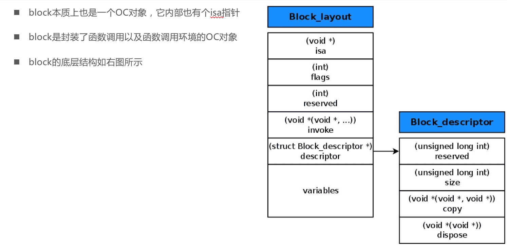

### block的变量捕获（capture）

* 为了保证block内部能够正常访问外部的变量，block有个变量捕获机制


	
	
### auto变量的捕获


### block的类型

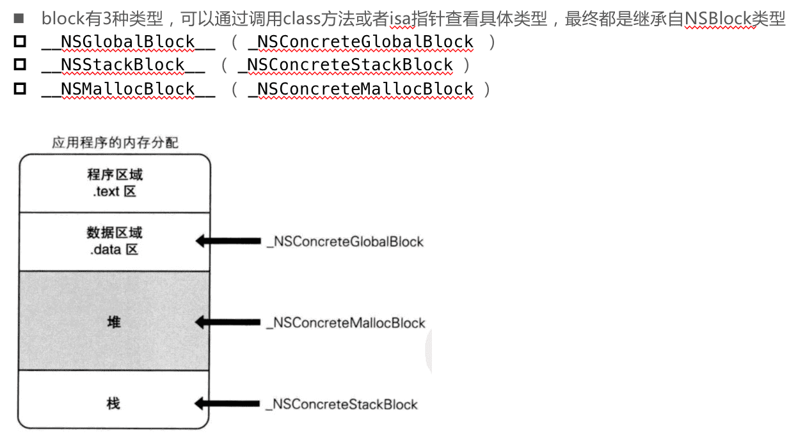

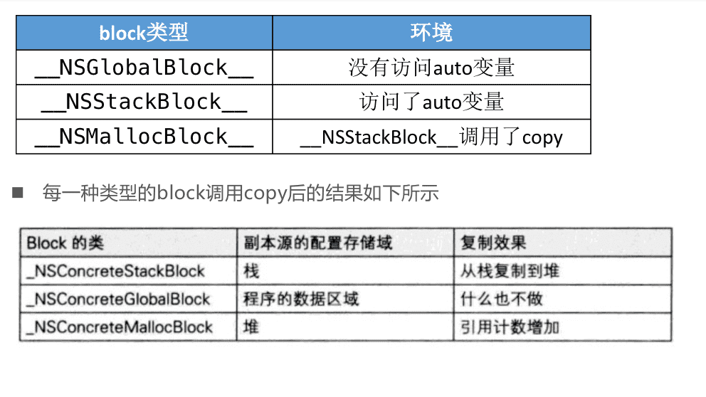


### block的copy

* arc环境下,编译器会根据情况自动将栈上的block复制到堆上,比如以下情况
	* block作为函数返回值时
	* 将block赋值给`__strong`指针时
	* block作为Cocoa API中方法名还有usingBlock的方法参数时
	* block作为GCD API的方法参数时

* MRC下block属性的建议写法
	* `@property(copy, nonatomic) void(^block)(void);`

* ARC下block属性的建议写法
	* `@property(strong, nonatomic) void(^block)(void);`
	* `@property(copy, nonatomic) void(^block)(void);`


### 对象类型的auto变量

* 当block内部访问了对象类型的auto变量时
	* 如果block是在栈上的,将不会对auto变量产生强引用
	* 如果block被拷贝到堆上
		* 会调用block内部的copy函数,在Desc里面
		* copy函数内部会调用`_Block_object_assign`函数
		* `_Block_object_assign`函数会根据auto变量的修饰符(`__strong,__weak,__unsafe_unretained`)做出相应的操作,行成强引用(retain)或者弱引用
	* 如果block从堆上移除
		* 会调用block内部的dispose函数
		* dispose函数内部会调用`_Block_object_dispose`函数
		* `_Block_object_dispose`函数会自动释放引用的auto变量(release)

	
	

### __weak问题解决

* 在使用clang转换oc为c++代码时,可能会遇到以下问题

	```
	cannot create __weak reference in file using manual reference
	```
	
* 解决方法: 支持arc,指定运行时系统版本,比如

	```
	xcrun -sdk iphoneos clang -arch arm64 -rewrite-objc -fobjc-arc -fobjc-runtime=ios-8.0.0 main.m
	```
	
<a id="__block修饰符"></a>
	
### __block修饰符


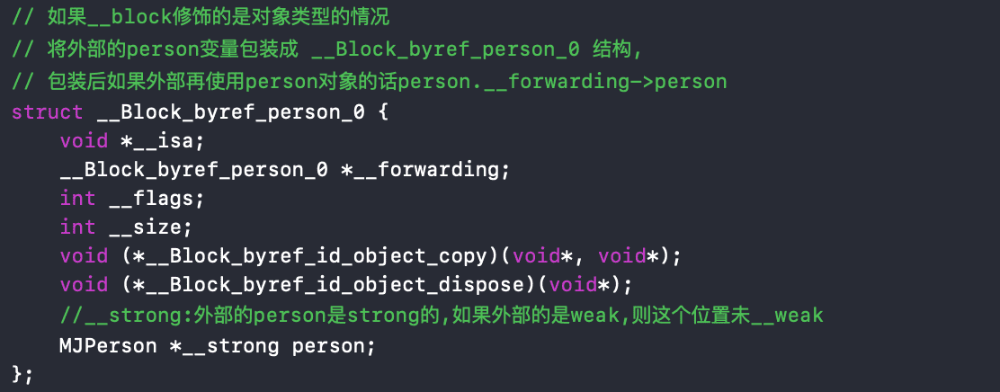

### __block的内存管理


### __block变量包装的结构体中的__forwarding指针

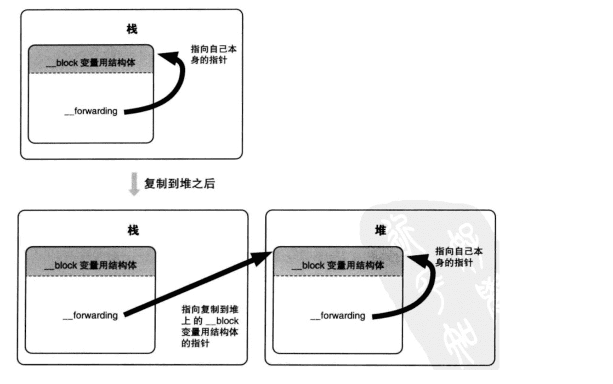

### 对象类型的auto变量、__block变量


### 被__block修饰的对象类型


#### 两个copy函数??

当`__block`修饰对象类型时候,包装的结构体`__Block_byref...`里面会多一个copy和dispose函数.他们和block结构体里面的copy和dispose函数的联系


### 解决循环引用 ARC


### 解决循环引用 MRC


<a id="Runtime1"></a>

## Runtime

* oc是一门动态性比较强的编程语言,跟c,c++有着恨到不同
* oc的动态性是由runtime api来支撑的
* runtime api提供的接口基本都是c语言的,源码有c\c++\汇编语言编写


#### isa详解


#### 位域

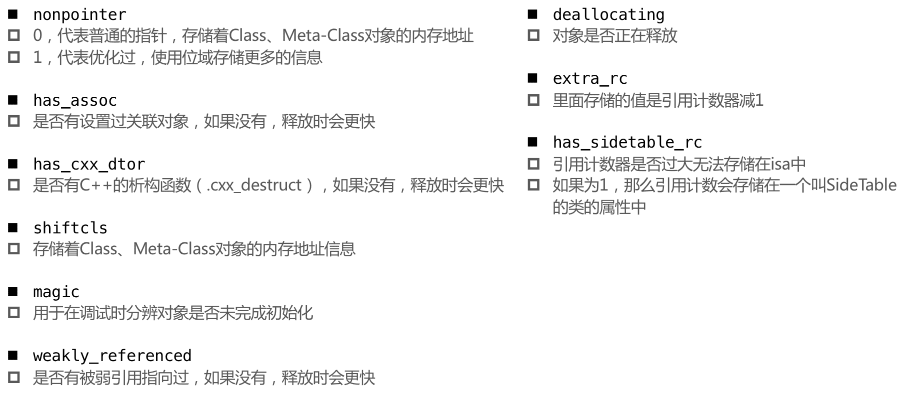


### Class的结构


#### class_rw _t

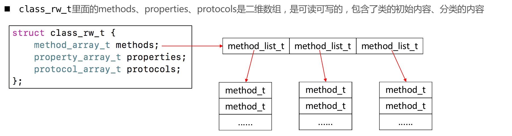


#### class_ro _t


#### method_t

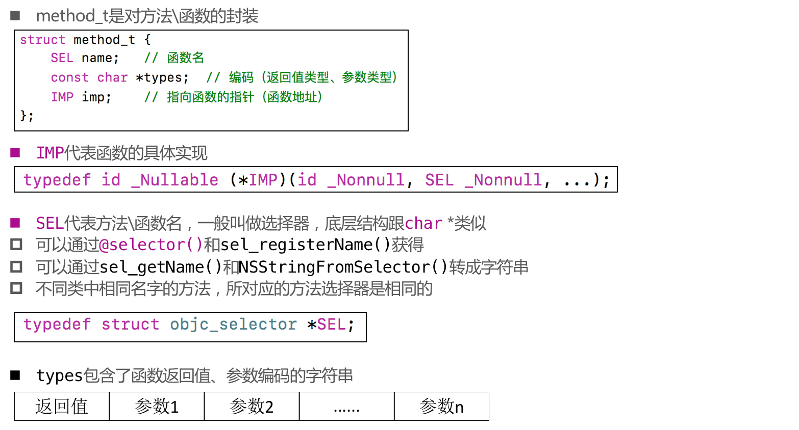

#### Type Encoding

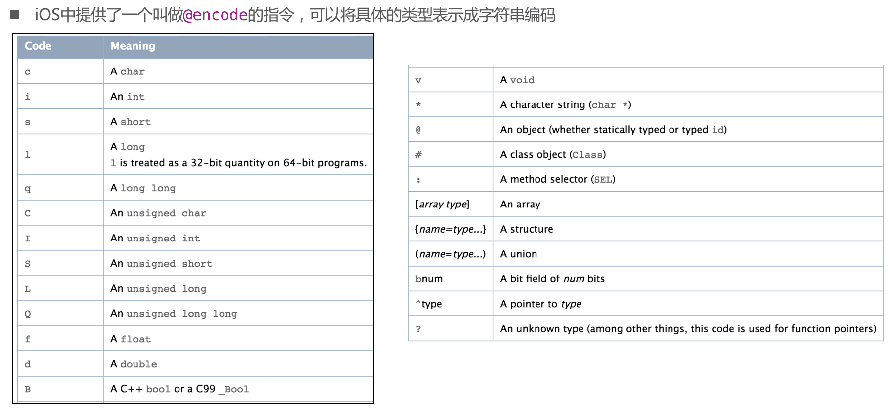


### 方法缓存

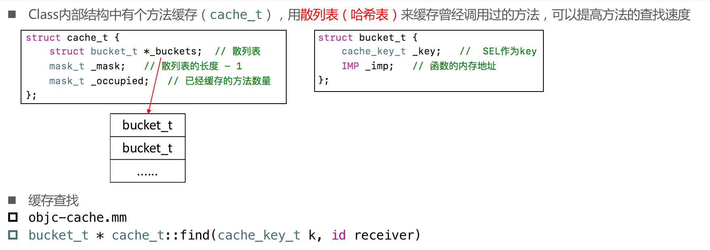


<a id="__objc_msgSend"></a>

### objc_msgSend


* oc中的方法调用,其实都是转换成`objc_msgSend`函数的调用
* `objc_msgSend`的执行流程流程可以分为3大阶段
	* 消息发送
	* 动态方法解析
	* 消息转发

#### objc_msgSend执行流程01-消息发送


#### objc_msgSend执行流程02-动态方法解析


#### 动态添加方法

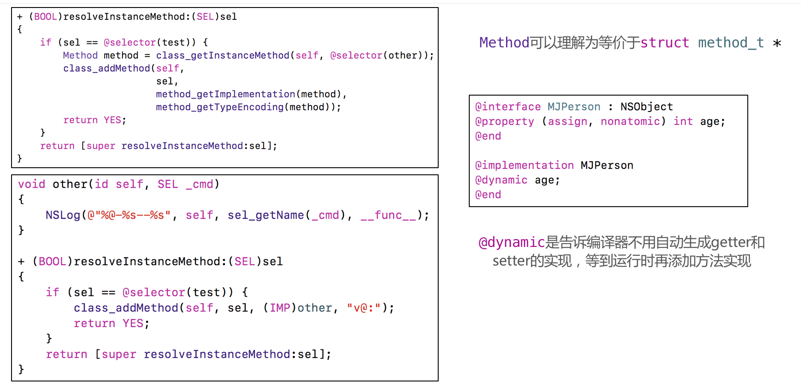


#### objc_msgSend的执行流程03-消息转发


```objective-c
- (id)forwardingTargetForSelector:(SEL)aSelector{
    return nil;
}
- (NSMethodSignature *)methodSignatureForSelector:(SEL)aSelector{	
	// NSMethodSignature可以通过NSObject的methodSignatureForSelector:来获得,也可用下面的types来获得
	return [NSMethodSignature signatureWithObjCTypes:"i@:i"];
}
- (void)forwardInvocation:(NSInvocation *)anInvocation{
	传过来的anInvocation带有target,sel,方法参数等
	可以根据NSInvocation里面的api修改targe,sel,方法参数.可以获取返回值
}
```

### super

#### super的本质

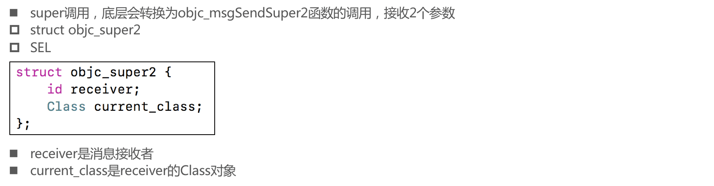

下面几点易错点

```objective-c
// 这里方法的接受者还是self,只是直接从父类中搜索init方法
self = [super init]; 

// 内部实现class_getSuperclass(object_getClass(self)).因为superclass指针是放在Class对象里面的
[self superclass]
```

### LLVM的中间代码(IR)

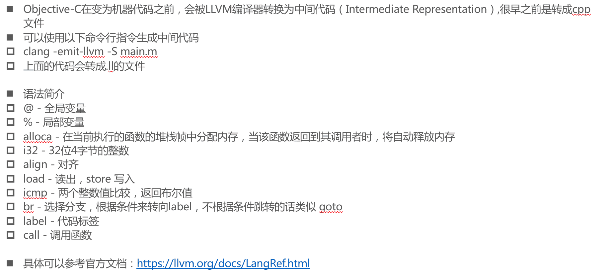


### Runtime API

#### Runtime API01 – 类 

```objective-c
// 动态创建一个类(参数: 父类,类名,额外的内存空间传0即可)
Class objc_allocateClassPair(Class superclass, const char *name, size_t extraBytes)

// 注册一个类 (要在类注册之前添成员变量)
void objc_registerClassPair(Class cls)

// 销毁一个类
void objc_disposeClassPair(Class cls)

// 获取isa指向的Class
Class object_getClass(id obj)

// 设置isa指向的Class
Class object_setClass(id obj, Class cls)

// 判断一个oc对象是否为Class
BOOL object_isClass(id obj)

// 判断一个Class是否为元类
BOOL class_isMetaClass(Class cls)

// 获取父类
Class class_getSuperclass(Class cls)
```

#### Runtime API02 – 成员变量 

```objective-c
// 获取一个实例变量信息
Ivar class_getInstanceVariable(Class cls, const char *name)

// 拷贝实例变量列表(最后需要调用free释放)
Ivar *class_copyIvarList(Class cls, unsigned int *outCount)

// 设置和获取成员变量的值
void object_setIvar(id obj, Ivar ivar, id value)
id object_getIvar(id obj, Ivar ivar)

// 动态添加成员变量(已经注册的类是不能动态添加成员变量的)
BOOL class_addIvar(Class cls, const char * name, size_t size, uint8_t alignment, const char * types)

// 获取成员变量的相关信息
const char *ivar_getName(Ivar v)
const char *ivar_getTypeEncoding(Ivar v)
```

#### Runtime API03 – 属性 

```objective-c
// 获取一个属性
objc_property_t class_getProperty(Class cls, const char *name)

// 拷贝属性列表(最好需要调用free释放)
objc_property_t *class_copyPropertyList(Class cls, unsigned int *outCount)

// 动态添加属性
BOOL class_addProperty(Class cls, const char *name, const objc_property_attribute_t *attributes,
                  unsigned int attributeCount)
                  
// 动态替换属性
void class_replaceProperty(Class cls, const char *name, const objc_property_attribute_t *attributes,
                      unsigned int attributeCount)

// 获取属性的一些信息
const char *property_getName(objc_property_t property)
const char *property_getAttributes(objc_property_t property)
```

#### Runtime API04 – 方法

```objective-c
// 获取一个实例方法,类方法
Method class_getInstanceMethod(Class cls, SEL name)
Method class_getClassMethod(Class cls, SEL name)

// 方法实现相关操作
IMP class_getMethodImplementation(Class cls, SEL name) 
IMP method_setImplementation(Method m, IMP imp)
void method_exchangeImplementations(Method m1, Method m2)

// 拷贝方法列表(最后需要调用free释放)
Method *class_copyMethodList(Class cls, unsigned int *outCount)

// 动态添加方法
BOOL class_addMethod(Class cls, SEL name, IMP imp, const char *types)

// 动态替换方法
IMP class_replaceMethod(Class cls, SEL name, IMP imp, const char *types)

// 获取方法的相关信息(带有copy的需要调用free去释放)
SEL method_getName(Method m)
IMP method_getImplementation(Method m)
const char *method_getTypeEncoding(Method m)
unsigned int method_getNumberOfArguments(Method m)
char *method_copyArgumentType(Method m, unsigned int index)

// 选择器相关
const char *sel_getName(SEL sel)
SEL sel_registerName(const char *str)

// 用block作为方法实现
IMP imp_implementationWithBlock(id block)
id imp_getBlock(IMP anImp)
BOOL imp_removeBlock(IMP anImp)
```

<a id="RunLoop1"></a>

## RunLoop

[经典的--深入理解RunLoop](https://blog.ibireme.com/2015/05/18/runloop/)

### RunLoop对象

* ios中有2套api来访问和使用RunLoop
	* Foundation: NSRunLoop
	* Core Foundation: CFRunLoopRef
* NSRunLoop和CFRunLoopRef都代表着RunLoop对象
* NSRunLoop是基于CFRunLoopRef的一层OC包装
* CFRunLoopRef是开源的
	* [https://opensource.apple.com/tarballs/CF/](https://opensource.apple.com/tarballs/CF/)

#### 获取RunLoop对象

```objective-c
Foundation 
[NSRunLoop currentRunLoop]; //获取当前线程的RunLoop对象
[NSRunLoop mainRunLoop]; //获取主线程的RunLoop对象

Core Foundation
CFRunLoopGetCurrent();
CFRunLoopGetMain();
```

<a id="__RunLoop与线程"></a>

### RunLoop与线程

* 每条线程都有唯一的一个与之对应的RunLoop对象
* RunLoop保存在一个全局的Dictionary里,线程作为key,RunLoop作为value
* 线程刚创建时并没有RunLoop对象,RunLoop会在第一次获取它时创建
* RunLoop会在线程结束时销毁
* 主线程的RunLoop已经自动获取(创建),子线程默认没有开启RunLoop


### RunLoop相关的类


<a id="__CFRunLoopModeRef"></a>

### CFRunLoopModeRef


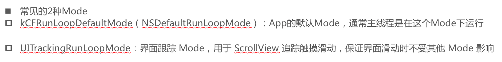

<a id="__CFRunLoopObserverRef"></a>

#### CFRunLoopObserverRef


#### 添加Observer监听RunLoop的所有状态

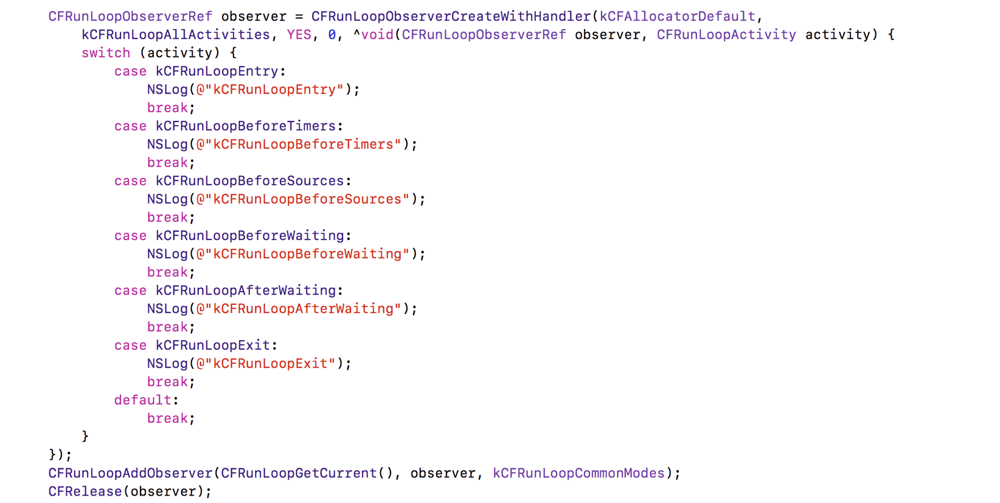

* 上面的mode传的kCFRunLoopCommonModes,就是既监听default模式,也是监听tracking模式

### RunLoop的运行逻辑

#### 官网的一张图


<a id="__runloop逻辑02"></a>

#### Source0,Source1,Timers,Observers 执行逻辑


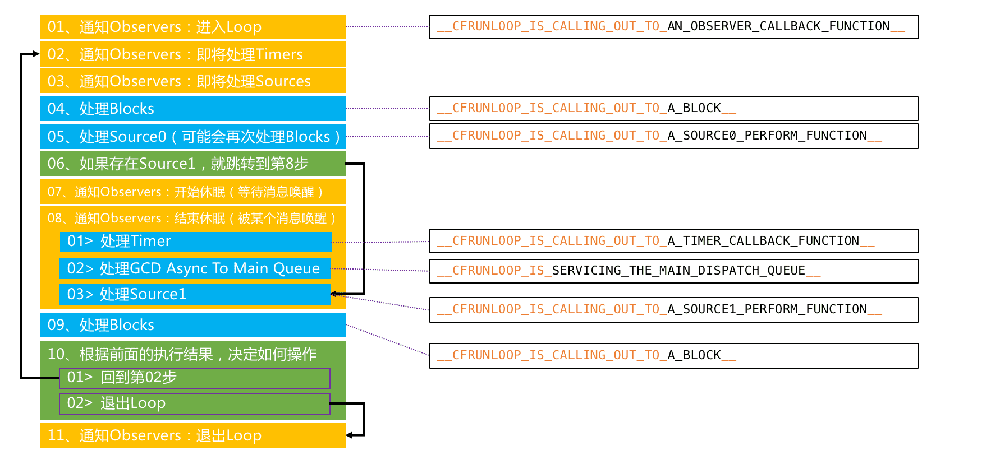

*  关于第04步的处理block,runloop运行直接向runloop添加block

	```objective-c
	CFRunLoopPerformBlock(runloop,mode,^{
		
	});
	或者
	[[NSRunloop currentRunLoop] performBlock:...];
	```
	
* 补充(触摸点击runloop做了什么): [https://blog.csdn.net/SL_ideas/article/details/76593854](https://blog.csdn.net/SL_ideas/article/details/76593854)

* 事件,UIEvent

	```
	@property(nonatomic,readonly) UIEventType     type;//触摸,加速,远程遥控,按压等
@property(nonatomic,readonly) UIEventSubtype  subtype;//子类型
@property(nonatomic,readonly) NSTimeInterval  timestamp;// 事件时间戳
	```

* 事件的传递, 事件已经生成, 那谁来处理?
	
	* 首先,事件不是谁都可以处理的,所以系统需要找到能处理事件的对象
	* 系统把事件加入到一个由UIApplication管理的事件队列中
	* 先进先出,事件会按照UIApplication -> UIWindow -> SuperView -> SubView的顺序不断的检测
	* 检测的就是靠两个方法histTest与pointInside
	* 检测的顺序是什么?
	* 首先判断窗口能不能处理事件,如果不能,意味着窗口不是最合适的view,而且也不会寻找更合适的view,直接返回nil,通知UIApplication没有合适的view
	* 如果窗口能响应事件,并且落点在自己身上,通过pointInside来判断, 
	* 遍历自己的子控件,寻找没有没有更合适的view,如果没有则窗口自己处理,如果有则重复上面过程

	
<a id="RunLoop休眠的实现原理"></a>
	
### RunLoop休眠的实现原理

runloop的核心是基于mach port的,其进入休眠时调用mach_mag().


苹果官方将整个系统大致划分为上述4个层次:

* 应用层包括用户能够接触到的图形应用,例如:Spotlight,Aqua,SpringBoard等
* 应用框架层即开发人员接触到的Cocoa等框架
* 核心框架层包括各种核心框架,OpenGL等内容
* Darwin即操作系统给的核心,包括系统内核,驱动,Shell等内容,这一层开源的[http://opensource.apple.com/](http://opensource.apple.com/)

看下Darwin这个核心的架构:

其中,在硬件层上面的三个组成部分: Mach,BSD,IOKit(还有一些上面没标注的内容),共同组成了XNU内核.

* XNU内核的内环被称做Mach,其作为一个微内核,仅提供诸如处理调度,IPC(进程间通信)等非常少量的基础服务.
* BSD层可以看做围绕Mach层的一个外环,其提供了诸如进程管理,文件系统和网络等功能.
* IOKit层可以是为设备驱动提供了一个面向对象(C++)的一个框架.

Mach本身提供的API非常有限,而且苹果也不鼓励使用Mach的API,但没有这些API的话,其他任何工作都无法实施.在Mach中所有的东西都是通过自己的对象实现的.进程,线程和虚拟内存都被称为'对象'.和其他框架不同,Mach的对象不能直接调用,只能通过消息传递的方式实现对象间的通信.消息是Mach中最基础的概念,消息在两个端口(port)之间传递,这就是IPC(进程间通信)的核心.

```c
typedef struct {
  mach_msg_header_t header;
  mach_msg_body_t body;
} mach_msg_base_t;
 
typedef struct {
  mach_msg_bits_t msgh_bits;
  mach_msg_size_t msgh_size;
  mach_port_t msgh_remote_port;
  mach_port_t msgh_local_port;
  mach_port_name_t msgh_voucher_port;
  mach_msg_id_t msgh_id;
} mach_msg_header_t;

mach_msg_return_t mach_msg(
mach_msg_header_t *msg,
mach_msg_option_t option,
mach_msg_size_t send_size,
mach_msg_size_t rcv_size,
mach_port_name_t rcv_name,
mach_msg_timeout_t timeout,
mach_port_name_t notify);
```

一条Mach消息时间上就是一个二进制数据包,其头部定义了当前端口`local_port`和目标端口`remote_port`,发送和接受消息是通过一个API进行的,其中option标记了传递方向.

为了实现发送和接受,runloop的休眠操作`mach_msg()`函数实际上调用了一个Mach陷阱(trap),即`mach_msg_trap()`,陷阱在Mach中等同于系统调用,当在用户态调用`mach_msg_trap()`就会触发陷阱机制,切换到内核态,内核态实现`mach_msg()`的实际工作.如下图

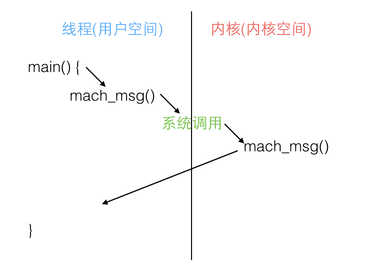

runloop核心就是一个`mach_msg()`,runloop调用这个函数,如果没有别人发送port消息过来,内核就会将现场置于等待状态.例如你在模拟器里跑起一个 iOS 的 App,然后在 App 静止时点击暂停,你会看到主线程调用栈是停留在 `mach_msg_trap()` 这个地方

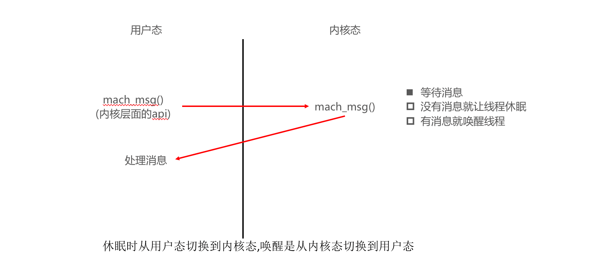

<a id="runloop与AutoreleasePool"></a>

### runloop与AutoreleasePool

App启动后，苹果在主线程 RunLoop 里注册了两个 Observer，其回调都是 _wrapRunLoopWithAutoreleasePoolHandler()。

第一个 Observer 监视的事件是 Entry(即将进入Loop)，其回调内会调用 `_objc_autoreleasePoolPush()` 创建自动释放池。其 order 是-2147483647，优先级最高，保证创建释放池发生在其他所有回调之前。

第二个 Observer 监视了两个事件： BeforeWaiting(准备进入休眠) 时调用`_objc_autoreleasePoolPop()` 和 `_objc_autoreleasePoolPush()` 释放旧的池并创建新池；Exit(即将退出Loop) 时调用 `_objc_autoreleasePoolPop()` 来释放自动释放池。这个 Observer 的 order 是 2147483647，优先级最低，保证其释放池子发生在其他所有回调之后。

在主线程执行的代码，通常是写在诸如事件回调、Timer回调内的。这些回调会被 RunLoop 创建好的 AutoreleasePool 环绕着，所以不会出现内存泄漏，开发者也不必显示创建 Pool 了。

<a id="runloop与事件响应"></a>

### runloop与事件响应

苹果注册了一个 Source1 (基于 mach port 的) 用来接收系统事件，其回调函数为 __IOHIDEventSystemClientQueueCallback()。

__IOHIDEventSystemClientQueueCallback会触发source0, source0会触发 _UIApplicationHandleEventQueue

当一个硬件事件(触摸/锁屏/摇晃等)发生后，首先由 IOKit.framework 生成一个 IOHIDEvent 事件并由 SpringBoard 接收。SpringBoard 只接收按键(锁屏/静音等)，触摸，加速，接近传感器等几种 Event，随后用 mach port 转发给需要的App进程。随后苹果注册的那个 Source1 就会触发回调，并调用 _UIApplicationHandleEventQueue() 进行应用内部的分发。

_UIApplicationHandleEventQueue() 会把 IOHIDEvent 处理并包装成 UIEvent 进行处理或分发，其中包括识别 UIGesture/处理屏幕旋转/发送给 UIWindow 等。通常事件比如 UIButton 点击、touchesBegin/Move/End/Cancel 事件都是在这个回调中完成的。

<a id="runloop与手势识别"></a>

### runloop与手势识别

当上面的 _UIApplicationHandleEventQueue() 识别了一个手势时，其首先会调用 Cancel 将当前的 touchesBegin/Move/End 系列回调打断。随后系统将对应的 UIGestureRecognizer 标记为待处理。

**苹果注册了一个 Observer 监测 BeforeWaiting (Loop即将进入休眠) 事件，这个Observer的回调函数是 _UIGestureRecognizerUpdateObserver()，其内部会获取所有刚被标记为待处理的 GestureRecognizer，并执行GestureRecognizer的回调。**

当有 UIGestureRecognizer 的变化(创建/销毁/状态改变)时，这个回调都会进行相应处理。

<a id="runloop与界面更新"></a>

### runloop与界面更新

当在操作 UI 时，比如改变了 Frame、更新了 UIView/CALayer 的层次时，或者手动调用了 UIView/CALayer 的 setNeedsLayout/setNeedsDisplay方法后，这个 UIView/CALayer 就被标记为待处理，并被提交到一个全局的容器去。

苹果注册了一个 Observer 监听 BeforeWaiting(即将进入休眠) 和 Exit (即将退出Loop) 事件，回调去执行一个很长的函数：
_ZN2CA11Transaction17observer_callbackEP19__CFRunLoopObservermPv()。这个函数里会遍历所有待处理的 UIView/CAlayer 以执行实际的绘制和调整，并更新 UI 界面。

这个函数内部的调用栈大概是这样的：

```objective-c
_ZN2CA11Transaction17observer_callbackEP19__CFRunLoopObservermPv()
    QuartzCore:CA::Transaction::observer_callback:
        CA::Transaction::commit();
            CA::Context::commit_transaction();
                CA::Layer::layout_and_display_if_needed();
                    CA::Layer::layout_if_needed();
                        [CALayer layoutSublayers];
                            [UIView layoutSubviews];
                    CA::Layer::display_if_needed();
                        [CALayer display];
                            [UIView drawRect];
```

<a id="runloop与定时器"></a>

### runloop与定时器

NSTimer 其实就是 CFRunLoopTimerRef，他们之间是 toll-free bridged 的。一个 NSTimer 注册到 RunLoop 后，RunLoop 会为其重复的时间点注册好事件。例如 10:00, 10:10, 10:20 这几个时间点。RunLoop为了节省资源，并不会在非常准确的时间点回调这个Timer。Timer 有个属性叫做 Tolerance (宽容度)，标示了当时间点到后，容许有多少最大误差。如果错过了10:10就要等10:20的了

CADisplayLink 是一个和屏幕刷新率一致的定时器（但实际实现原理更复杂，和 NSTimer 并不一样，其内部实际是操作了一个 Source）。如果在两次屏幕刷新之间执行了一个长任务，那其中就会有一帧被跳过去（和 NSTimer 相似），造成界面卡顿的感觉。在快速滑动TableView时，即使一帧的卡顿也会让用户有所察觉

当调用 NSObject 的 performSelecter:afterDelay: 后，实际上其内部会创建一个 Timer 并添加到当前线程的 RunLoop 中。所以如果当前线程没有 RunLoop，则这个方法会失效。

当调用 performSelector:onThread: 时，实际上其会创建一个 Timer 加到对应的线程去，同样的，如果对应线程没有 RunLoop 该方法也会失效。

<a id="runloop与GCD"></a>

### runloop与GCD

当调用 dispatch_async(dispatch_get_main_queue(), block) 时，libDispatch 会向主线程的 RunLoop 发送消息，RunLoop会被唤醒，并从消息中取得这个 block，并在回调 `__CFRUNLOOP_IS_SERVICING_THE_MAIN_DISPATCH_QUEUE__()` 里执行这个 block。但这个逻辑仅限于 dispatch 到主线程，dispatch 到其他线程仍然是由 libDispatch 处理的。

<a id="runloop与网络请求"></a>

### runloop与网络请求

iOS 中，关于网络请求的接口自下至上有如下几层:

```objective-c
CFSocket
CFNetwork       ->ASIHttpRequest
NSURLConnection ->AFNetworking
NSURLSession    ->AFNetworking2, Alamofire
```

* CFSocket 是最底层的接口，只负责 socket 通信。
* CFNetwork 是基于 CFSocket 等接口的上层封装，ASIHttpRequest 工作于这一层。
* NSURLConnection 是基于 CFNetwork 的更高层的封装，提供面向对象的接口，AFNetworking 工作于这一层。
* NSURLSession 是 iOS7 中新增的接口，表面上是和 NSURLConnection 并列的，但底层仍然用到了 NSURLConnection 的部分功能 (比如 com.apple.NSURLConnectionLoader 线程)，AFNetworking2 和 Alamofire 工作于这一层。

下面主要介绍下 NSURLConnection 的工作过程。

通常使用 NSURLConnection 时，你会传入一个 Delegate，当调用了 [connection start] 后，这个 Delegate 就会不停收到事件回调。实际上，start 这个函数的内部会会获取 CurrentRunLoop，然后在其中的 DefaultMode 添加了4个 Source0 (即需要手动触发的Source)。CFMultiplexerSource 是负责各种 Delegate 回调的，CFHTTPCookieStorage 是处理各种 Cookie 的。

当开始网络传输时，我们可以看到 NSURLConnection 创建了两个新线程：com.apple.NSURLConnectionLoader 和 com.apple.CFSocket.private。其中 CFSocket 线程是处理底层 socket 连接的。NSURLConnectionLoader 这个线程内部会使用 RunLoop 来接收底层 socket 的事件，并通过之前添加的 Source0 通知到上层的 Delegate。

<a id="__线程保活"></a>

### runloop应用线程保活

```objective-c
// 创建线程
self.thread = [[MJThread alloc] initWithBlock:^{
    // 往RunLoop里面添加Source\Timer\Observer
    [[NSRunLoop currentRunLoop] addPort:[[NSPort alloc] init] forMode:NSDefaultRunLoopMode];
    while (weakSelf && !weakSelf.isStoped) {
    	// run方法会无限调用runMode:.这样会导致CFRunLoopStop停止不了当前runloop
        [[NSRunLoop currentRunLoop] runMode:NSDefaultRunLoopMode beforeDate:[NSDate distantFuture]];
    }
}];
[self.thread start];


// 停止runloop
if (!self.thread) return;
// 在子线程调用stop（waitUntilDone设置为YES，代表子线程的代码执行完毕后，这个方法才会往下走）
[self performSelector:@selector(stopThread) onThread:self.thread withObject:nil waitUntilDone:YES];


// 用于停止子线程的RunLoop
- (void)stopThread
{
    // 设置标记为YES
    self.stopped = YES;
    // 停止RunLoop
    CFRunLoopStop(CFRunLoopGetCurrent());
    // 清空线程
    self.thread = nil;
}


// 向线程中添加操作
if (!self.thread) return;
[self performSelector:@selector(test) onThread:self.thread withObject:nil waitUntilDone:NO];
```

#### runloop线程保活的封装 - NSRunLoop 

```objective-c
@interface MJThread : NSThread
@end
@implementation MJThread
- (void)dealloc{
    NSLog(@"%s", __func__);
}
@end

@interface MJPermenantThread()
@property (strong, nonatomic) MJThread *innerThread;
@property (assign, nonatomic, getter=isStopped) BOOL stopped;
@end

@implementation MJPermenantThread
#pragma mark - public methods
- (instancetype)init{
    if (self = [super init]) {
        self.stopped = NO;
        
        __weak typeof(self) weakSelf = self;
        
        self.innerThread = [[MJThread alloc] initWithBlock:^{
            [[NSRunLoop currentRunLoop] addPort:[[NSPort alloc] init] forMode:NSDefaultRunLoopMode];
            
            while (weakSelf && !weakSelf.isStopped) {
                [[NSRunLoop currentRunLoop] runMode:NSDefaultRunLoopMode beforeDate:[NSDate distantFuture]];
            }
        }];
        
        [self.innerThread start];
    }
    return self;
}

- (void)executeTask:(dispatch_block_t)task{
    if (!self.innerThread || !task) return;   
    [self performSelector:@selector(__executeTask:) onThread:self.innerThread withObject:task waitUntilDone:NO];
}

- (void)stop{
    if (!self.innerThread) return;    
    [self performSelector:@selector(__stop) onThread:self.innerThread withObject:nil waitUntilDone:YES];
}

- (void)dealloc{
    [self stop];
}

#pragma mark - private methods
- (void)__stop{
    self.stopped = YES;
    CFRunLoopStop(CFRunLoopGetCurrent());
    self.innerThread = nil;
}
- (void)__executeTask:(dispatch_block_t)task{
    task();
}
@end
```

#### runloop线程保活的封装 - CFRunLoop

```objective-c
@interface MJThread : NSThread
@end
@implementation MJThread
- (void)dealloc
{
    NSLog(@"%s", __func__);
}
@end

@interface MJPermenantThread()
@property (strong, nonatomic) MJThread *innerThread;
@end

@implementation MJPermenantThread
#pragma mark - public methods
- (instancetype)init
{
    if (self = [super init]) {
        self.innerThread = [[MJThread alloc] initWithBlock:^{
            // 创建上下文（要初始化一下结构体）
            CFRunLoopSourceContext context = {0};
            
            // 创建source
            CFRunLoopSourceRef source = CFRunLoopSourceCreate(kCFAllocatorDefault, 0, &context);
            
            // 往Runloop中添加source
            CFRunLoopAddSource(CFRunLoopGetCurrent(), source, kCFRunLoopDefaultMode);
            
            // 销毁source
            CFRelease(source);
            
            // 启动 第3个参数：returnAfterSourceHandled，设置为true，代表执行完source后就会退出当前loop
            CFRunLoopRunInMode(kCFRunLoopDefaultMode, 1.0e10, false);
        }];
        
        [self.innerThread start];
    }
    return self;
}

- (void)executeTask:(dispatch_block)task{
    if (!self.innerThread || !task) return;
    [self performSelector:@selector(__executeTask:) onThread:self.innerThread withObject:task waitUntilDone:NO];
}
- (void)stop{
    if (!self.innerThread) return;   
    [self performSelector:@selector(__stop) onThread:self.innerThread withObject:nil waitUntilDone:YES];
}
- (void)dealloc{
    [self stop];
}
#pragma mark - private methods
- (void)__stop{
    CFRunLoopStop(CFRunLoopGetCurrent());
    self.innerThread = nil;
}
- (void)__executeTask:(dispatch_block_t)task{
    task();
}
@end
```

<a id="多线程1"></a>

## 多线程

<a id="iOS中的常见多线程方案"></a>

### iOS中的常见多线程方案

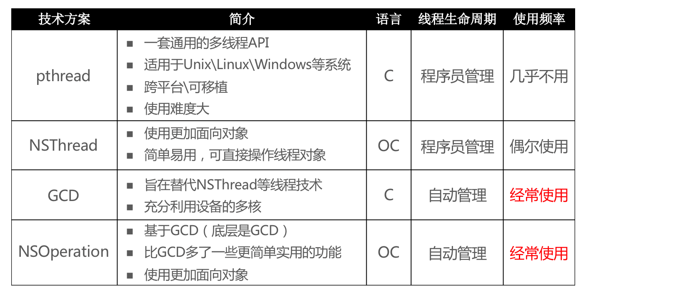


<a id="GCD的队列"></a>

### GCD的队列


### 容易混淆的术语


### 各种队列的执行效果


### 队列组的使用

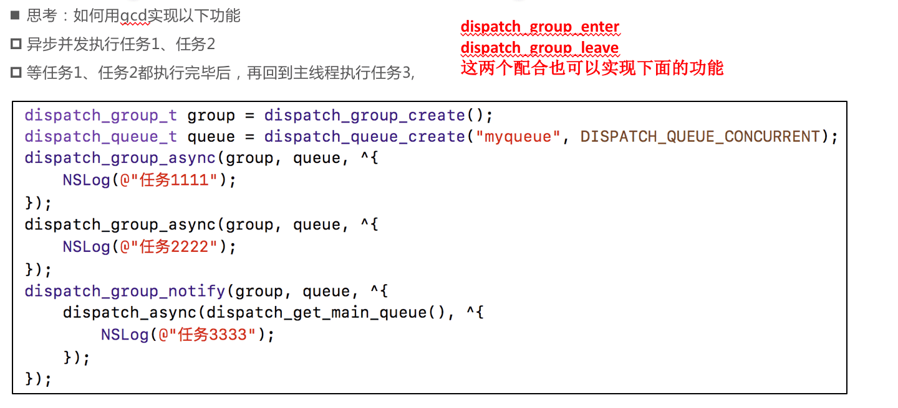


###  GNUstep

* GNUstep是GNU计划的项目之一,他讲cocoa的oc库重新开源了一遍
* 源码地址: [http://www.gnustep.org/resources/downloads.php](http://www.gnustep.org/resources/downloads.php)
* 虽然GNUstep不是苹果官方源码，但还是具有一定的参考价值

<a id="iOS中的线程同步方案"></a>

### iOS中的线程同步方案


### OSSpinLock

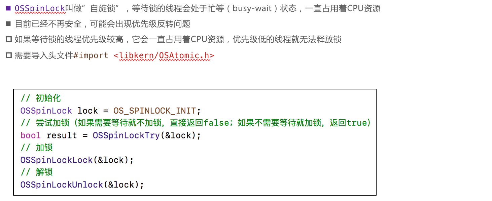

### os_unfair _lock


### pthread_mutex


### pthread_mutex – 递归锁

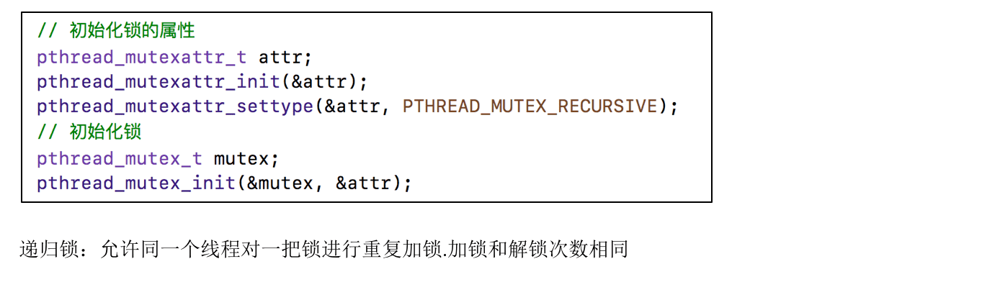

### pthread_mutex – 条件

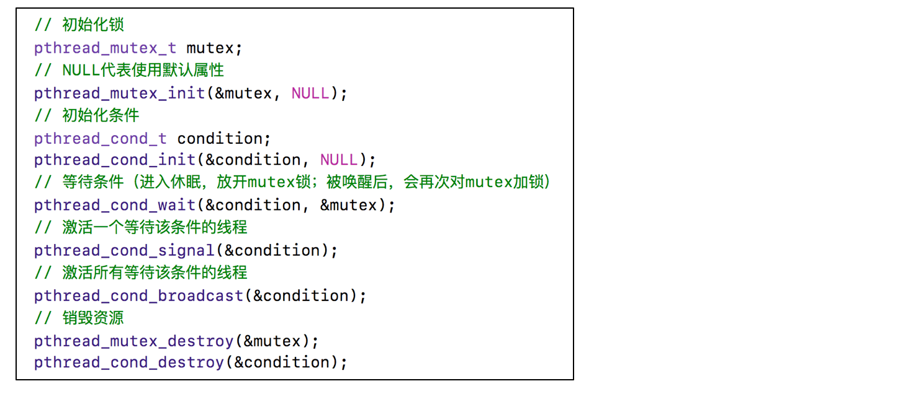


### NSLock、NSRecursiveLock


### NSCondition


### NSConditionLock

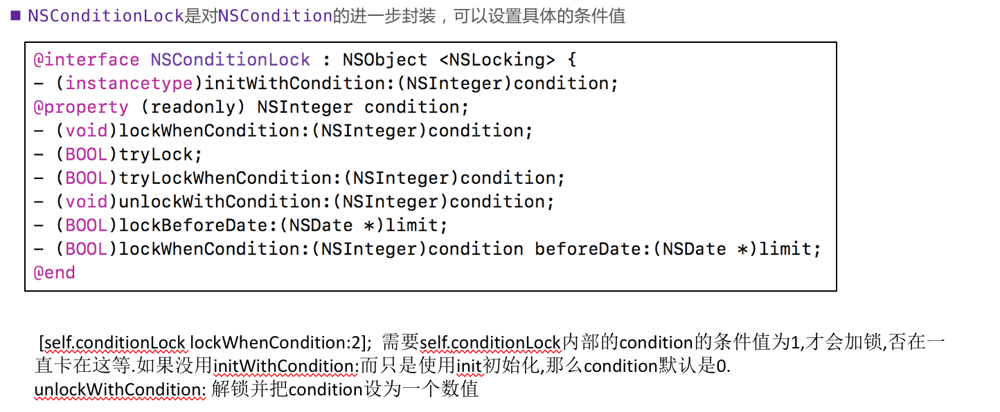


### dispatch_semaphore


### dispatch_queue


### @synchronized

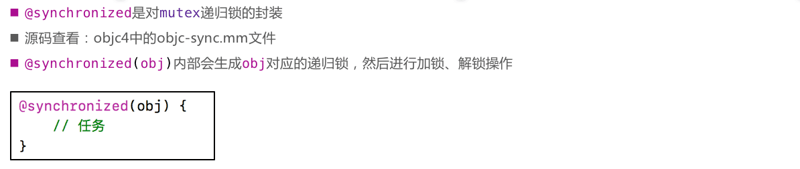

### iOS线程同步方案性能比较


<a id="自旋锁、互斥锁比较"></a>

### 自旋锁、互斥锁比较


### atomic

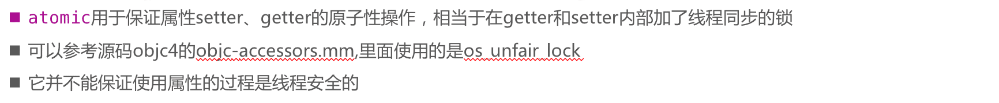

### iOS中的读写安全方案

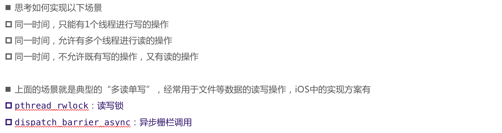

### pthread_rwlock

内部是互斥锁实现

```
typedef struct{
    pthread_mutex_t rw_mutex;// basic lock on this  struct
    pthread_cond_t  rw_condreaders;//for reader
    pthread_cond_t rw_condwriteres;//for writer
    
    int rw_magic;                  //for error checking
    int rw_nwaiterreaders;         //the num of readers
    int rw_nwaiterwirteres;        //the num of writers
    int rw_refcount;               //-1 is writer has this lock else reader has this lock
}pthread_rwlock_t;
```


### dispatch_barrier_async


<a id="内存管理1"></a>

## 内存管理

<a id="定时器"></a>

### 定时器

#### CADisplayLink、NSTimer使用注意

CADisplayLink 基于source1

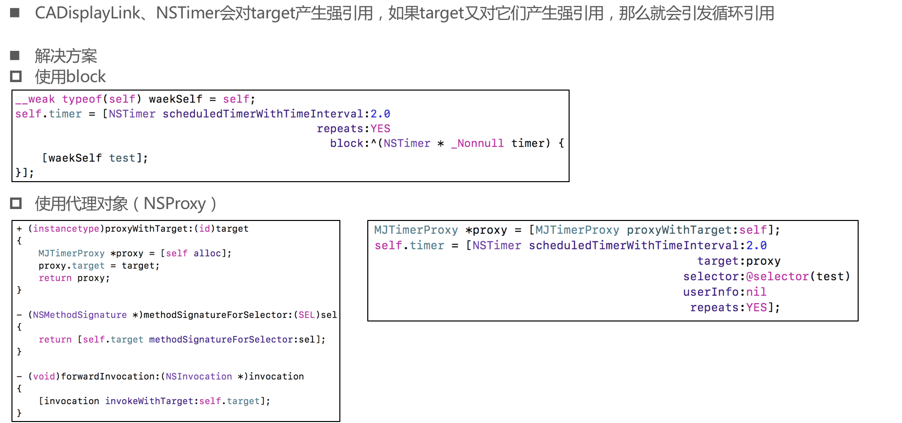

#### GCD定时器

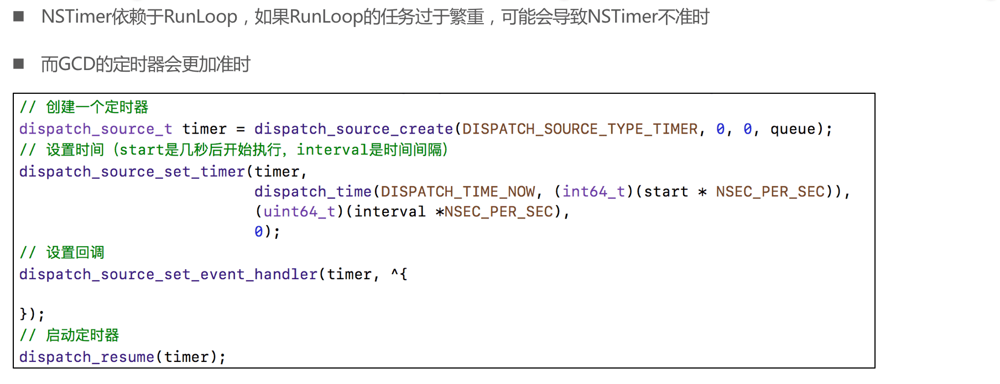

<a id="iOS程序的内存布局"></a>

### iOS程序的内存布局


### Tagged Pointer


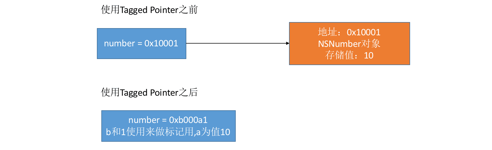

#### 判断是否为Tagged Pointer


### 对象的内存管理

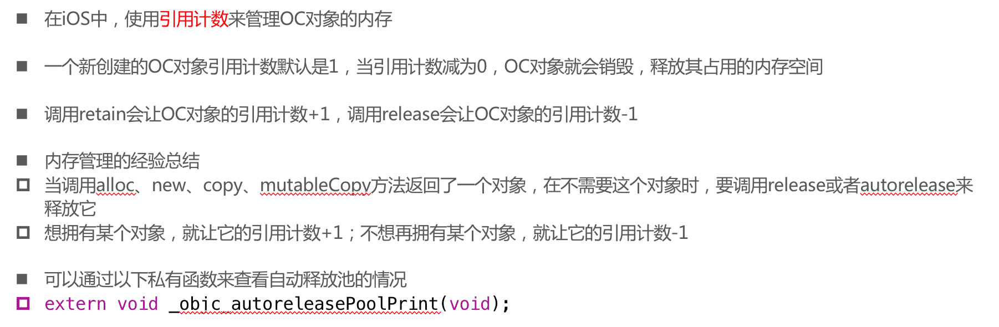

#### copy和mutalbeCopy

* 拷贝的目的: 产生一个副本对象,跟源对象互不影响
	* 修改了源对象,不会影响副本对象
	* 修改了副本对象,不会影响源对象

* iOS提供了2个拷贝方法
	* copy, 不可变拷贝,产生不可变副本
	* mutableCopy, 可变拷贝,产生可变副本

* 深拷贝和浅拷贝
	* 深拷贝: 内容拷贝,产生新的对象
	* 浅拷贝: 指针拷贝,没有产生新的对象


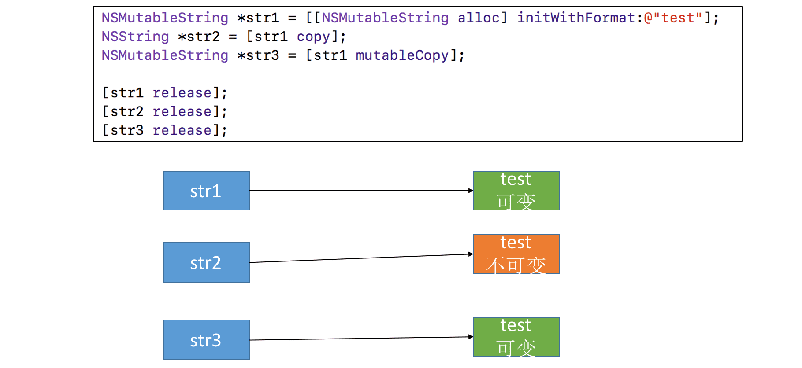


#### 引用计数的存储


#### dealloc


### 自动释放池

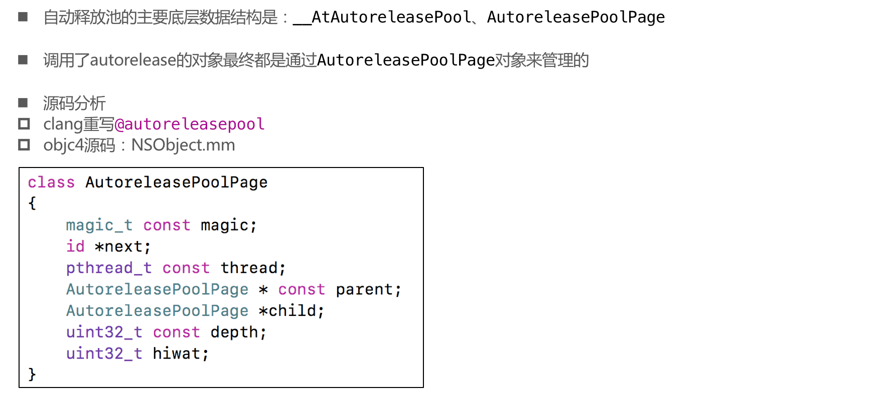

#### AutoreleasePoolPage的结构

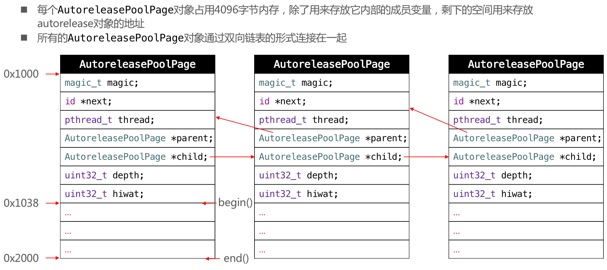

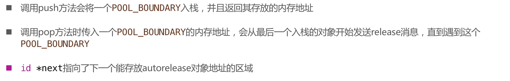

<a id="Runloop和Autorelease"></a>

#### Runloop和Autorelease


<a id="性能优化1"></a>

## 性能优化


### CPU和GPU

* 在屏幕成像的过程中,cpu和gpu起着至关重要的作用
	* cpu(central processing unit,中央处理器)
		* 对象的创建和销毁,对象属性的调整,布局计算,文本的计算和排版,图片的格式转换和解码,图像的绘制(Core Graphics)
	* gpu(graphics processing unit,图形处理器)
		文理的渲染
		
	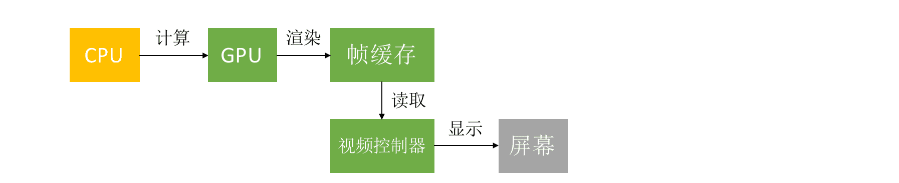
	
	
		
* 在ios中是双缓冲机制,有前帧缓存,后帧缓存

#### 卡顿产生的原因

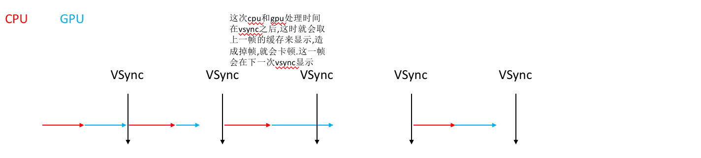

* 卡顿解决的主要思路:
	* 尽可能减少cpu,gpu资源消耗
* 按照40FPS的刷帧率,每隔16ms就会有一次VSync信号

#### 卡顿优化-CPU

* 尽量用轻量级的对象，比如用不到事件处理的地方，可以考虑使用CALayer取代UIView
* 不要频繁地调用UIView的相关属性，比如frame、bounds、transform等属性，尽量减少不必要的修改
* 尽量提前计算好布局，在有需要时一次性调整对应的属性，不要多次修改属性
* Autolayout会比直接设置frame消耗更多的CPU资源
* 图片的size最好刚好跟UIImageView的size保持一致
* 控制一下线程的最大并发数量
* 尽量把耗时的操作放到子线程
	* 文本处理（尺寸计算、绘制）
	* 图片处理（解码、绘制）
		* imageWithName:在将要显示图片的时候才会解码,在主线程.
		* 可以现在子线程解码.先获取UIImage的CGImageRef.再创建一个CGBitmapContextCreate位图上下文,在CGContextDrawImage画到上下文上,再根据上下文生成一个CGImage,再根据这个CGImage生成一个UIImage.就完成解码了
		* SDWebImage也有类似操作

#### 卡段优化GPU

* 尽量避免短时间内大量图片的显示，尽可能将多张图片合成一张进行显示
* GPU能处理的最大纹理尺寸是4096x4096，一旦超过这个尺寸，就会占用CPU资源进行处理，所以纹理尽量不要超过这个尺寸
* 尽量减少视图数量和层次
* 减少透明的视图（alpha<1），不透明的就设置opaque为YES
* 尽量避免出现离屏渲染


#### 离屏渲染

* 在OpenGL中，GPU有2种渲染方式
	* On-Screen Rendering：当前屏幕渲染，在当前用于显示的屏幕缓冲区进行渲染操作
	* Off-Screen Rendering：离屏渲染，在当前屏幕缓冲区以外新开辟一个缓冲区进行渲染操作

* 离屏渲染消耗性能的原因
	* 需要创建新的缓冲区
	* 离屏渲染的整个过程，需要多次切换上下文环境，先是从当前屏幕（On-Screen）切换到离屏（Off-Screen）；等到离屏渲染结束以后，将离屏缓冲区的渲染结果显示到屏幕上，又需要将上下文环境从离屏切换到当前屏幕
* 哪些操作会触发离屏渲染？
	* 光栅化，layer.shouldRasterize = YES
	* 遮罩，layer.mask
	* 圆角，同时设置layer.masksToBounds = YES、layer.cornerRadius大于0
		* 考虑通过CoreGraphics绘制裁剪圆角，或者叫美工提供圆角图片
		* 不设置layer.masksToBounds也会有圆角效果,他的作用是指示sublayer在超出bounds的时候是否被裁剪
	* 阴影，layer.shadowXXX
		* 如果设置了layer.shadowPath就不会产生离屏渲染,如果不设置就会默认围绕整个view


#### 卡顿检测

* 平时所说的"卡顿",主要是因为在主线程执行了比较耗时的操作
* 方法
	* 可以添加observer到主线程runloop中,通过监听runloop状态的切换耗时,达到监控卡顿的目的.可以参考LXDAppFluecyMonitor.里面子线程配合信号量达到耗时检测的操作
	* 还可以用instrument的time profiler来查看主线程哪些方法耗时长
		
		
		
### 耗电优化

#### 耗电的主要来源

* CPU处理,Processing
* 网络, Networking
* 定位, Location
* 图像, Graphics


#### 耗电的优化

* 尽可能降低CPU、GPU功耗

* 少用定时器

* 优化I/O操作
	* 尽量不要频繁写入小数据，最好批量一次性写入
	* 读写大量重要数据时，考虑用dispatch_io，其提供了基于GCD的异步操作文件I/O的	* API。用dispatch_io系统会优化磁盘访问
	* 数据量比较大的，建议使用数据库（比如SQLite、CoreData）

* 网络优化
	* 减少、压缩网络数据
* 如果多次请求的结果是相同的，尽量使用缓存
* 使用断点续传，否则网络不稳定时可能多次传输相同的内容
* 网络不可用时，不要尝试执行网络请求
* 让用户可以取消长时间运行或者速度很慢的网络操作，设置合适的超时时间
* 批量传输，比如，下载视频流时，不要传输很小的数据包，直接下载整个文件或者一大块一大块地下载。如果下载广告，一次性多下载一些，然后再慢慢展示。如果下载电子邮件，一次下载多封，不要一封一封地下载
* 定位优化
	* 如果只是需要快速确定用户位置，最好用CLLocationManager的requestLocation方法。定位完成后，会自动让定位硬件断电
	* 如果不是导航应用，尽量不要实时更新位置，定位完毕就关掉定位服务
	* 尽量降低定位精度，比如尽量不要使用精度最高的kCLLocationAccuracyBest
	* 需要后台定位时，尽量设置pausesLocationUpdatesAutomatically为YES，如果用户不太可能移动的时候系统会自动暂停位置更新
	* 尽量不要使用startMonitoringSignificantLocationChanges，优先考虑startMonitoringForRegion:

硬件检测优化
用户移动、摇晃、倾斜设备时，会产生动作(motion)事件，这些事件由加速度计、陀螺仪、磁力计等硬件检测。在不需要检测的场合，应该及时关闭这些硬件


<a id="启动优化"></a>

### 启动优化

* [https://mp.weixin.qq.com/s?__biz=MzI1MzYzMjE0MQ==&mid=2247486932&idx=1&sn=eb4d294e00375d506b93a00b535c6b05&chksm=e9d0c636dea74f20ec800af333d1ee94969b74a92f3f9a5a66a479380d1d9a4dbb8ffd4574ca&scene=21#wechat_redirect](https://mp.weixin.qq.com/s?__biz=MzI1MzYzMjE0MQ==&mid=2247486932&idx=1&sn=eb4d294e00375d506b93a00b535c6b05&chksm=e9d0c636dea74f20ec800af333d1ee94969b74a92f3f9a5a66a479380d1d9a4dbb8ffd4574ca&scene=21#wechat_redirect)
* [https://www.infoq.cn/article/tx0tcv9h6lkvknokqn7i](https://www.infoq.cn/article/tx0tcv9h6lkvknokqn7i)
* [https://tech.meituan.com/2018/12/06/waimai-ios-optimizing-startup.html](https://tech.meituan.com/2018/12/06/waimai-ios-optimizing-startup.html)

#### APP的启动

* Mach-O

	mach-o是ios的可执行文件格式, 典型的mach-o是主二进制和动态库.分为三部分

	* Header: 最开始是Magic Number表示是一个mach-o文件,还有一些flags会影响解析
	* Load Commands: mach-o布局信息,segment command和Data中的Segment/Section是一一对应的, 除此之外还有依赖的动态库等启动app需要的信息
	* Data: 包含了实际的代码和数据,被分割成很多segment,segment又被分割成很多section分别存放不同的类型数据. 标准的3个segment是TEXT,DATA,LINKEDIT
		* TEXT,代码段,只读可执行,存储函数的二进制代码,常量字符串,OC的类/方法名信息
		* DATA,数据段,读写,存储OC的的字符串cfstring,已经运行时的元数据:class/protocol/method,还有全局变量,静态变量
		* LINKEDIT,q启动app需要的信息,必须bind,rebase地址,代码签名,符号表
	

	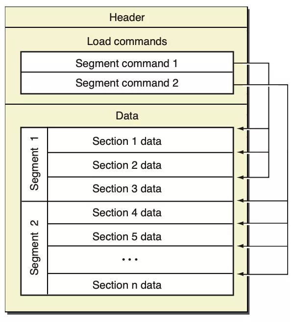


* dyld

	* dyld主要有两个版本dyld2和dyld3
	* dyld2一直到ios12,一个比较大的优化就是dyld share cache,把系统库(UIKit等)合成一个大的文件,提高加载性能的缓存文件
	* dyld3从ios13开始,增加启动闭包,包含了启动需要的缓存信息,提高启动速度
	* dyld3如果优化启动速度? 启动闭包里面都有什么?
		* dependends 依赖动态库列表,将动态库的依赖信息初始化顺序保存
		* fixup：bind & rebase的地址
			* rebase: 修复内部指针mach-o加载到虚拟内存后有一个偏移地址slide,需要把内部的指针加上这个偏移
			* bind: 修复外部指针,像printf这种外部函数要等运行才知道地址,bind就是将指针指向这个地址
			* 比如oc字符串`NSString *str = @"1234";`TEXT段存储cstring"1234",假设地址为`0x10`,DATA段存储cfstring,oc字符串的元数据.rebase就是把mmap后指针`0x10`加上slide变成`0x1010`.运行时类对象的地址已经知道了,bind就是把isa指向实际内存地址
		* 闭包中包含oc元数据如类方法等信息
		* 初始化调用数据
		* uuid等

 * APP的启动可以分为2种
	* 冷启动（Cold Launch）：从零(重启/升级系统/升级app)开始启动APP
	* 热启动（Warm Launch）：存在缓存闭包情况下的启动

* APP启动时间的优化，主要是针对冷启动进行优化

	通过添加环境变量可以打印出APP的启动时间分析（Edit scheme -> Run -> Arguments）
DYLD_PRINT_STATISTICS设置为1

	如果需要更详细的信息，那就将DYLD_PRINT_STATISTICS_DETAILS设置为1

* 虚拟内存
	* 物理内存,实际占用的内存
	* 虚拟内存,在物理内存之上建立的一层逻辑内存,保证内存安全的同事为应用提供了连续的地址空间
	* 物理内存和虚拟内存以页为单位映射,但映射关系不是一一对应,一页物理内存可能对应多页虚拟内存,一页虚拟内存也可能不占用物理内存
	* iphone6s之前Page是4k,之后是16k

* mmap

	* memory map,一种内存映射技术,把文件映射到虚拟内存的地址空间,这样就可以像直接操作内存来读写文件
	* 当读取的虚拟内存对应的物理内存中不存在的时候,会触发File Backed Page In把对应的内容读入物理内存
	* 启动的时候,mach-o通过mmap映射到虚拟内存里面,如下图.zero fill是因为全局变量的初始化一般都是0, 这些0没必要存在mach-o中,操作系统会识别出这些页,在Page In之后对其置零
	
	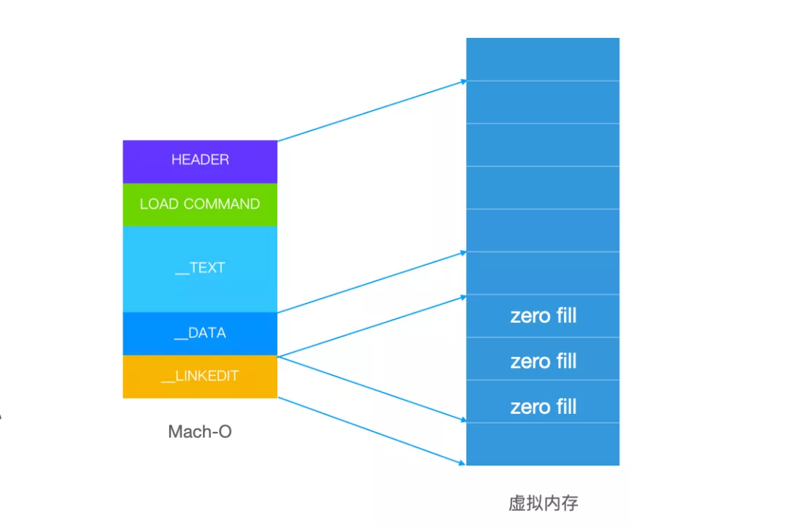
	
* Page In
	
	启动的路径上会触发很多次Page In,启动会读写二进制中的很多内容,Page In占用启动消耗中很大一部分,如下图

	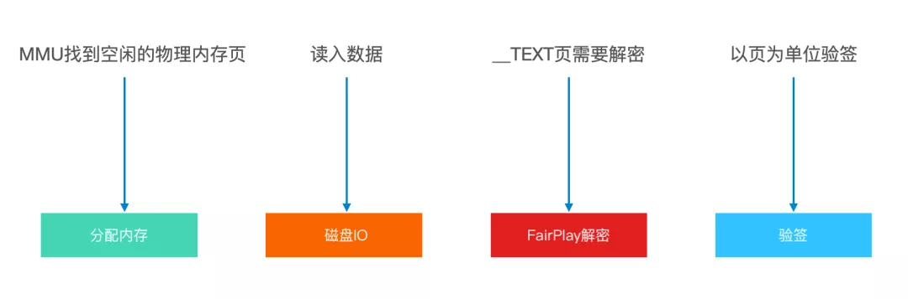
	
	* MMU找到空闲的物理内存页面
	* 触发磁盘IO,把数据读入物理内存
	* 如果是TEXT段的页,需要进行解密
	* 对解密后的页,进行签名验证

	解密是大头,IO其次. iTunes Connect会对上传的mach-o的TEXT段
	惊醒加密,防止ipa下载了可以直接看到代码,逆向中的脱壳就是对TEXT的加密.iOS13优化了这个过程,Page In的时候不需要解密

* 二进制重排

	Page In优化.启动具有局部性特征. 少部分函数在启动的使用用到,这些函数在二进制中的分布是零散的.Page In读入的数据利用率不高.如果我们可以把启动用到的函数排到连续的区间,那么就可以减少Page In的次数,从而优化启动时间.
	
	下面method1和method3是启动的时候用到的, 需要2次Page In,如果把method1和method3排列到一起,那么只需要1次Page In,从而提升启动速度
	
	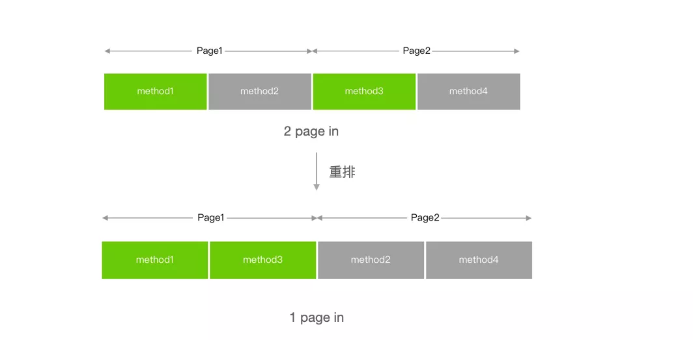
	
	连接器ld有个参数`-order_file`支持按照符号方式排列二进制

* ipa 构建流程
	
	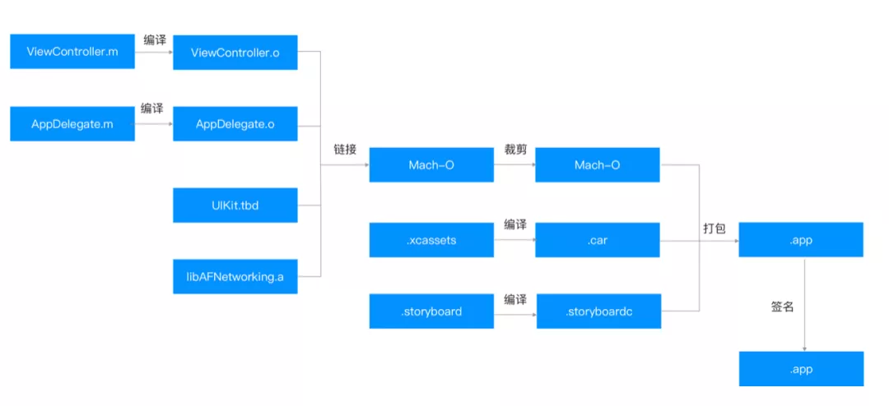
	
	* 编译: 源文件(.m/.c/.swift)单独编译,输出对应的目标文件.o.
		* 编译分为前端和后端,二者以IR中间代码作为媒介,这样前后端可以独立变化
		* c语言家族前端是clang,swift前端是swiftc,二者后端都是llvm
		* 前端负责预处理,词法语法分析,生成IR
		* 后端基于IR做优化,生成机器码

	* 连接: 目标文件,动态库,静态库一起连接出最后的Mach-O.
		* 动态库.tbd,只提供包含符号的tbd文件
		
	* 裁剪: 编译完mach-o之后会进行裁剪,比如调试信息
	* 资源文件如storyboard,asset也会编译,编译后加载速度会更快
	* mach-o和资源文件一起打包处最后的app
	* 对app签名,防篡改,保证文件内容不多不少
	

* APP的冷启动main之前
	* exe()系统分配进程
	* mmap加载可执行文件
	* 读取可执行文件中load command中dyld地址加载dyld
	* **dyld加载其他动态库**:Dyld从主执行文件的header获取到需要加载的所依赖动态库列表，然后它需要找到每个 dylib，而应用所依赖的 dylib 文件可能会再依赖其他 dylib，所以所需要加载的是动态库列表一个递归依赖的集合
	* **Rebase**: Rebase在Image内部调整指针的指向。在过去，会把动态库加载到指定地址，所有指针和数据对于代码都是对的，而现在地址空间布局是随机化，所以需要在原来的地址根据随机的偏移量做一下修正
	* **Bind**: Bind是把指针正确地指向Image外部的内容。这些指向外部的指针被符号(symbol)名称绑定，dyld需要去符号表里查找，找到symbol对应的实现
	* Objc setup:
		* 注册Objc类 (class registration)
		* 把category的定义插入方法列表
		* 保证每一个selector唯一
	* Initializers:
		*  Objc的+load()函数
		*  C++的构造函数属性函数
		*  非基本类型的C++静态全局变量的创建(通常是类或结构体)
	* main: dyld最后会调用main

	
	
	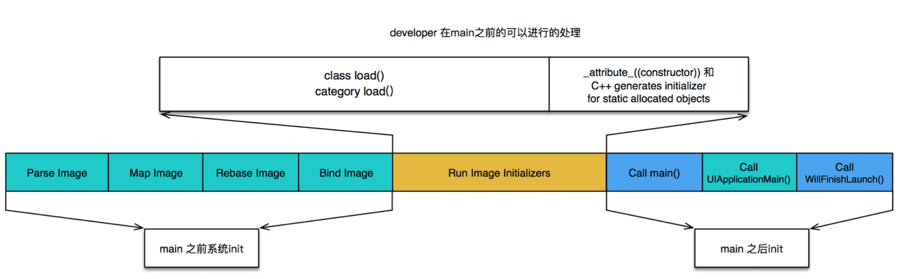

#### 启动统计

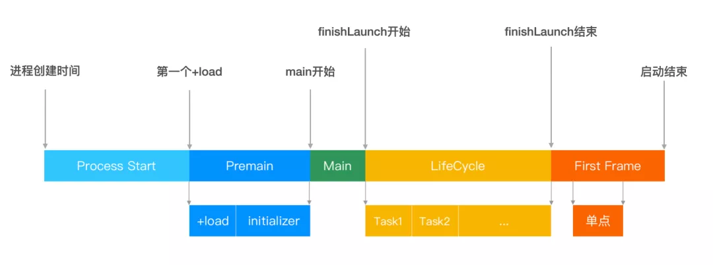

* 进程开始时间可以根据进程identifier从`sysctl`系统调用获得
* 第一个+load,命名一个AAA的pod,实现一个AAA类的是+load,load的调用顺序跟连接顺序有关, xcode运行日志里面有记录
* 第一帧渲染完事,通过监听runloop的before waiting

#### APP的启动 - dyld

 * dyld（dynamic link editor），Apple的动态链接器，可以用来装载Mach-O文件（可执行文件、动态库等）

 * 启动APP时，dyld所做的事情有
	* 装载APP的可执行文件，同时会递归加载所有依赖的动态库
	* 当dyld把可执行文件、动态库都装载完毕后，会通知Runtime进行下一步的处理

	
#### APP的启动 - runtime

* 启动APP时，runtime所做的事情有
	* 调用map_images进行可执行文件内容的解析和处理
	* 在load_images中调用call_load_methods，调用所有Class和Category的+load方法
	* 进行各种objc结构的初始化（注册Objc类 、初始化类对象等等）
	* 调用C++静态初始化器和__attribute__((constructor))修饰的函数

* 到此为止，可执行文件和动态库中所有的符号(Class，Protocol，Selector，IMP，…)都已经按格式成功加载到内存中，被runtime 所管理

#### APP的启动 - main

总结一下

* APP的启动由dyld主导，将可执行文件加载到内存，顺便加载所有依赖的动态库
* 并由runtime负责加载成objc定义的结构
* 所有初始化工作结束后，dyld就会调用main函数
* 接下来就是UIApplicationMain函数，AppDelegate的application:didFinishLaunchingWithOptions:方法

#### 分阶段/优先级启动

* 为了实现启动项维护方式可插拔,启动项之间,业务模块之间不耦合, 采用业务启动模块自注册的方式. 实现上是: 
* 通过 `__attribute__((section("name")))`的方式将数据写到数据段, 如下所示,used是作用是不要优化掉这个信息, 及时没有使用到. 具体写法如下

```objective-c
#define DYAppDelegateServiceRegister(_class_, _priority_)                      \
    __attribute__(                                                             \
        (used)) static struct DYAppDelegateMetaInfo DYADModule##_class_        \
        __attribute((used, section("__DATA,__DYADKitSvcs"))) = {               \
            .className = #_class_, .priority = _priority_,                     \
    };
    
/**
 * 由数据段读取 服务列表
 */
static void dyld_callback(const struct mach_header *mhp, intptr_t vmaddr_slide)
{
    unsigned long size = 0;
#ifndef __LP64__
    uintptr_t *memory = (uintptr_t *)getsectiondata(
        mhp, SEG_DATA, DYAppDelegateServiceSectName, &size);
#else
    const struct mach_header_64 *mhp64 = (const struct mach_header_64 *)mhp;
    uintptr_t *memory = (uintptr_t *)getsectiondata(
        mhp64, SEG_DATA, DYAppDelegateServiceSectName, &size);
#endif

    unsigned long count = size / sizeof(struct DYAppDelegateMetaInfo);
    struct DYAppDelegateMetaInfo *items =
        (struct DYAppDelegateMetaInfo *)memory;

    for (int index = 0; index < count; index++) {
        NSString *classStr =
            [NSString stringWithUTF8String:items[index].className];
        NSInteger priority = items[index].priority;
        if (!classStr) {
            continue;
        }

        if (classStr) {
            DYAppDelegateServiceItem *item =
                [[DYAppDelegateServiceItem alloc] init];
            Class cls = NSClassFromString(classStr);

            if (cls) {
                item.service = [cls new];
                item.priority = priority;

                [[DYAppDelegateServiceManager sharedManager]
                    registerService:item];
            }
        }
    }
}

__attribute__((constructor)) void initProphet()
{
    _dyld_register_func_for_add_image(dyld_callback);
}

```

* 使用`__attribute__((constructor))`读取代码的数据(main函数之前),加载服务实例到manager
* 在appdelegate中将消息转发到manager,分发给各个服务
* 将各个服务的任务加到`DYLaunchEventManager`中,分阶段执行.阶段包括 开始启动,同意协议,开始首页ui,launch结束,首页ui加载结束(tabbar didappear),app空闲时间
* 最后的空闲时间会将任务放在runloop空闲时间,(打点,礼物,资源配置等)


#### APP的启动优化

* 按照不同的阶段
	* dyld
		* 减少动态库、合并一些动态库（定期清理不必要的动态库）
		* 减少Objc类、分类的数量、减少Selector数量（定期清理不必要的类、分类）
		* 减少C++虚函数数量
		* Swift尽量使用struct

	* runtime
		* 用+initialize方法和dispatch_once取代所有的__attribute__((constructor))、C++静态构造器、ObjC的+load,load可能会触发page in

	* main
		* 在不影响用户体验的前提下，尽可能将一些操作延迟，不要全部都放在finishLaunching方法中
		* 按需加载
* 优化tips
	* +load迁移,利用clang attribute的 `attribute((section)())`.
		* section()函数提供了二进制段的读写能力,可以将一些编译器就可以确定的常量写入到数据段.在编译期，编译器会将标记了 `attribute((section()))` 的数据写到指定的数据段中，例如写一个{key(key代表不同的启动阶段), *pointer}对到数据段。到运行时，在合适的时间节点，在根据key读取出函数指针
		* 可以通过`_dyld_register_func_for_add_image`去读取数据段的内容
		* 这样可以减少load的page in
		
	* 下线无用代码,用AppCode扫描.或者扫描mach-o
		* `_objc_selrefs` 和 `_objc_classrefs` 存储了引用到的 sel 和 class
		* `__objc_classlist` 存储了所有的 sel 和 class然后做差集

	* SDK启动延迟,比如分享,登录
	* 高频plist或者UserDefault做内存缓存
	* 启动用到的图片尽量放在asset中不要放bundle,asset加载快
	* 首帧优化
		* 动图,可以先展示静态图, 首帧出来再播动态
		* autolayout看看能否改frame
		* 用time profiler检查启动

### 安装包优化

* 安装包（IPA）主要由可执行文件、资源组成

* 资源（图片、音频、视频等）
	* 采取无损压缩
	* 去除没有用到的资源： [https://github.com/tinymind/LSUnusedResources](https://github.com/tinymind/LSUnusedResources)

* 可执行文件瘦身
	* 编译器优化
		* Strip Linked Product、Make Strings Read-Only、Symbols Hidden by Default设置为YES
		* 去掉异常支持，Enable C++ Exceptions、Enable Objective-C Exceptions设置为NO， Other C Flags添加-fno-exceptions

		* 利用AppCode（[https://www.jetbrains.com/objc/](https://www.jetbrains.com/objc/)）检测未使用的代码：菜单栏 -> Code -> Inspect Code.可以检测出没有用到的类和方法

		* 编写LLVM插件检测出重复代码、未被调用的代码

#### LinkMap

* 生成LinkMap文件，可以查看可执行文件的具体组成

	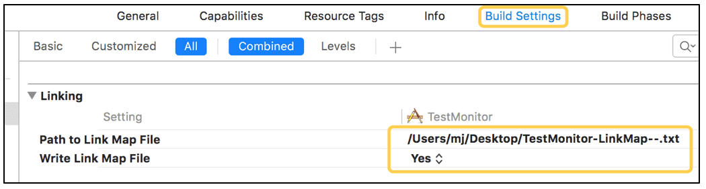

* 可借助第三方工具解析LinkMap文件： [https://github.com/huanxsd/LinkMap](https://github.com/huanxsd/LinkMap)


<a id="设计模式与架构1"></a>

## 设计模式与架构

###  何为架构

* 架构（Architecture）
	* 软件开发中的设计方案
	* 类与类之间的关系、模块与模块之间的关系、客户端与服务端的关系

* 经常听到的架构名词
	* MVC、MVP、MVVM、VIPER、CDD
	* 三层架构、四层架构
	* ......


#### MVC-Apple版


* 优点 : view,model可以重复利用,可以独立使用
* 缺点 : controller的代码过于臃肿


#### MVC-变种


* 优点 : 对controller进行瘦身,将view内部细节封装起来了,外界不知道view内部的具体实现
* 缺点 : view依赖于model


#### MVP


* controller在这里用来管理presenter
* presenter可以弱引用controller,方便将view添加到viewController上
* presenter将model数据整合到view上,处理view的事件
* controller可以拥有根据业务需要多个presenter


#### MVVM


跟MVP共同点:

* 将view跟model的逻辑扔到vm中,控制器只需管理viewmodel就可以

不同点: 

* view可以监听viewmodel里面数据的改变,view的显示跟着改变
* view会拥有viewmodel,然后设置监听
* 监听可以使用RAC,KVOController


#### 三层,四层架构


### 设计模式

* 设计模式(design pattern)
	* 是一套被反复使用,代码设计经验的总结,类跟类的关系,某个放啊的设计思路
	* 使用设计模式的好处: 可重用代码,让代码更容易被他人理解,保证代码的可靠性
	* 一般与编程语言无关,是一套比较成熟的编程思想

* 设计模式可以分为三大类
	* 创建型模式: 对象实例化的模式,用于解耦对象的实例化过程
		* 单例模式,工厂模式等等
	* 结构型模式: 把类或者对象结合在一起形成一个更大的结构
		* 代理模式(不是delegate,ios中NSProxy就比较像),适配器模式,组合模式,装饰模式,等等
	* 行为模式: 类或对象之前如何交互,以及划分责任和算法
		* 观察者模式,命令模式,责任链模式等等