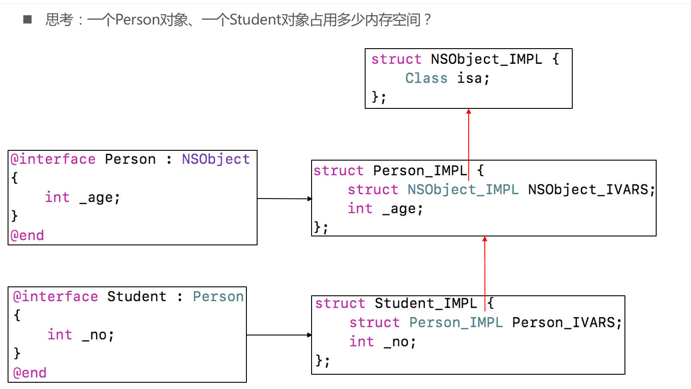
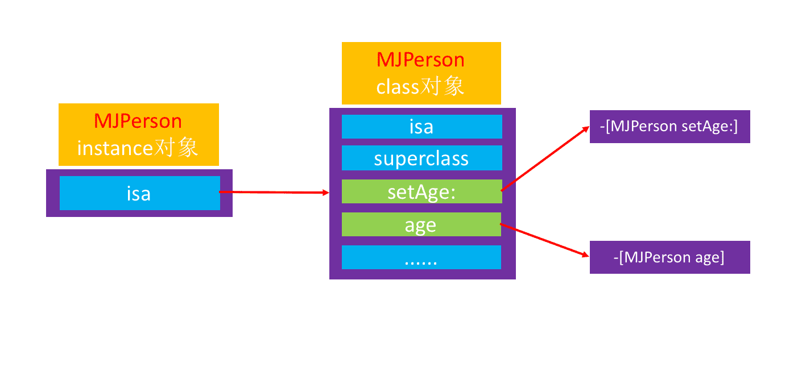
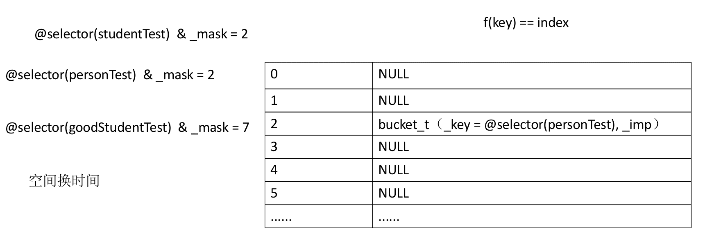

## 目录

* <a href="#面向对象0">面向对象问题</a> , <a href="#面向对象1">面向对象知识点</a> 
* <a href="#KVO0">KVO问题</a> , <a href="#KVO1">KVO知识点</a> 
* <a href="#KVC0">KVC问题</a> , <a href="#KVC1">KVC知识点</a> 
* <a href="#Category0">Category问题</a> , <a href="#Category1"> Category知识点</a> 
* <a href="#Block0">Block问题</a> , <a href="#Block1">Block知识点</a>
* <a href="#Runtime0">Runtime问题</a> , <a href="#Runtime1">Runtime知识点</a>


<a id="面向对象0"></a>

### 面向对象

* **一个NSObject对象占用多少内存？**
 
	系统分配了16个字节给NSObject对象（通过`malloc_size`,runtime.h头文件函数获得）,oc对象的allocwithzone:的内部分配内存的时候,会按照16的倍数分配,方便操作系统分配内存.这个可以看libmalloc源码,[https://opensource.apple.com/tarballs/](https://opensource.apple.com/tarballs/)
	
	但NSObject对象内部只使用了8个字节的空间（64bit环境下，可以通过`class_getInstanceSize`函数获得）.`class_getInstanceSize`获得NSObject实例对象的成员变量所占用的大小8.转成C++后是一个`NSObject_IMPL`的结构体,这个结构体中只有一个isa的成员变量.如果一个类继承NSObject并且有一个long类型的成员变量,那么用`class_getInstanceSize`获取到的为16字节.如果不是long是int类型,还是16.因为结构体对齐.8+4=12然后在对齐.他和sizeof的区别:sizeof是运算符,一编译就会生成一个常数,他传入的参数是类型.`class_getInstanceSize`传入的是一个对象,是程序运行时的

*  **对象的isa指针指向哪里？**

	* instance对象的isa指向class对象
	* class对象的isa指向meta-class对象
	* meta-class对象的isa指向基类的meta-class对象

* **OC的类信息存放在哪里？**
	* 对象方法、属性、成员变量、协议信息，存放在class对象中
	* 类方法，存放在meta-class对象中
	* 成员变量的具体值，存放在instance对象

<a id="KVO0"></a>

### KVO

* **iOS用什么方式实现对一个对象的KVO？(KVO的本质是什么？)**

	利用RuntimeAPI动态生成一个子类，并且让instance对象的isa指向这个全新的子类
当修改instance对象的属性时，会调用Foundation的`_NSSetXXXValueAndNotify`函数,这个函数会调用下面方法

	willChangeValueForKey:

	父类原来的setter

	didChangeValueForKey:
	内部会触发监听器（Oberser）的监听方法( observeValueForKeyPath:ofObject:change:context:）
	
* **如何手动触发KVO？**

	手动调用willChangeValueForKey:和didChangeValueForKey:(这个会检查willChange...有没有调用)
	
* **直接修改成员变量会触发KVO么？**
	
	不会触发KVO

<a id="KVC0"></a>

### KVC

* **通过KVC修改属性会触发KVO么？**
	
	会触发KVO.即使只声明成员变量,没有setter方法.也会触发.说明`setValue:forKey:`内部会做willChangeValueForKey:和didChangeValueForKey:
	
* **KVC的赋值和取值过程是怎样的？原理是什么？**

	<a href="#__kvc">看下面KVC原理</a>

<a id="Category0"></a>

### Category

* **Category的使用场合是什么？**

	一个类拆解模块...

* **Category的实现原理**

	Category编译之后的底层结构是struct category_t，里面存储着分类的对象方法、类方法、属性、协议信息
	
	在程序运行的时候，runtime会将Category的数据，合并到类信息中（类对象、元类对象中）
	
* **Category和Class Extension的区别是什么？**

	Class Extension在编译的时候，它的数据就已经包含在类信息中
	
	Category是在运行时，才会将数据合并到类信息中

* **Category中有load方法吗？load方法是什么时候调用的？load 方法能继承吗？**

	有load方法
	
	load方法在runtime加载类、分类的时候调用
	
	load方法可以继承，但是一般情况下不会主动去调用load方法，都是让系统自动调用

* **load、initialize方法的区别什么？它们在category中的调用的顺序？以及出现继承时他们之间的调用过程？**

	* 调用方式
		* load是根据函数地址直接调用
		* initialize是通过objc_msgSend调用
	* 调用时刻
		* load是runtime加载类,分类的时候调用(只调用一次)
		* initialize是类第一次接受到消息的时候调用.每一个类只会initilaize一次(父类的initialize可能会被调用多次)
	* load,initialize调用用顺序?
	* load:
		* 先调用类的load,先编译的类,优先调用load,调用子类的load之前会先调用父类的load
		* 再调用分类的load.先编译的分类,有限调用load
	* initialzie
		* 先初始化父类,再初始化子类(可能最终调用的是父类的initialize方法)

* **Category能否添加成员变量？如果可以，如何给Category添加成员变量？**

	如果是类,写一个属性,编译器在编译的时候会自动声明setter和getter方法声明和实现.还会添加一个成员变量
	
	如果是分类,他只会自动添加setter和getter方法的声明
	
	不能直接给Category添加成员变量，但是可以间接实现Category有成员变量的效果


<a id="Block0"></a>

### Block


* **block的原理是怎样的？本质是什么？**

	封装了函数调用以及调用环境的OC对象 

* **__block的作用是什么？有什么使用注意点？**

	<a href="#__block修饰符">看下面</a>

* **block的属性修饰词为什么是copy？使用block有哪些使用注意？**

	block一旦没有进行copy操作，就不会在堆上
	
	使用注意：循环引用问题

* **block在修改NSMutableArray，需不需要添加__block？**

	不需要.
	
	```objective-c
	NSMutableArray *array = [NSMutableArray array];
	dispatch_block_t block = ^{
		[array addObject:@1];
	};
	```
	
<a id="Runtime0"></a>	

### Runtime


* **讲一下 OC 的消息机制**

	OC中的方法调用其实都是转成了`objc_msgSend`函数的调用，给receiver（方法调用者）发送了一条消息（selector方法名）
	
	`objc_msgSend`底层有3大阶段
消息发送（当前类、父类中查找）、动态方法解析、消息转发

* **消息转发机制流程**

	<a href="#__objc_msgSend">看下面</a>
	
* **什么是Runtime？平时项目中有用过么？**

	OC是一门动态性比较强的编程语言，允许很多操作推迟到程序运行时再进行
	OC的动态性就是由Runtime来支撑和实现的，Runtime是一套C语言的API，封装了很多动态性相关的函数
	平时编写的OC代码，底层都是转换成了Runtime API进行调用

	具体应用
	
	 * 利用关联对象（AssociatedObject）给分类添加属性
	 *	遍历类的所有成员变量（修改textfield的占位文字颜色、字典转模型、自动归档解档）
	* 交换方法实现（交换系统的方法）
	* 利用消息转发机制解决方法找不到的异常问题
	......

<a id="面向对象1"></a>

## 面向对象

### OC的本质

* 我们平时编写的Objective-C代码，底层实现其实都是C\C++代码
* 将Objective-C代码转换为C\C++代码

	`xcrun  -sdk  iphoneos  clang  -arch  arm64  -rewrite-objc  OC源文件  -o  输出的CPP文件`

	`如果需要链接其他框架，使用-framework参数。比如-framework UIKit`
	
### OC对象的本质




### 常用LLDB指令

```
memory read/数量,格式,字节数 内存地址 
memory read 可以简写成x

格式
x是16进制，f是浮点，d是10进制
字节大小
b：byte 1字节，h：half word 2字节
w：word 4字节，g：giant word 8字节

x/3xg 0x1007284a0 是读取0x1007284a0开始的3段8字节的16进制数据
```

xcode实时查看内存数据,Debug->Debug Workflow ->View Memory

### OC对象获取信息注意点

* 下面代码获取的是class对象不是meta-class对象

	```objective-c
	Class objectClass = [[NSObject class]class];
	```

* 下面两个函数,方法的区别

	```objective-c
	<objc/runtime.h>
	object_getClass(id _Nullable obj)  //传入一个对象,返回isa指向的Class
	objc_getClass(const char * _Nonnull name) //传入一个字符串,返回一个类对象.不回返回一个元类对象.
	- (Class)class{
		return self->isa;	
	}
	+ (Class)class{
		return self;
	}
	这两个返回的就是类对象
	```
	
* 判断是否是元类对象

	```objective-c
	class_isMetaClass(); //传入一个对象,可以是实例对象,可以是类对象
	```
	

### isa

#### 对象isa指向


#### isa,superclass总结


### Class的结构

#### isa 指针

isa在64位之前是直接指向class或meta-class,64位之后要`&ISA_MASK`


#### objc4源码

* 类对象和元类对象都是Class类型,是一个`struct objc_class`

	

* `struct objc_class`的结构

	


<a id="KVO1"></a>

### KVO

* 未使用KVO监听的对象



* 使用了KVO监听的对象


* 怎么看setAge:调用的是_NSSetIntValueAndNotify
	
	```objective-c
	// 在self.person添加监听后,获取self.person的setAge:的方法实现
	NSLog(@"%p",[self.person methodForSelector:@selector(setAge:)]); //0x1069189e4
	// 打断点在lldb中输入p (IMP)0x1069189e4 
	// 输出 (IMP) $1 = 0X00000001069189E4 (Foundation `_NSSetIntValueAndNotify`)
	```


<a id="KVC1"></a>

<a id="__kvc"></a>

### KVC

* key-value coding 键值编码 常见api

	```objective-c
	常见的API有
	- (void)setValue:(id)value forKeyPath:(NSString *)keyPath;
	- (void)setValue:(id)value forKey:(NSString *)key;
	- (id)valueForKeyPath:(NSString *)keyPath;
	- (id)valueForKey:(NSString *)key; 
	```
	
#### setValue:ForKey:原理
	


#### valueForKey:原理


<a id="Category1"></a>

### Category


* 分类的方法,协议,属性是程序运行时加载的

#### category的底层结构


#### Category的加加载处理过程


#### Category方法存放,load方法


### +load方法


### +initialize方法


### 关联对象

* 默认情况下，因为分类底层结构的限制，不能添加成员变量到分类中。但可以通过关联对象来间接实现

* 关联对象提供了以下API

	```objective-c
	添加关联对象
	void objc_setAssociatedObject(id object, const void * key,
	                                id value, objc_AssociationPolicy policy)
	
	获得关联对象
	id objc_getAssociatedObject(id object, const void * key)
	
	移除所有的关联对象
	void objc_removeAssociatedObjects(id object)
	```

* objc_AssociationPolicy

	
	
* key的常见用法

	```objective-c
	// 存全局变量的地址,如果不希望外界修改可以加const
	static void *MyKey = &MyKey;
	objc_setAssociatedObject(obj, MyKey, value, OBJC_ASSOCIATION_RETAIN_NONATOMIC)
	objc_getAssociatedObject(obj, MyKey)
	
	static char MyKey;
	objc_setAssociatedObject(obj, &MyKey, value, OBJC_ASSOCIATION_RETAIN_NONATOMIC)
	objc_getAssociatedObject(obj, &MyKey)
	
	使用属性名作为key
	objc_setAssociatedObject(obj, @"property", value, OBJC_ASSOCIATION_RETAIN_NONATOMIC);
	objc_getAssociatedObject(obj, @"property");
	
	使用get方法的@selecor作为key
	objc_setAssociatedObject(obj, @selector(getter), value, OBJC_ASSOCIATION_RETAIN_NONATOMIC)
	objc_getAssociatedObject(obj, @selector(getter))
	```

### 关联对象实现原理


<a id="Block1"></a>


### Block


### block的本质


### block的变量捕获（capture）

* 为了保证block内部能够正常访问外部的变量，block有个变量捕获机制


	
	
### auto变量的捕获


### block的类型


### block的copy

* arc环境下,编译器会根据情况自动将栈上的block复制到堆上,比如以下情况
	* block作为函数返回值时
	* 将block赋值给`__strong`指针时
	* block作为Cocoa API中方法名还有usingBlock的方法参数时
	* block作为GCD API的方法参数时

* MRC下block属性的建议写法
	* `@property(copy, nonatomic) void(^block)(void);`

* ARC下block属性的建议写法
	* `@property(strong, nonatomic) void(^block)(void);`
	* `@property(copy, nonatomic) void(^block)(void);`


### 对象类型的auto变量

* 当block内部访问了对象类型的auto变量时
	* 如果block是在栈上的,将不会对auto变量产生强引用
	* 如果block被拷贝到堆上
		* 会调用block内部的copy函数,在Desc里面
		* copy函数内部会调用`_Block_object_assign`函数
		* `_Block_object_assign`函数会根据auto变量的修饰符(`__strong,__weak,__unsafe_unretained`)做出相应的操作,行成强引用(retain)或者弱引用
	* 如果block从堆上移除
		* 会调用block内部的dispose函数
		* dispose函数内部会调用`_Block_object_dispose`函数
		* `_Block_object_dispose`函数会自动释放引用的auto变量(release)

	
	

### __weak问题解决

* 在使用clang转换oc为c++代码时,可能会遇到以下问题

	```
	cannot create __weak reference in file using manual reference
	```
	
* 解决方法: 支持arc,指定运行时系统版本,比如

	```
	xcrun -sdk iphoneos clang -arch arm64 -rewrite-objc -fobjc-arc -fobjc-runtime=ios-8.0.0 main.m
	```
	
<a id="__block修饰符"></a>
	
### __block修饰符


### __block的内存管理


### __block变量包装的结构体中的__forwarding指针


### 对象类型的auto变量、__block变量


### 被__block修饰的对象类型


#### 两个copy函数??

当`__block`修饰对象类型时候,包装的结构体`__Block_byref...`里面会多一个copy和dispose函数.他们和block结构体里面的copy和dispose函数的联系


### 解决循环引用 ARC


### 解决循环引用 MRC


<a id="Runtime1"></a>

## Runtime

* oc是一门动态性比较强的编程语言,跟c,c++有着恨到不同
* oc的动态性是由runtime api来支撑的
* runtime api提供的接口基本都是c语言的,源码有c\c++\汇编语言编写


#### isa详解


#### 位域


### Class的结构


#### class_rw _t


#### class_ro _t


#### method_t


#### Type Encoding


### 方法缓存




<a id="__objc_msgSend"></a>

### objc_msgSend


* oc中的方法调用,其实都是转换成`objc_msgSend`函数的调用
* `objc_msgSend`的执行流程流程可以分为3大阶段
	* 消息发送
	* 动态方法解析
	* 消息转发

#### objc_msgSend执行流程01-消息发送


#### objc_msgSend执行流程02-动态方法解析


#### 动态添加方法


#### objc_msgSend的执行流程03-消息转发


```objective-c
- (id)forwardingTargetForSelector:(SEL)aSelector{
    return nil;
}
- (NSMethodSignature *)methodSignatureForSelector:(SEL)aSelector{	
	// NSMethodSignature可以通过NSObject的methodSignatureForSelector:来获得,也可用下面的types来获得
	return [NSMethodSignature signatureWithObjCTypes:"i@:i"];
}
- (void)forwardInvocation:(NSInvocation *)anInvocation{
	传过来的anInvocation带有target,sel,方法参数等
	可以根据NSInvocation里面的api修改targe,sel,方法参数.可以获取返回值
}
```

### super

#### super的本质


下面几点易错点

```objective-c
// 这里方法的接受者还是self,只是直接从父类中搜索init方法
self = [super init]; 

// 内部实现class_getSuperclass(object_getClass(self)).因为superclass指针是放在Class对象里面的
[self superclass]
```

### LLVM的中间代码(IR)


### Runtime API

#### Runtime API01 – 类 

```objective-c
// 动态创建一个类(参数: 父类,类名,额外的内存空间传0即可)
Class objc_allocateClassPair(Class superclass, const char *name, size_t extraBytes)

// 注册一个类 (要在类注册之前添成员变量)
void objc_registerClassPair(Class cls)

// 销毁一个类
void objc_disposeClassPair(Class cls)

// 获取isa指向的Class
Class object_getClass(id obj)

// 设置isa指向的Class
Class object_setClass(id obj, Class cls)

// 判断一个oc对象是否为Class
BOOL object_isClass(id obj)

// 判断一个Class是否为元类
BOOL class_isMetaClass(Class cls)

// 获取父类
Class class_getSuperclass(Class cls)
```

#### Runtime API02 – 成员变量 

```objective-c
// 获取一个实例变量信息
Ivar class_getInstanceVariable(Class cls, const char *name)

// 拷贝实例变量列表(最后需要调用free释放)
Ivar *class_copyIvarList(Class cls, unsigned int *outCount)

// 设置和获取成员变量的值
void object_setIvar(id obj, Ivar ivar, id value)
id object_getIvar(id obj, Ivar ivar)

// 动态添加成员变量(已经注册的类是不能动态添加成员变量的)
BOOL class_addIvar(Class cls, const char * name, size_t size, uint8_t alignment, const char * types)

// 获取成员变量的相关信息
const char *ivar_getName(Ivar v)
const char *ivar_getTypeEncoding(Ivar v)
```

#### Runtime API03 – 属性 

```objective-c
// 获取一个属性
objc_property_t class_getProperty(Class cls, const char *name)

// 拷贝属性列表(最好需要调用free释放)
objc_property_t *class_copyPropertyList(Class cls, unsigned int *outCount)

// 动态添加属性
BOOL class_addProperty(Class cls, const char *name, const objc_property_attribute_t *attributes,
                  unsigned int attributeCount)
                  
// 动态替换属性
void class_replaceProperty(Class cls, const char *name, const objc_property_attribute_t *attributes,
                      unsigned int attributeCount)

// 获取属性的一些信息
const char *property_getName(objc_property_t property)
const char *property_getAttributes(objc_property_t property)
```

#### Runtime API04 – 方法

```objective-c
// 获取一个实例方法,类方法
Method class_getInstanceMethod(Class cls, SEL name)
Method class_getClassMethod(Class cls, SEL name)

// 方法实现相关操作
IMP class_getMethodImplementation(Class cls, SEL name) 
IMP method_setImplementation(Method m, IMP imp)
void method_exchangeImplementations(Method m1, Method m2)

// 拷贝方法列表(最后需要调用free释放)
Method *class_copyMethodList(Class cls, unsigned int *outCount)

// 动态添加方法
BOOL class_addMethod(Class cls, SEL name, IMP imp, const char *types)

// 动态替换方法
IMP class_replaceMethod(Class cls, SEL name, IMP imp, const char *types)

// 获取方法的相关信息(带有copy的需要调用free去释放)
SEL method_getName(Method m)
IMP method_getImplementation(Method m)
const char *method_getTypeEncoding(Method m)
unsigned int method_getNumberOfArguments(Method m)
char *method_copyArgumentType(Method m, unsigned int index)

// 选择器相关
const char *sel_getName(SEL sel)
SEL sel_registerName(const char *str)

// 用block作为方法实现
IMP imp_implementationWithBlock(id block)
id imp_getBlock(IMP anImp)
BOOL imp_removeBlock(IMP anImp)
```
