## 目录

* <a href="#RunLoop0">RunLoop问题</a> , <a href="#RunLoop1">RunLoop知识点</a>
* <a href="#多线程0">多线程问题</a> , <a href="#多线程1">多线程知识点</a>
* <a href="#内存管理0">内存管理问题</a> , <a href="#内存管理1">内存管理知识点</a>
* <a href="#性能优化0">性能优化问题</a> , <a href="#性能优化1">性能优化知识点</a>
* <a href="#设计模式与架构0">设计模式与架构</a> , <a href="#设计模式与架构1">设计模式与架构</a>

<a id="RunLoop0"></a>	

### RunLoop

* **讲讲 RunLoop，项目中有用到吗？**

	* <a href="#__线程保活">线程保活</a>

* **runloop内部实现逻辑？**

	<a href="#__runloop逻辑02">看下面</a>

* **runloop和线程的关系？**

	<a href="#__RunLoop与线程">看下面</a>

* **timer 与 runloop 的关系？**

	

* **程序中添加每3秒响应一次的NSTimer，当拖动tableview时timer可能无法响应要怎么解决？**

	

* **runloop 是怎么响应用户操作的， 具体流程是什么样的？**

	source1会捕捉事件,将事件封装成event queue,分发给source0处理

* **说说runLoop的几种状态**

	<a href="#__CFRunLoopObserverRef">看下面</a>

* **runloop的mode作用是什么？**

	<a href="#__CFRunLoopModeRef">看下面</a>


<a id="多线程0"></a>

### 多线程

* 下面的代码的打印结果是什么?

	
	
* 下面的代码的打印结果是什么?

	
	
	
* **你理解的多线程？**

* **iOS的多线程方案有哪几种？你更倾向于哪一种？**

	<a href="#iOS中的常见多线程方案">下面-iOS中的常见多线程方案</a>

* **你在项目中用过 GCD 吗？**

* **GCD 的队列类型**

	<a href="#GCD的队列">GCD的队列</a>
	
* **说一下 OperationQueue 和 GCD 的区别，以及各自的优势**

* **线程安全的处理手段有哪些？**

	<a href="#iOS中的线程同步方案">iOS中的线程同步方案</a>	
* **OC你了解的锁有哪些？在你回答基础上进行二次提问；**

	* 追问一：自旋和互斥对比？
	* 追问二：使用以上锁需要注意哪些？
	* 追问三：用C/OC/C++，任选其一，实现自旋或互斥？口述即可！

	<a href="#自旋锁、互斥锁比较">自旋锁、互斥锁比较</a>
	

<a id="内存管理0"></a>
	
### 内存管理

* **使用CADisplayLink、NSTimer有什么注意点？**

	循环引用,不准时问题.具体<a href="#定时器">看下面</a>

* **介绍下内存的几大区域**

	<a href="#iOS程序的内存布局"></a>
	
* **思考以下2段代码能发生什么事？有什么区别？**

	

* **讲一下你对 iOS 内存管理的理解**

* **ARC 都帮我们做了什么？** 

	LLVM + Runtime 相互协作
	
	利用LLVM编译器自动生成retain,release,autorelease这种内存管理的代码.比如大括号结束时加上release. 
	
	像弱引用则需要runtime支持,需要运行时,清除弱引用对象.
  
* **weak指针的实现原理**

	将弱引用存到散列表中,当对象销毁时,取出当前对象对应弱引用表,把弱引用存储的对象给清除掉

* **autorelease对象在什么时机会被调用release**
	
	非@autorelease{}时跟runloop有关
	
	<a href="#Runloop和Autorelease">看下面</a>
	
	自己声明的@autorelease{}在}结束就会走`__AtAutoreleasePool`的析构函数就会走objc_autoreleasePoolPop


* **方法里有局部对象， 出了方法后会立即释放吗** 

	这个要看出了方法的时候llvm编译器为对象生成的是release方法,还是autorelease方法.如果是release就是立即释放.如果是autorelease方法就不会立即释放


<a id="性能优化0"></a>

### 性能优化

你在项目中是怎么优化内存的？

优化你是从哪几方面着手？

列表卡顿的原因可能有哪些？你平时是怎么优化的？

遇到tableView卡顿嘛？会造成卡顿的原因大致有哪些？

<a id="设计模式与架构0"></a>

### 设计模式与架构

讲讲 MVC、MVVM、MVP，以及你在项目里具体是怎么写的？

你自己用过哪些设计模式？

一般开始做一个项目，你的架构是如何思考的？


<a id="面向对象1"></a>

## 面向对象

### OC的本质

* 我们平时编写的Objective-C代码，底层实现其实都是C\C++代码
* 将Objective-C代码转换为C\C++代码

	`xcrun  -sdk  iphoneos  clang  -arch  arm64  -rewrite-objc  OC源文件  -o  输出的CPP文件`

	`如果需要链接其他框架，使用-framework参数。比如-framework UIKit`
	
### OC对象的本质


### 常用LLDB指令

```
memory read/数量,格式,字节数 内存地址 
memory read 可以简写成x

格式
x是16进制，f是浮点，d是10进制
字节大小
b：byte 1字节，h：half word 2字节
w：word 4字节，g：giant word 8字节

x/3xg 0x1007284a0 是读取0x1007284a0开始的3段8字节的16进制数据
```

xcode实时查看内存数据,Debug->Debug Workflow ->View Memory

### OC对象获取信息注意点

* 下面代码获取的是class对象不是meta-class对象

	```objective-c
	Class objectClass = [[NSObject class]class];
	```

* 下面两个函数,方法的区别

	```objective-c
	<objc/runtime.h>
	object_getClass(id _Nullable obj)  //传入一个对象,返回isa指向的Class
	objc_getClass(const char * _Nonnull name) //传入一个字符串,返回一个类对象.不回返回一个元类对象.
	- (Class)class{
		return self->isa;	
	}
	+ (Class)class{
		return self;
	}
	这两个返回的就是类对象
	```
	
* 判断是否是元类对象

	```objective-c
	class_isMetaClass(); //传入一个对象,可以是实例对象,可以是类对象
	```
	

### isa

#### 对象isa指向

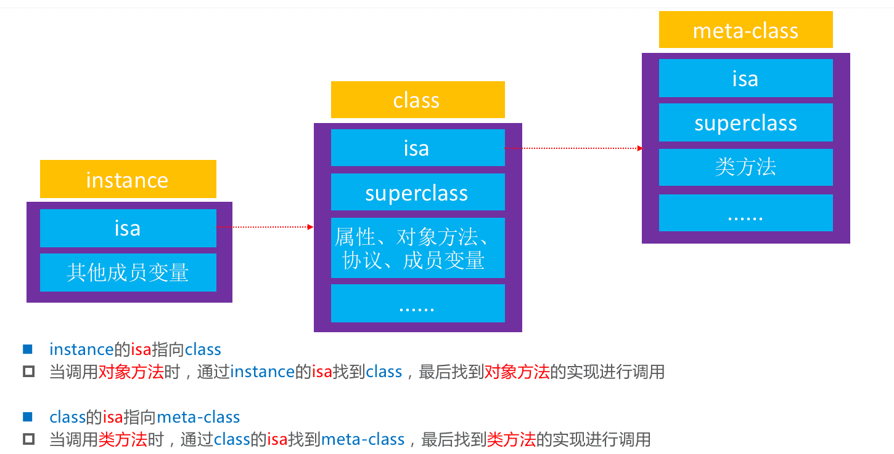

#### isa,superclass总结


### Class的结构

#### isa 指针

isa在64位之前是直接指向class或meta-class,64位之后要`&ISA_MASK`


#### objc4源码

* 类对象和元类对象都是Class类型,是一个`struct objc_class`

	

* `struct objc_class`的结构

	


<a id="KVO1"></a>

### KVO

* 未使用KVO监听的对象


* 使用了KVO监听的对象


* 怎么看setAge:调用的是_NSSetIntValueAndNotify
	
	```objective-c
	// 在self.person添加监听后,获取self.person的setAge:的方法实现
	NSLog(@"%p",[self.person methodForSelector:@selector(setAge:)]); //0x1069189e4
	// 打断点在lldb中输入p (IMP)0x1069189e4 
	// 输出 (IMP) $1 = 0X00000001069189E4 (Foundation `_NSSetIntValueAndNotify`)
	```


<a id="KVC1"></a>

<a id="__kvc"></a>

### KVC

* key-value coding 键值编码 常见api

	```objective-c
	常见的API有
	- (void)setValue:(id)value forKeyPath:(NSString *)keyPath;
	- (void)setValue:(id)value forKey:(NSString *)key;
	- (id)valueForKeyPath:(NSString *)keyPath;
	- (id)valueForKey:(NSString *)key; 
	```
	
#### setValue:ForKey:原理
	
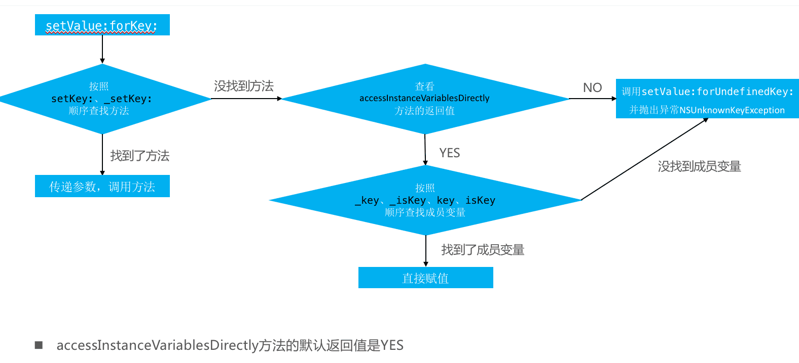

#### valueForKey:原理

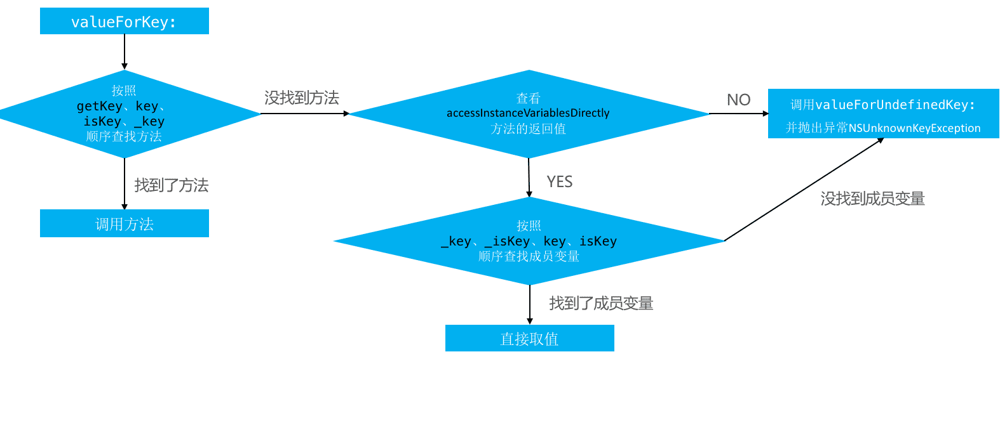


<a id="Category1"></a>

### Category


* 分类的方法,协议,属性是程序运行时加载的

#### category的底层结构

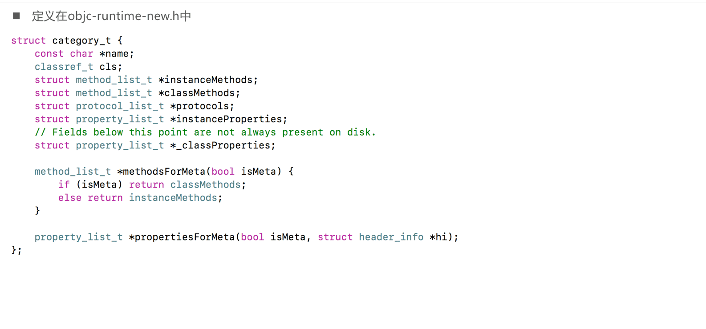


#### Category的加加载处理过程

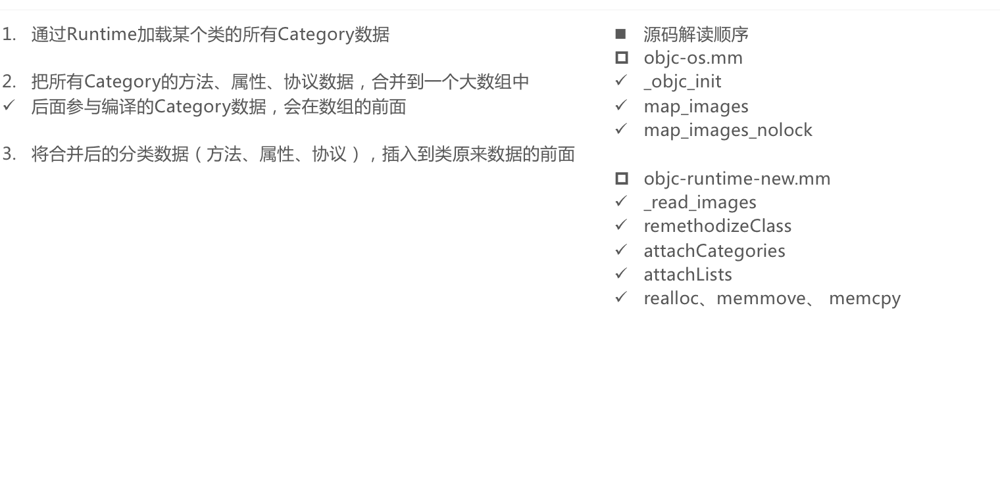


#### Category方法存放,load方法


### +load方法


### +initialize方法

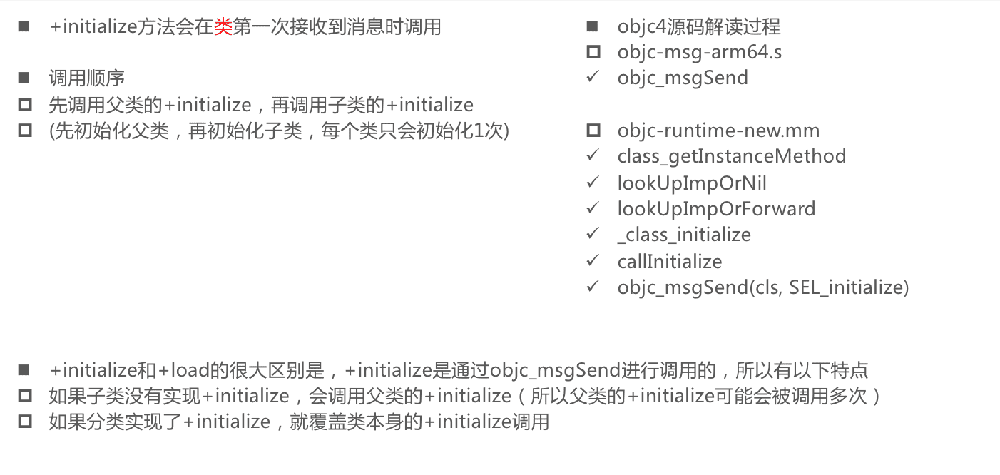


### 关联对象

* 默认情况下，因为分类底层结构的限制，不能添加成员变量到分类中。但可以通过关联对象来间接实现

* 关联对象提供了以下API

	```objective-c
	添加关联对象
	void objc_setAssociatedObject(id object, const void * key,
	                                id value, objc_AssociationPolicy policy)
	
	获得关联对象
	id objc_getAssociatedObject(id object, const void * key)
	
	移除所有的关联对象
	void objc_removeAssociatedObjects(id object)
	```

* objc_AssociationPolicy

	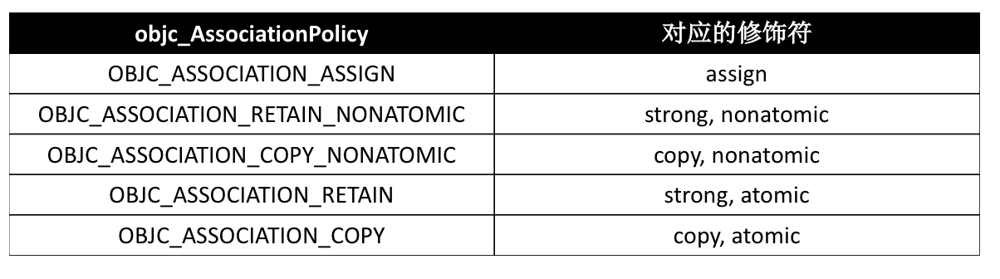
	
* key的常见用法

	```objective-c
	// 存全局变量的地址,如果不希望外界修改可以加const
	static void *MyKey = &MyKey;
	objc_setAssociatedObject(obj, MyKey, value, OBJC_ASSOCIATION_RETAIN_NONATOMIC)
	objc_getAssociatedObject(obj, MyKey)
	
	static char MyKey;
	objc_setAssociatedObject(obj, &MyKey, value, OBJC_ASSOCIATION_RETAIN_NONATOMIC)
	objc_getAssociatedObject(obj, &MyKey)
	
	使用属性名作为key
	objc_setAssociatedObject(obj, @"property", value, OBJC_ASSOCIATION_RETAIN_NONATOMIC);
	objc_getAssociatedObject(obj, @"property");
	
	使用get方法的@selecor作为key
	objc_setAssociatedObject(obj, @selector(getter), value, OBJC_ASSOCIATION_RETAIN_NONATOMIC)
	objc_getAssociatedObject(obj, @selector(getter))
	```

### 关联对象实现原理


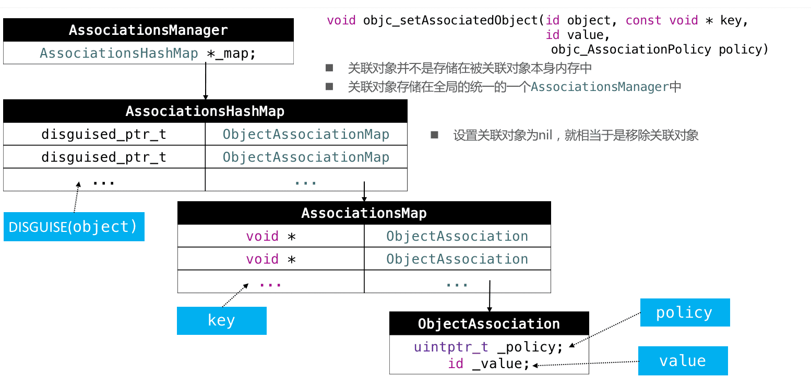

<a id="Block1"></a>


### Block


### block的本质


### block的变量捕获（capture）

* 为了保证block内部能够正常访问外部的变量，block有个变量捕获机制


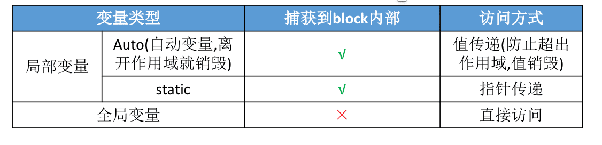
	
	
### auto变量的捕获


### block的类型


### block的copy

* arc环境下,编译器会根据情况自动将栈上的block复制到堆上,比如以下情况
	* block作为函数返回值时
	* 将block赋值给`__strong`指针时
	* block作为Cocoa API中方法名还有usingBlock的方法参数时
	* block作为GCD API的方法参数时

* MRC下block属性的建议写法
	* `@property(copy, nonatomic) void(^block)(void);`

* ARC下block属性的建议写法
	* `@property(strong, nonatomic) void(^block)(void);`
	* `@property(copy, nonatomic) void(^block)(void);`


### 对象类型的auto变量

* 当block内部访问了对象类型的auto变量时
	* 如果block是在栈上的,将不会对auto变量产生强引用
	* 如果block被拷贝到堆上
		* 会调用block内部的copy函数,在Desc里面
		* copy函数内部会调用`_Block_object_assign`函数
		* `_Block_object_assign`函数会根据auto变量的修饰符(`__strong,__weak,__unsafe_unretained`)做出相应的操作,行成强引用(retain)或者弱引用
	* 如果block从堆上移除
		* 会调用block内部的dispose函数
		* dispose函数内部会调用`_Block_object_dispose`函数
		* `_Block_object_dispose`函数会自动释放引用的auto变量(release)

	
	

### __weak问题解决

* 在使用clang转换oc为c++代码时,可能会遇到以下问题

	```
	cannot create __weak reference in file using manual reference
	```
	
* 解决方法: 支持arc,指定运行时系统版本,比如

	```
	xcrun -sdk iphoneos clang -arch arm64 -rewrite-objc -fobjc-arc -fobjc-runtime=ios-8.0.0 main.m
	```
	
<a id="__block修饰符"></a>
	
### __block修饰符


### __block的内存管理


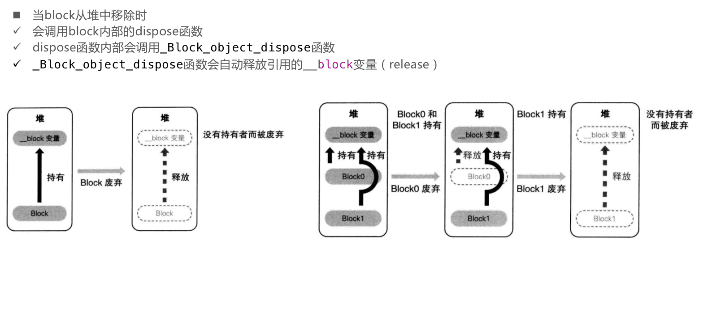


### __block变量包装的结构体中的__forwarding指针


### 对象类型的auto变量、__block变量


### 被__block修饰的对象类型

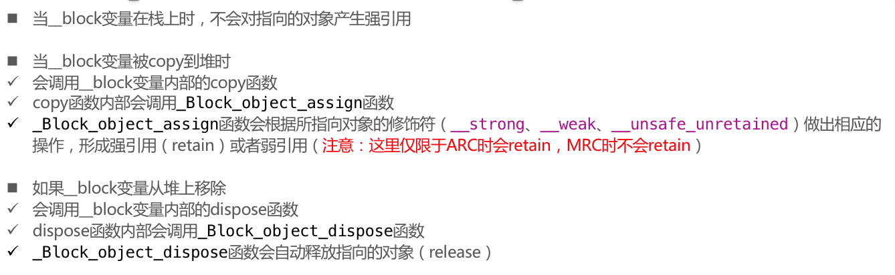


#### 两个copy函数??

当`__block`修饰对象类型时候,包装的结构体`__Block_byref...`里面会多一个copy和dispose函数.他们和block结构体里面的copy和dispose函数的联系

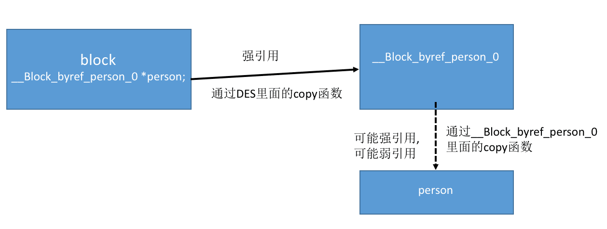

### 解决循环引用 ARC

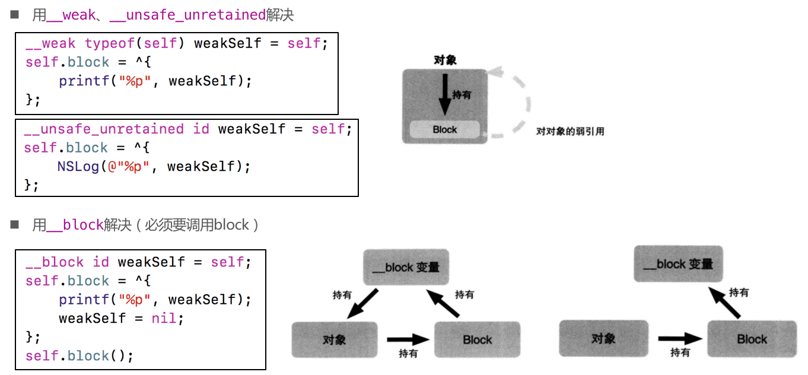

### 解决循环引用 MRC

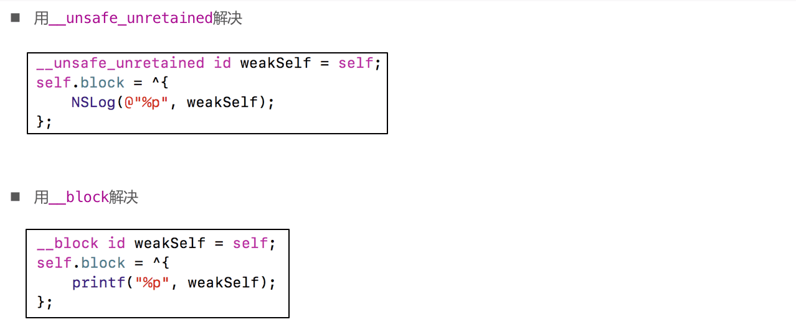


<a id="Runtime1"></a>

## Runtime

* oc是一门动态性比较强的编程语言,跟c,c++有着恨到不同
* oc的动态性是由runtime api来支撑的
* runtime api提供的接口基本都是c语言的,源码有c\c++\汇编语言编写


#### isa详解

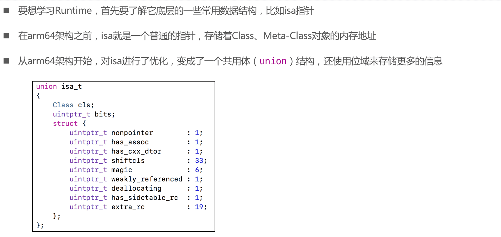

#### 位域


### Class的结构

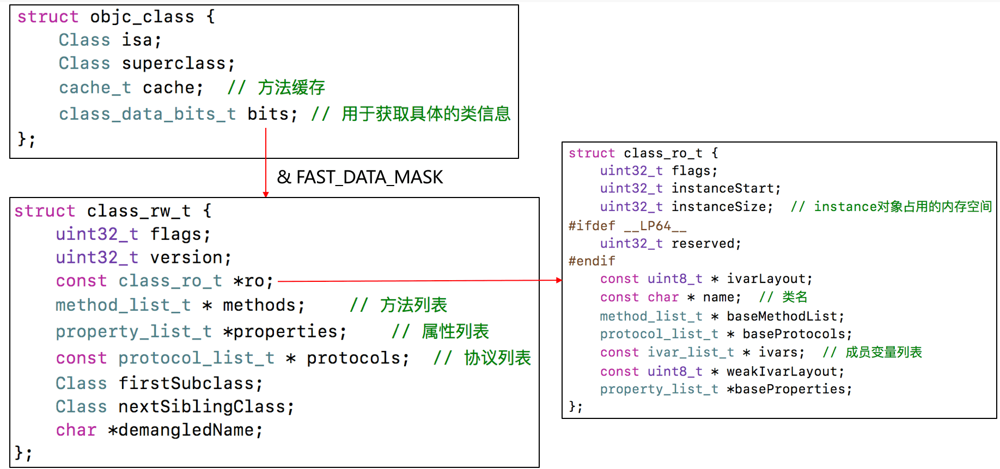


#### class_rw _t


#### class_ro _t


#### method_t


#### Type Encoding


### 方法缓存


<a id="__objc_msgSend"></a>

### objc_msgSend


* oc中的方法调用,其实都是转换成`objc_msgSend`函数的调用
* `objc_msgSend`的执行流程流程可以分为3大阶段
	* 消息发送
	* 动态方法解析
	* 消息转发

#### objc_msgSend执行流程01-消息发送

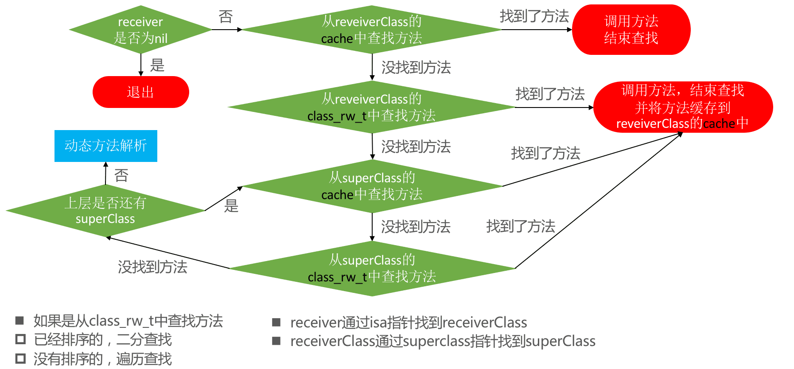

#### objc_msgSend执行流程02-动态方法解析

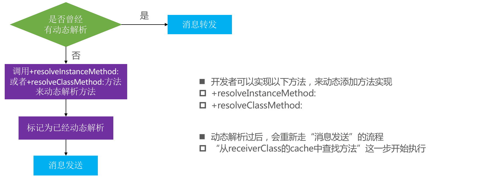

#### 动态添加方法


#### objc_msgSend的执行流程03-消息转发


```objective-c
- (id)forwardingTargetForSelector:(SEL)aSelector{
    return nil;
}
- (NSMethodSignature *)methodSignatureForSelector:(SEL)aSelector{	
	// NSMethodSignature可以通过NSObject的methodSignatureForSelector:来获得,也可用下面的types来获得
	return [NSMethodSignature signatureWithObjCTypes:"i@:i"];
}
- (void)forwardInvocation:(NSInvocation *)anInvocation{
	传过来的anInvocation带有target,sel,方法参数等
	可以根据NSInvocation里面的api修改targe,sel,方法参数.可以获取返回值
}
```

### super

#### super的本质


下面几点易错点

```objective-c
// 这里方法的接受者还是self,只是直接从父类中搜索init方法
self = [super init]; 

// 内部实现class_getSuperclass(object_getClass(self)).因为superclass指针是放在Class对象里面的
[self superclass]
```

### LLVM的中间代码(IR)


### Runtime API

#### Runtime API01 – 类 

```objective-c
// 动态创建一个类(参数: 父类,类名,额外的内存空间传0即可)
Class objc_allocateClassPair(Class superclass, const char *name, size_t extraBytes)

// 注册一个类 (要在类注册之前添成员变量)
void objc_registerClassPair(Class cls)

// 销毁一个类
void objc_disposeClassPair(Class cls)

// 获取isa指向的Class
Class object_getClass(id obj)

// 设置isa指向的Class
Class object_setClass(id obj, Class cls)

// 判断一个oc对象是否为Class
BOOL object_isClass(id obj)

// 判断一个Class是否为元类
BOOL class_isMetaClass(Class cls)

// 获取父类
Class class_getSuperclass(Class cls)
```

#### Runtime API02 – 成员变量 

```objective-c
// 获取一个实例变量信息
Ivar class_getInstanceVariable(Class cls, const char *name)

// 拷贝实例变量列表(最后需要调用free释放)
Ivar *class_copyIvarList(Class cls, unsigned int *outCount)

// 设置和获取成员变量的值
void object_setIvar(id obj, Ivar ivar, id value)
id object_getIvar(id obj, Ivar ivar)

// 动态添加成员变量(已经注册的类是不能动态添加成员变量的)
BOOL class_addIvar(Class cls, const char * name, size_t size, uint8_t alignment, const char * types)

// 获取成员变量的相关信息
const char *ivar_getName(Ivar v)
const char *ivar_getTypeEncoding(Ivar v)
```

#### Runtime API03 – 属性 

```objective-c
// 获取一个属性
objc_property_t class_getProperty(Class cls, const char *name)

// 拷贝属性列表(最好需要调用free释放)
objc_property_t *class_copyPropertyList(Class cls, unsigned int *outCount)

// 动态添加属性
BOOL class_addProperty(Class cls, const char *name, const objc_property_attribute_t *attributes,
                  unsigned int attributeCount)
                  
// 动态替换属性
void class_replaceProperty(Class cls, const char *name, const objc_property_attribute_t *attributes,
                      unsigned int attributeCount)

// 获取属性的一些信息
const char *property_getName(objc_property_t property)
const char *property_getAttributes(objc_property_t property)
```

#### Runtime API04 – 方法

```objective-c
// 获取一个实例方法,类方法
Method class_getInstanceMethod(Class cls, SEL name)
Method class_getClassMethod(Class cls, SEL name)

// 方法实现相关操作
IMP class_getMethodImplementation(Class cls, SEL name) 
IMP method_setImplementation(Method m, IMP imp)
void method_exchangeImplementations(Method m1, Method m2)

// 拷贝方法列表(最后需要调用free释放)
Method *class_copyMethodList(Class cls, unsigned int *outCount)

// 动态添加方法
BOOL class_addMethod(Class cls, SEL name, IMP imp, const char *types)

// 动态替换方法
IMP class_replaceMethod(Class cls, SEL name, IMP imp, const char *types)

// 获取方法的相关信息(带有copy的需要调用free去释放)
SEL method_getName(Method m)
IMP method_getImplementation(Method m)
const char *method_getTypeEncoding(Method m)
unsigned int method_getNumberOfArguments(Method m)
char *method_copyArgumentType(Method m, unsigned int index)

// 选择器相关
const char *sel_getName(SEL sel)
SEL sel_registerName(const char *str)

// 用block作为方法实现
IMP imp_implementationWithBlock(id block)
id imp_getBlock(IMP anImp)
BOOL imp_removeBlock(IMP anImp)
```

<a id="RunLoop1"></a>

## RunLoop


### RunLoop对象

* ios中有2套api来访问和使用RunLoop
	* Foundation: NSRunLoop
	* Core Foundation: CFRunLoopRef
* NSRunLoop和CFRunLoopRef都代表着RunLoop对象
* NSRunLoop是基于CFRunLoopRef的一层OC包装
* CFRunLoopRef是开源的
	* [https://opensource.apple.com/tarballs/CF/](https://opensource.apple.com/tarballs/CF/)

#### 获取RunLoop对象

```objective-c
Foundation 
[NSRunLoop currentRunLoop]; //获取当前线程的RunLoop对象
[NSRunLoop mainRunLoop]; //获取主线程的RunLoop对象

Core Foundation
CFRunLoopGetCurrent();
CFRunLoopGetMain();
```

<a id="__RunLoop与线程"></a>

### RunLoop与线程

* 每条线程都有唯一的一个与之对应的RunLoop对象
* RunLoop保存在一个全局的Dictionary里,线程作为key,RunLoop作为value
* 线程刚创建时并没有RunLoop对象,RunLoop会在第一次获取它时创建
* RunLoop会在线程结束时销毁
* 主线程的RunLoop已经自动获取(创建),子线程默认没有开启RunLoop


### RunLoop相关的类


<a id="__CFRunLoopModeRef"></a>

### CFRunLoopModeRef


<a id="__CFRunLoopObserverRef"></a>

#### CFRunLoopObserverRef


#### 添加Observer监听RunLoop的所有状态


* 上面的mode传的kCFRunLoopCommonModes,就是既监听default模式,也是监听tracking模式

### RunLoop的运行逻辑

#### 官网的一张图


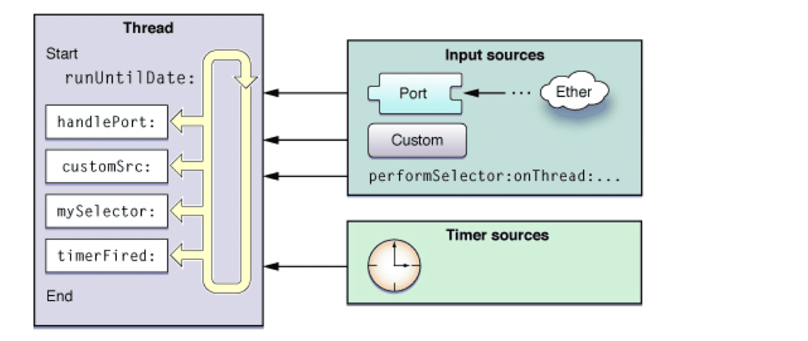

<a id="__runloop逻辑02"></a>

#### Source0,Source1,Timers,Observers 执行逻辑


*  关于第04步的处理block,runloop运行直接向runloop添加block

	```objective-c
	CFRunLoopPerformBlock(runloop,mode,^{
		
	});
	或者
	[[NSRunloop currentRunLoop] performBlock:...];
	```
	
	
#### RunLoop休眠的实现原理


<a id="__线程保活"></a>

### runloop应用线程保活

```objective-c
// 创建线程
self.thread = [[MJThread alloc] initWithBlock:^{
    // 往RunLoop里面添加Source\Timer\Observer
    [[NSRunLoop currentRunLoop] addPort:[[NSPort alloc] init] forMode:NSDefaultRunLoopMode];
    while (weakSelf && !weakSelf.isStoped) {
    	// run方法会无限调用runMode:.这样会导致CFRunLoopStop停止不了当前runloop
        [[NSRunLoop currentRunLoop] runMode:NSDefaultRunLoopMode beforeDate:[NSDate distantFuture]];
    }
}];
[self.thread start];


// 停止runloop
if (!self.thread) return;
// 在子线程调用stop（waitUntilDone设置为YES，代表子线程的代码执行完毕后，这个方法才会往下走）
[self performSelector:@selector(stopThread) onThread:self.thread withObject:nil waitUntilDone:YES];


// 用于停止子线程的RunLoop
- (void)stopThread
{
    // 设置标记为YES
    self.stopped = YES;
    // 停止RunLoop
    CFRunLoopStop(CFRunLoopGetCurrent());
    // 清空线程
    self.thread = nil;
}


// 向线程中添加操作
if (!self.thread) return;
[self performSelector:@selector(test) onThread:self.thread withObject:nil waitUntilDone:NO];
```

#### runloop线程保活的封装 - NSRunLoop 

```objective-c
@interface MJThread : NSThread
@end
@implementation MJThread
- (void)dealloc{
    NSLog(@"%s", __func__);
}
@end

@interface MJPermenantThread()
@property (strong, nonatomic) MJThread *innerThread;
@property (assign, nonatomic, getter=isStopped) BOOL stopped;
@end

@implementation MJPermenantThread
#pragma mark - public methods
- (instancetype)init{
    if (self = [super init]) {
        self.stopped = NO;
        
        __weak typeof(self) weakSelf = self;
        
        self.innerThread = [[MJThread alloc] initWithBlock:^{
            [[NSRunLoop currentRunLoop] addPort:[[NSPort alloc] init] forMode:NSDefaultRunLoopMode];
            
            while (weakSelf && !weakSelf.isStopped) {
                [[NSRunLoop currentRunLoop] runMode:NSDefaultRunLoopMode beforeDate:[NSDate distantFuture]];
            }
        }];
        
        [self.innerThread start];
    }
    return self;
}

- (void)executeTask:(dispatch_block_t)task{
    if (!self.innerThread || !task) return;   
    [self performSelector:@selector(__executeTask:) onThread:self.innerThread withObject:task waitUntilDone:NO];
}

- (void)stop{
    if (!self.innerThread) return;    
    [self performSelector:@selector(__stop) onThread:self.innerThread withObject:nil waitUntilDone:YES];
}

- (void)dealloc{
    [self stop];
}

#pragma mark - private methods
- (void)__stop{
    self.stopped = YES;
    CFRunLoopStop(CFRunLoopGetCurrent());
    self.innerThread = nil;
}
- (void)__executeTask:(dispatch_block_t)task{
    task();
}
@end
```

#### runloop线程保活的封装 - CFRunLoop

```objective-c
@interface MJThread : NSThread
@end
@implementation MJThread
- (void)dealloc
{
    NSLog(@"%s", __func__);
}
@end

@interface MJPermenantThread()
@property (strong, nonatomic) MJThread *innerThread;
@end

@implementation MJPermenantThread
#pragma mark - public methods
- (instancetype)init
{
    if (self = [super init]) {
        self.innerThread = [[MJThread alloc] initWithBlock:^{
            // 创建上下文（要初始化一下结构体）
            CFRunLoopSourceContext context = {0};
            
            // 创建source
            CFRunLoopSourceRef source = CFRunLoopSourceCreate(kCFAllocatorDefault, 0, &context);
            
            // 往Runloop中添加source
            CFRunLoopAddSource(CFRunLoopGetCurrent(), source, kCFRunLoopDefaultMode);
            
            // 销毁source
            CFRelease(source);
            
            // 启动 第3个参数：returnAfterSourceHandled，设置为true，代表执行完source后就会退出当前loop
            CFRunLoopRunInMode(kCFRunLoopDefaultMode, 1.0e10, false);
        }];
        
        [self.innerThread start];
    }
    return self;
}

- (void)executeTask:(dispatch_block)task{
    if (!self.innerThread || !task) return;
    [self performSelector:@selector(__executeTask:) onThread:self.innerThread withObject:task waitUntilDone:NO];
}
- (void)stop{
    if (!self.innerThread) return;   
    [self performSelector:@selector(__stop) onThread:self.innerThread withObject:nil waitUntilDone:YES];
}
- (void)dealloc{
    [self stop];
}
#pragma mark - private methods
- (void)__stop{
    CFRunLoopStop(CFRunLoopGetCurrent());
    self.innerThread = nil;
}
- (void)__executeTask:(dispatch_block_t)task{
    task();
}
@end
```

<a id="多线程1"></a>

## 多线程

<a id="iOS中的常见多线程方案"></a>

### iOS中的常见多线程方案


<a id="GCD的队列"></a>

### GCD的队列


### 容易混淆的术语


### 各种队列的执行效果


### 队列组的使用


###  GNUstep

* GNUstep是GNU计划的项目之一,他讲cocoa的oc库重新开源了一遍
* 源码地址: [http://www.gnustep.org/resources/downloads.php](http://www.gnustep.org/resources/downloads.php)
* 虽然GNUstep不是苹果官方源码，但还是具有一定的参考价值

<a id="iOS中的线程同步方案"></a>

### iOS中的线程同步方案

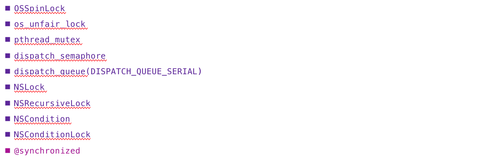


### OSSpinLock


### os_unfair _lock


### pthread_mutex

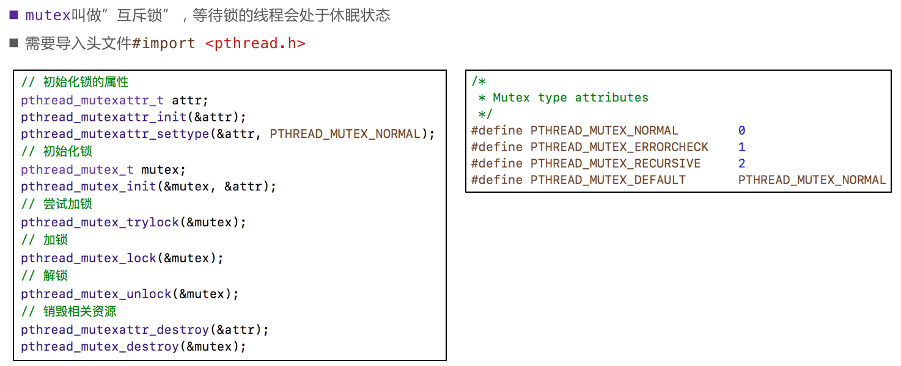


### pthread_mutex – 递归锁


### pthread_mutex – 条件


### NSLock、NSRecursiveLock


### NSCondition


### NSConditionLock


### dispatch_semaphore


### dispatch_queue


### @synchronized


### iOS线程同步方案性能比较


<a id="自旋锁、互斥锁比较"></a>

### 自旋锁、互斥锁比较


### atomic


### iOS中的读写安全方案


### pthread_rwlock

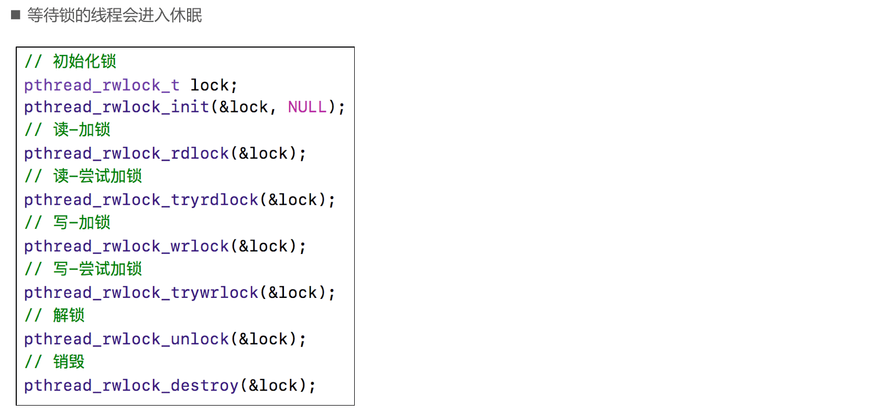

### dispatch_barrier_async

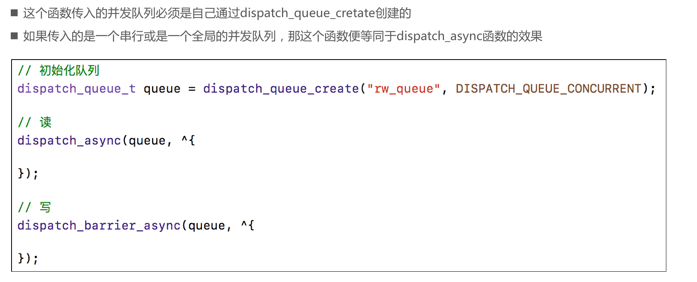


<a id="内存管理1"></a>

## 内存管理

<a id="定时器"></a>

### 定时器

#### CADisplayLink、NSTimer使用注意


#### GCD定时器


<a id="iOS程序的内存布局"></a>

### iOS程序的内存布局

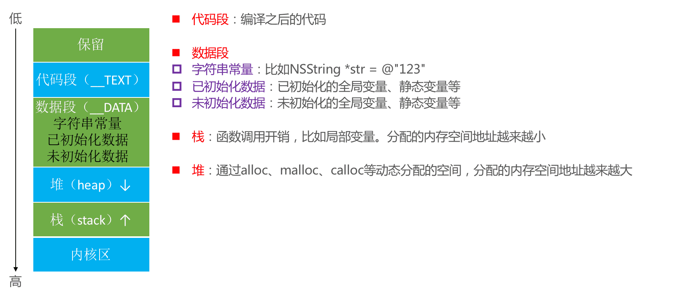

### Tagged Pointer

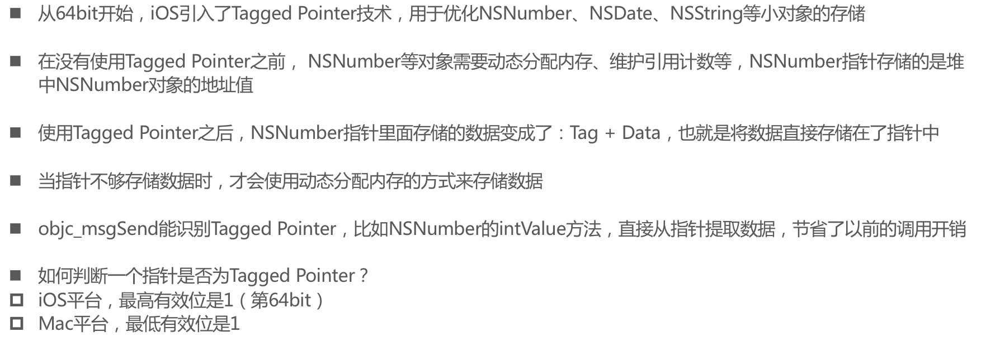


#### 判断是否为Tagged Pointer


### 对象的内存管理


#### copy和mutalbeCopy

* 拷贝的目的: 产生一个副本对象,跟源对象互不影响
	* 修改了源对象,不会影响副本对象
	* 修改了副本对象,不会影响源对象

* iOS提供了2个拷贝方法
	* copy, 不可变拷贝,产生不可变副本
	* mutableCopy, 可变拷贝,产生可变副本

* 深拷贝和浅拷贝
	* 深拷贝: 内容拷贝,产生新的对象
	* 浅拷贝: 指针拷贝,没有产生新的对象


#### 引用计数的存储


#### dealloc


### 自动释放池


#### AutoreleasePoolPage的结构


<a id="Runloop和Autorelease"></a>

#### Runloop和Autorelease


<a id="性能优化1"></a>

## 性能优化


### CPU和GPU

* 在屏幕成像的过程中,cpu和gpu起着至关重要的作用
	* cpu(central processing unit,中央处理器)
		* 对象的创建和销毁,对象属性的调整,布局计算,文本的计算和排版,图片的格式转换和解码,图像的绘制(Core Graphics)
	* gpu(graphics processing unit,图形处理器)
		文理的渲染
		
	
	
	
		
* 在ios中是双缓冲机制,有前帧缓存,后帧缓存

#### 卡顿产生的原因


* 卡顿解决的主要思路:
	* 尽可能减少cpu,gpu资源消耗
* 按照40FPS的刷帧率,每隔16ms就会有一次VSync信号

#### 卡顿优化-CPU

* 尽量用轻量级的对象，比如用不到事件处理的地方，可以考虑使用CALayer取代UIView
* 不要频繁地调用UIView的相关属性，比如frame、bounds、transform等属性，尽量减少不必要的修改
* 尽量提前计算好布局，在有需要时一次性调整对应的属性，不要多次修改属性
* Autolayout会比直接设置frame消耗更多的CPU资源
* 图片的size最好刚好跟UIImageView的size保持一致
* 控制一下线程的最大并发数量
* 尽量把耗时的操作放到子线程
	* 文本处理（尺寸计算、绘制）
	* 图片处理（解码、绘制）
		* imageWithName:在将要显示图片的时候才会解码,在主线程.
		* 可以现在子线程解码.先获取UIImage的CGImageRef.再创建一个CGBitmapContextCreate位图上下文,在CGContextDrawImage画到上下文上,再根据上下文生成一个CGImage,再根据这个CGImage生成一个UIImage.就完成解码了
		* SDWebImage也有类似操作

#### 卡段优化GPU

* 尽量避免短时间内大量图片的显示，尽可能将多张图片合成一张进行显示
* GPU能处理的最大纹理尺寸是4096x4096，一旦超过这个尺寸，就会占用CPU资源进行处理，所以纹理尽量不要超过这个尺寸
* 尽量减少视图数量和层次
* 减少透明的视图（alpha<1），不透明的就设置opaque为YES
* 尽量避免出现离屏渲染


#### 离屏渲染

* 在OpenGL中，GPU有2种渲染方式
	* On-Screen Rendering：当前屏幕渲染，在当前用于显示的屏幕缓冲区进行渲染操作
	* Off-Screen Rendering：离屏渲染，在当前屏幕缓冲区以外新开辟一个缓冲区进行渲染操作

* 离屏渲染消耗性能的原因
	* 需要创建新的缓冲区
	* 离屏渲染的整个过程，需要多次切换上下文环境，先是从当前屏幕（On-Screen）切换到离屏（Off-Screen）；等到离屏渲染结束以后，将离屏缓冲区的渲染结果显示到屏幕上，又需要将上下文环境从离屏切换到当前屏幕
* 哪些操作会触发离屏渲染？
	* 光栅化，layer.shouldRasterize = YES
	* 遮罩，layer.mask
	* 圆角，同时设置layer.masksToBounds = YES、layer.cornerRadius大于0
		* 考虑通过CoreGraphics绘制裁剪圆角，或者叫美工提供圆角图片
		* 不设置layer.masksToBounds也会有圆角效果,他的作用是指示sublayer在超出bounds的时候是否被裁剪
	* 阴影，layer.shadowXXX
		* 如果设置了layer.shadowPath就不会产生离屏渲染,如果不设置就会默认围绕整个view


#### 卡顿检测

* 平时所说的"卡顿",主要是因为在主线程执行了比较耗时的操作
* 方法
	* 可以添加observer到主线程runloop中,通过监听runloop状态的切换耗时,达到监控卡顿的目的.可以参考LXDAppFluecyMonitor.里面子线程配合信号量达到耗时检测的操作
	* 还可以用instrument的time profiler来查看主线程哪些方法耗时长
		
		
		
### 耗电优化

#### 耗电的主要来源

* CPU处理,Processing
* 网络, Networking
* 定位, Location
* 图像, Graphics


#### 耗电的优化

* 尽可能降低CPU、GPU功耗

* 少用定时器

* 优化I/O操作
	* 尽量不要频繁写入小数据，最好批量一次性写入
	* 读写大量重要数据时，考虑用dispatch_io，其提供了基于GCD的异步操作文件I/O的	* API。用dispatch_io系统会优化磁盘访问
	* 数据量比较大的，建议使用数据库（比如SQLite、CoreData）

* 网络优化
	* 减少、压缩网络数据
* 如果多次请求的结果是相同的，尽量使用缓存
* 使用断点续传，否则网络不稳定时可能多次传输相同的内容
* 网络不可用时，不要尝试执行网络请求
* 让用户可以取消长时间运行或者速度很慢的网络操作，设置合适的超时时间
* 批量传输，比如，下载视频流时，不要传输很小的数据包，直接下载整个文件或者一大块一大块地下载。如果下载广告，一次性多下载一些，然后再慢慢展示。如果下载电子邮件，一次下载多封，不要一封一封地下载
* 定位优化
	* 如果只是需要快速确定用户位置，最好用CLLocationManager的requestLocation方法。定位完成后，会自动让定位硬件断电
	* 如果不是导航应用，尽量不要实时更新位置，定位完毕就关掉定位服务
	* 尽量降低定位精度，比如尽量不要使用精度最高的kCLLocationAccuracyBest
	* 需要后台定位时，尽量设置pausesLocationUpdatesAutomatically为YES，如果用户不太可能移动的时候系统会自动暂停位置更新
	* 尽量不要使用startMonitoringSignificantLocationChanges，优先考虑startMonitoringForRegion:

硬件检测优化
用户移动、摇晃、倾斜设备时，会产生动作(motion)事件，这些事件由加速度计、陀螺仪、磁力计等硬件检测。在不需要检测的场合，应该及时关闭这些硬件


### 启动优化

#### APP的启动

 * APP的启动可以分为2种
	* 冷启动（Cold Launch）：从零开始启动APP
	* 热启动（Warm Launch）：APP已经在内存中，在后台存活着，再次点击图标启动APP

* APP启动时间的优化，主要是针对冷启动进行优化

	通过添加环境变量可以打印出APP的启动时间分析（Edit scheme -> Run -> Arguments）
DYLD_PRINT_STATISTICS设置为1

	如果需要更详细的信息，那就将DYLD_PRINT_STATISTICS_DETAILS设置为1
	
	
* APP的冷启动可以概括为3大阶段
	* dyld
	* runtime
	* main

	


#### APP的启动 - dyld

 * dyld（dynamic link editor），Apple的动态链接器，可以用来装载Mach-O文件（可执行文件、动态库等）

 * 启动APP时，dyld所做的事情有
	* 装载APP的可执行文件，同时会递归加载所有依赖的动态库
	* 当dyld把可执行文件、动态库都装载完毕后，会通知Runtime进行下一步的处理

	
#### APP的启动 - runtime

* 启动APP时，runtime所做的事情有
	* 调用map_images进行可执行文件内容的解析和处理
	* 在load_images中调用call_load_methods，调用所有Class和Category的+load方法
	* 进行各种objc结构的初始化（注册Objc类 、初始化类对象等等）
	* 调用C++静态初始化器和__attribute__((constructor))修饰的函数

* 到此为止，可执行文件和动态库中所有的符号(Class，Protocol，Selector，IMP，…)都已经按格式成功加载到内存中，被runtime 所管理

#### APP的启动 - main

总结一下

* APP的启动由dyld主导，将可执行文件加载到内存，顺便加载所有依赖的动态库
* 并由runtime负责加载成objc定义的结构
* 所有初始化工作结束后，dyld就会调用main函数
* 接下来就是UIApplicationMain函数，AppDelegate的application:didFinishLaunchingWithOptions:方法

#### APP的启动优化

* 按照不同的阶段
	* dyld
		* 减少动态库、合并一些动态库（定期清理不必要的动态库）
		* 减少Objc类、分类的数量、减少Selector数量（定期清理不必要的类、分类）
		* 减少C++虚函数数量
		* Swift尽量使用struct

	* runtime
		* 用+initialize方法和dispatch_once取代所有的__attribute__((constructor))、C++静态构造器、ObjC的+load

	* main
		* 在不影响用户体验的前提下，尽可能将一些操作延迟，不要全部都放在finishLaunching方法中
		* 按需加载


### 安装包优化

* 安装包（IPA）主要由可执行文件、资源组成

* 资源（图片、音频、视频等）
	* 采取无损压缩
	* 去除没有用到的资源： [https://github.com/tinymind/LSUnusedResources](https://github.com/tinymind/LSUnusedResources)

* 可执行文件瘦身
	* 编译器优化
		* Strip Linked Product、Make Strings Read-Only、Symbols Hidden by Default设置为YES
		* 去掉异常支持，Enable C++ Exceptions、Enable Objective-C Exceptions设置为NO， Other C Flags添加-fno-exceptions

		* 利用AppCode（[https://www.jetbrains.com/objc/](https://www.jetbrains.com/objc/)）检测未使用的代码：菜单栏 -> Code -> Inspect Code.可以检测出没有用到的类和方法

		* 编写LLVM插件检测出重复代码、未被调用的代码

#### LinkMap

* 生成LinkMap文件，可以查看可执行文件的具体组成

	

* 可借助第三方工具解析LinkMap文件： [https://github.com/huanxsd/LinkMap](https://github.com/huanxsd/LinkMap)


<a id="设计模式与架构1"></a>

## 设计模式与架构

###  何为架构

* 架构（Architecture）
	* 软件开发中的设计方案
	* 类与类之间的关系、模块与模块之间的关系、客户端与服务端的关系

* 经常听到的架构名词
	* MVC、MVP、MVVM、VIPER、CDD
	* 三层架构、四层架构
	* ......


#### MVC-Apple版


* 优点 : view,model可以重复利用,可以独立使用
* 缺点 : controller的代码过于臃肿


#### MVC-变种


* 优点 : 对controller进行瘦身,将view内部细节封装起来了,外界不知道view内部的具体实现
* 缺点 : view依赖于model


#### MVP


* controller在这里用来管理presenter
* presenter可以弱引用controller,方便将view添加到viewController上
* presenter将model数据整合到view上,处理view的事件
* controller可以拥有根据业务需要多个presenter


#### MVVM


跟MVP共同点:

* 将view跟model的逻辑扔到vm中,控制器只需管理viewmodel就可以

不同点: 

* view可以监听viewmodel里面数据的改变,view的显示跟着改变
* view会拥有viewmodel,然后设置监听
* 监听可以使用RAC,KVOController


#### 三层,四层架构


### 设计模式

* 设计模式(design pattern)
	* 是一套被反复使用,代码设计经验的总结,类跟类的关系,某个放啊的设计思路
	* 使用设计模式的好处: 可重用代码,让代码更容易被他人理解,保证代码的可靠性
	* 一般与编程语言无关,是一套比较成熟的编程思想

* 设计模式可以分为三大类
	* 创建型模式: 对象实例化的模式,用于解耦对象的实例化过程
		* 单例模式,工厂模式等等
	* 结构型模式: 把类或者对象结合在一起形成一个更大的结构
		* 代理模式(不是delegate,ios中NSProxy就比较像),适配器模式,组合模式,装饰模式,等等
	* 行为模式: 类或对象之前如何交互,以及划分责任和算法
		* 观察者模式,命令模式,责任链模式等等