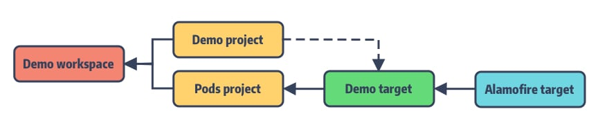
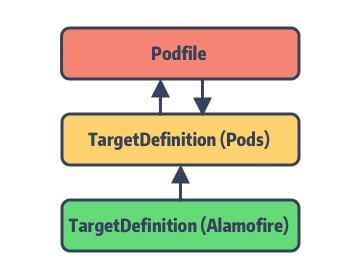
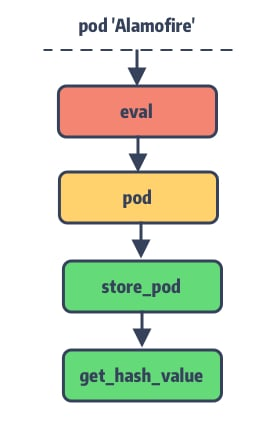
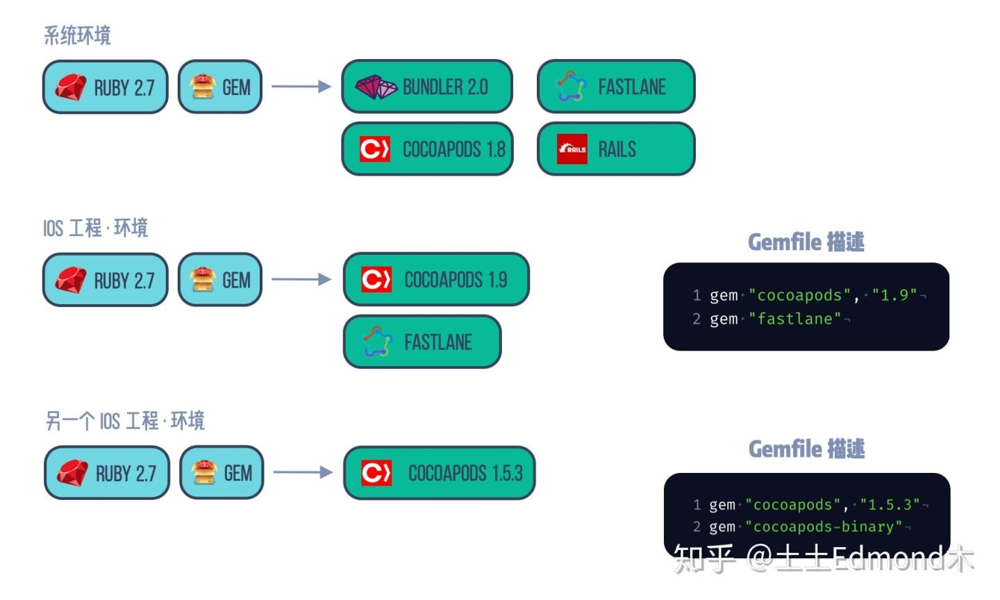
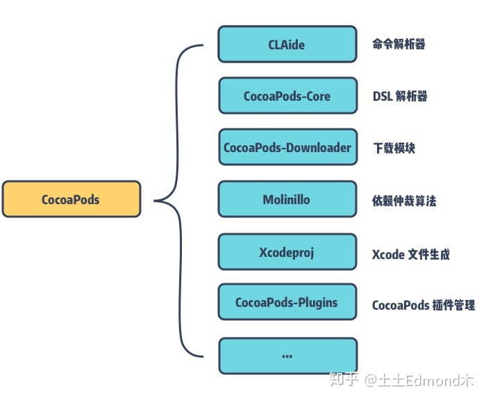
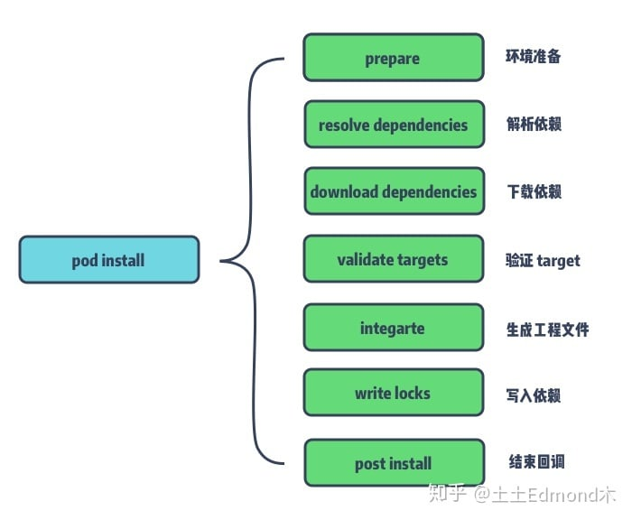
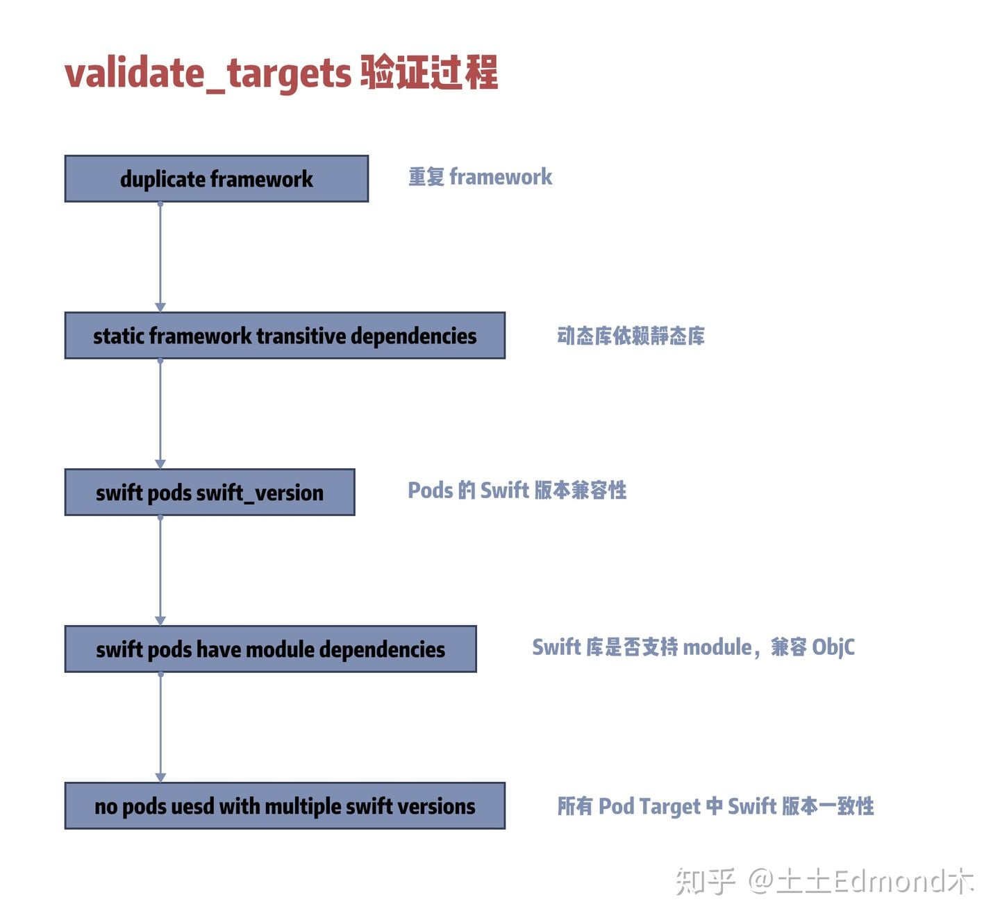

## cocoapods

* Podfile 是用于描述一个或多个 Xcode Project 中各个 Targets 之间的依赖关系

### Xcode工程结构

Podfile编译后工程目录如下:



* cocoapods将所管理的Pods依赖库组成一个个Target,统一放在`Pod project`中的`Demo target`, 并自动配置好Target间的依赖关系
* 之后将Example主工程和Pods工程一起打包到新建的Example.workspace,配好Pods工程之间的依赖,完成最终转换

cocoapods巧妙利用xcode工程结构的特点,引入Pods.project这一中间层,将主工程Pods依赖全部转接到Pods.project上,最后将Pods.project作为主项目的依赖.尽管这么做也受到一些质疑(侵入性台前). 但Pods.project这一设计也隔绝了第三方依赖库对于主项目的频繁更改,提现了软件工程的**开发-关闭原则**

一个问题, 当 Pods project依赖的过多引起的解析索引复杂度升高,使用
`install! 'cocoapods', :generate_multiple_pod_projects => true`让每个依赖作为一个单独的项目引入,大大增加解析所读


### Ruby特性

#### [Mix-in](https://mp.weixin.qq.com/s?__biz=MzA5MTM1NTc2Ng==&mid=2458324049&idx=1&sn=8de53f46fbc52427cdb660b427cb8226&chksm=870e0348b0798a5ed6d14715cc4a1af93cd168a5e15198acfb3b84ea49506b0f815fa891d683&token=883887783&lang=zh_CN#rd)

* 区别于继承描述的是“它是什么”，而 Mix-in 描述的是“它能做什么”。从这一点出发，Mix-in 的设计是单一职责的，并且 Mix-in 实际上对宿主类一无所知
* 简单理解就是带实现的协议

 ```rb
 // 声明module
 module RunMixin
 	def run
 		puts "i can run"
 	end
 end
 
 class Dog
 include RunMixin
 end
 
 dog = Dog.new
 dog.run
 ```


### Lockfile

Lockfile，顾名思义是用于记录最后一次 CocoaPods 所安装的 Pod 依赖库版本的信息快照。也就是生成的 **Podfile.lock**

在`pod install`过程,Podfile会结合它来确定最终所安装的Pod版本,固定Pod依赖库版本防止其自动更新.lockfile也作为Pods状态清淡,用于记录安装过程中哪些pod需要被删除或安装或更新

lockfile记录了什么?

* PODS  所有Pod库的具体安装版本号
* DEPENDENCIES 库之间的依赖关系
* EXTERNAL SOURCES 通过外部导入的库(git,path引入)
* SPEC CHECKSUMS 各个Pod的Podspec文件的hash值
* PODFILE CHECKSUM  Podfile文件的hash值
* COCOAPODS cocoapods版本

### Podfile

* podfile不仅支持ruby格式,还支持yaml格式, Podfile.lock就是yaml格式

#### Podfile的主要数据结构

* specification即存储 PodSpec 的内容，是用于描述一个 Pod 库的源代码和资源将如何被打包编译成链接库或 framework

* TargetDefinition

	TargetDefinition 是一个多叉树结构，每个节点记录着 Podfile 中定义的 Pod 的 Source 来源、Build Setting、Pod 子依赖等。该树的根节点指向 Podfile，而 Podfile 中的 `root_target_definitions` 则记录着所有的 TargetDefinition 的根节点，正常情况下该 list 中只有一个 root 即 **Pods.project**

对应上面的目录结构
	


#### Podfile内容解析

解析映射过程如下图: 

   

* 解析到`pod 'Alamofire'`会先通过`eval`(字符串转方法调用),将其转为`dsl.rb`中的pod方法
* pod传入name和requirements, requirements控制该pod的来源,pod target的编译选项等
* 对name校验后,直接传入`current_target_definition`,毕竟Pod库都在`Pod.project`之下
* 最后将name, requirements存入到全局`internal_hash`中


### Source

作为 PodSpec 的聚合仓库，Spec Repo 记录着所有 pod 所发布的不同版本的 PodSpec 文件。该仓库对应到 Core 的数据结构为 Source

整个 Source 的结构比较简单，它基本是围绕着 Git 来做文章，主要是对 PodSpec 文件进行各种查找更新操作


### 版本管理工具及 Ruby 工具链环境

* **SCM**：Source Code Manager，针对单个文件的进行版本控制，如git，svn
* **Package Manger (PM)**：以每个独立的 Package 作为最小的管理单元。包管理工具都是结合 SCM 来完成管理工作，对于被 PM 接管的依赖库的文件，通常会在 Git 的 .ignore 文件中选择忽略它们。具有语义化的版本检查能力，依赖递归查找，依赖冲突解决的能力。如cocoapods、npm、rubyGems。 PM 工具基本围绕这个两个文件来实现包管理：
	* 描述文件：声明了项目中存在哪些依赖，版本限制；如cocoapods的Podfile、npm的package.json
	* 锁存文件（Lock 文件）：记录了依赖包最后一次更新时的全版本列表。如Podfile.lock和Podfile.lock

* **rbenv**:都是专门管理多个 Ruby 环境的工具，可以维护和管理多个版本的Ruby

* **RubyGems**:是 Ruby 的一个包管理工具，这里面管理着用 Ruby 编写的工具或依赖我们称之为 Gem,Gems 还提供了 Ruby 组件的托管服务，可以集中式的查找和安装 library 和 apps。当我们使用 gem install xxx 时，会通过 rubygems.org 来查询对应的 Gem Package。而 iOS 日常中的很多工具都是 Gem 提供的，例：Bundler，fastlane，jazzy，CocoaPods 等
* **Bundler**:是管理 Gem 依赖的工具，可以隔离不同项目中 Gem 的版本和依赖环境的差异，也是一个 Gem
	
	Bundler 通过读取项目中的依赖描述文件 Gemfile ，来确定各个 Gems 的版本号或者范围，来提供了稳定的应用环境。当我们使用 bundle install 它会生成 Gemfile.lock 将当前 librarys 使用的具体版本号写入其中。之后，他人再通过 bundle install 来安装 libaray 时则会读取 Gemfile.lock 中的 librarys、版本信息等
	
* **Gemfile**: 可以说 CocoaPods 其实是 iOS 版的 RubyGems + Bundler 组合。Bundler 依据项目中的 Gemfile 文件来管理 Gem，而 CocoaPods 通过 Podfile 来管理 Pod, Gemfile配置如下

	```rb
	source 'https://gems.example.com' do
  gem 'cocoapods', '1.8.4'是管理 Gem 依赖的工具
  gem 'another_gem', :git => 'https://looseyi.github.io.git', :branch => 'master'
end
	```

	Gemfile的DSL(为某一领域专门设置的语言)写法和Podfile如出一辙,
	
#### 如何使用Bundle管理工程中的Gem环境

如何保证整个团队统一Gem环境中的Ruby版本,从而避免文件冲突和不必要的错误(列入cocoapods每年都会有重大调整, 调整后在install的过程中对.xcodeproj文件的修改不同), 假设现有情况如下图:



1. 初始换Bundle环境, `bundle init`, 生成一个Gemfile
2. 在Gemfile中设置cocapods版本 `gem "cocoapods", "1.5.3"`,后`bundle install`, 会生成Gemfile.lock
3. `bundle exec gem list`查看, 比全局gem精简了很多
4. 使用`bundle exec pod install`来install就可以指定cocoaopods版本


### Cocoapods组件构成与职责

如下图所示: 



对应cocoapods的Gemfile内容如下

```rb
SKIP_UNRELEASED_VERSIONS = false
# ...

source 'https://rubygems.org'
gemspec
gem 'json', :git => 'https://github.com/segiddins/json.git', :branch => 'seg-1.7.7-ruby-2.2'

group :development do
  cp_gem 'claide',                'CLAide'
  cp_gem 'cocoapods-core',        'Core', '1-9-stable'
  cp_gem 'cocoapods-deintegrate', 'cocoapods-deintegrate'
  cp_gem 'cocoapods-downloader',  'cocoapods-downloader'
  cp_gem 'cocoapods-plugins',     'cocoapods-plugins'
  cp_gem 'cocoapods-search',      'cocoapods-search'
  cp_gem 'cocoapods-stats',       'cocoapods-stats'
  cp_gem 'cocoapods-trunk',       'cocoapods-trunk'
  cp_gem 'cocoapods-try',         'cocoapods-try'
  cp_gem 'molinillo',             'Molinillo'
  cp_gem 'nanaimo',               'Nanaimo'
  cp_gem 'xcodeproj',             'Xcodeproj'
   
  gem 'cocoapods-dependencies', '~> 1.0.beta.1'
  # ...
  # Integration tests
  gem 'diffy'
  gem 'clintegracon'
  # Code Quality
  gem 'inch_by_inch'
  gem 'rubocop'
  gem 'danger'
end
```

* **CLAide** 虽然是一个简单的命令行解释器，但它提供了功能齐全的命令行界面和 API。它不仅负责解析我们使用到的 Pods 命令，如：pod install, pod update 等，还可用于封装常用的一些脚本，将其打包成简单的命令行小工具
* CocoaPods-Core 用于 CocoaPods 中模板文件的解析，包括 Podfile、.podspec，以及所有的 .lock 文件中特殊的 YAML 文件
* Cocoapods-Downloader 是用于下载源码的小工具，它支持各种类型的版本管理工具，包括 HTTP / SVN / Git / Mercurial。它可以提供 tags、commites，revisions，branches 以及 zips 文件的下载和解压缩操作。
* Molinillo 是 CocoaPods 对于依赖仲裁算法的封装，它是一个具有前向检察的回溯算法。不仅在 Pods 中，Bundler 和 RubyGems 也是使用的这一套仲裁算法
* Xcodeproj 可通过 Ruby 来操作 Xcode 项目的创建和编辑等。可友好的支持 Xcode 项目的脚本管理和 libraries 构建，以及 Xcode 工作空间 (.xcworkspace) 和配置文件 .xcconfig 的管理
* cocoapods-plugins 插件管理功能，其中有 pod plugin 全套命令，支持对于 CocoaPods 插件的列表一览（list）、搜索（search）、创建（create）功能

### pod install 过程


#### 如何找到CocoaPods程序

通过pod的时候通过`xxx/gems/ruby-2.6.1/bin/pod`里面简单的脚本找到CocoaPods这个gem的按照目录唤起, 通过CLAide解析命令后执行到`Command::Install`类对应的run,接下来就是install的主体部分

#### 执行功能主体

   
   
* Install 环境准备

	在 prepare 阶段会将 pod install 的环境准备完成，包括版本一致性、目录结构以及将 pre-install 的装载插件脚本全部取出，并执行对应的 pre_install hook
	
* 解决依赖冲突（resolve_dependencies）
	
	依赖解析过程就是通过 Podfile、Podfile.lock 以及沙盒中的 manifest 生成 Analyzer 对象。Analyzer内部会使用 Molinillo （具体的是 Molinillo::DependencyGraph 图算法）解析得到一张依赖关系表。

* 下载依赖文件

	在 create_file_accessors 中会创建沙盒目录的文件访问器，通过构造 FileAccessor 实例来解析沙盒中的各种文件。接着是最重要的 install_pod_sources 过程，它会调用对应 Pod 的 install! 方法进行资源下载。
	
* 验证 targets (validate_targets)

	用来验证之前流程中的产物 (pod 所生成的 Targets) 的合法性。
	
	
	
* 生成工程 (Integrate)

	工程文件的生成是 pod install 的最后一步，他会将之前版本仲裁后的所有组件通过 Project 文件的形式组织起来，并且会对 Project 中做一些用户指定的配置
	
* 写入依赖 (write_lockfiles)

	将依赖更新写入 Podfile.lock 和 Manifest.lock

* 结束回调（perform_post_install_action）

	最后一步收尾工作，为所有插件提供 post-installation 操作以及 hook


