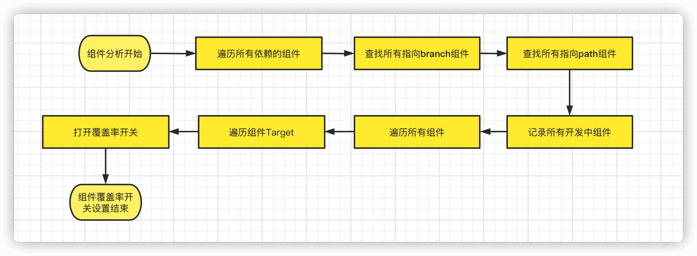
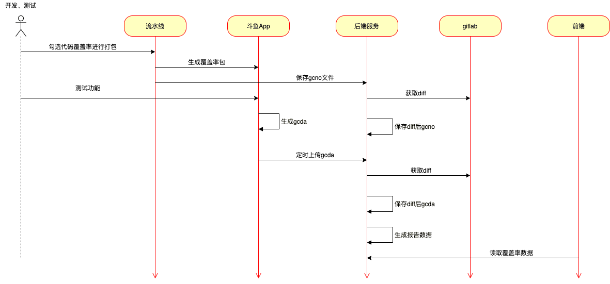

### Docker

Docker是一个在称为“容器”（或Docker容器）的孤立环境中可运行应用程序的平台,像Jenkins这样的应用程序可以作为只读的“镜像”,每个镜像都作为容器在Docker中运行

* [shell](https://blog.csdn.net/weixin_43288201/article/details/105643692)
* [证书管理](https://doc.douyu.tv/ddse/preview/space/207200?sid=395)
* [jenkins](https://www.jenkins.io/zh/doc/book/installing/)

证书管理-添加设备:

1. 去开发者中心生成一个秘钥
2. 去App Store Connect API Key使用,配合api和fastlane以及秘钥 在开发者中心注册真机设备,
3. 注册完后拿到最新的描述文件,同步到证书仓库,并且同步到shell脚本仓库
4. 将证书同步到打包机(拉证书仓库地址,用脚本里面的fastlane命令更新证书)
5. 除了注册真机, connect api配合fastlane 还能干很多 比如上传ipa包deliver

重签名流程:

1. 拉取证书仓库,执行重签名脚本
2. 脚本里面有重签名用到的identifier和描述文件
3. 两种重签名	
	* 完全重签名(fastlane),会替换bundle id
	* 不完全重签名, 替换ipa里面的描述文件,重签名可执行文件,用新标识,导出ipa

* 邮件通知  jenkins有专门配置
* 企业微信有对应api, 群机器人
* xcode-cloud 苹果的持续交付

覆盖率

[https://doc.douyu.tv/ddse/preview/share/536a92e4c53154cb8199?sid=429&shareType=1](https://doc.douyu.tv/ddse/preview/share/536a92e4c53154cb8199?sid=429&shareType=1)

[https://doc.douyu.tv/ddse/preview/share/b903c3f205f35fb9795d?sid=429&shareType=1](https://doc.douyu.tv/ddse/preview/share/b903c3f205f35fb9795d?sid=429&shareType=1)

基本概念:

* gcov: 官方描述为LLVM code coverage tool,GNU的本地覆盖率测试工具
* gcno: 利用Clang分别生成了源文件的AST和IR文件，.gcno文件则是用来保存计数插桩位置和源文件之间的关系。GCOVPass在通过两层循环插入计数指令的同时，会将文件及BB(基本代码块)信息写入.gcno
	* 在BuildSettings分别设置Instrument Program Flow、Generate Legacy Test Coverage File为True，即可打开插桩
* gcda: 添加-fprofile-arcs编译参数后的编译后的文件，运行所产生的
	* gcda文件路径可以通过GCOV相关代码指定,
	* 导出gcda文件后可通过gcov命令解码
* 可以通过开源的lcov对覆盖率可视化

开启组件项目覆盖率

