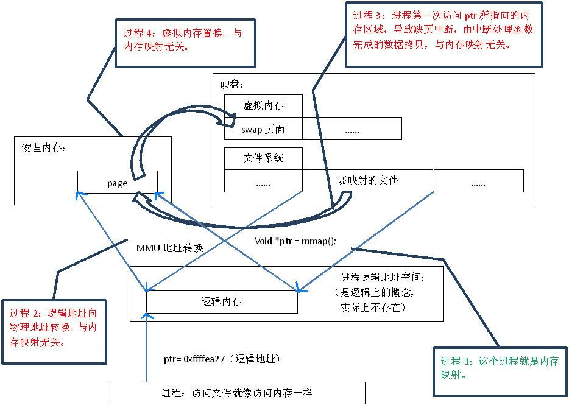
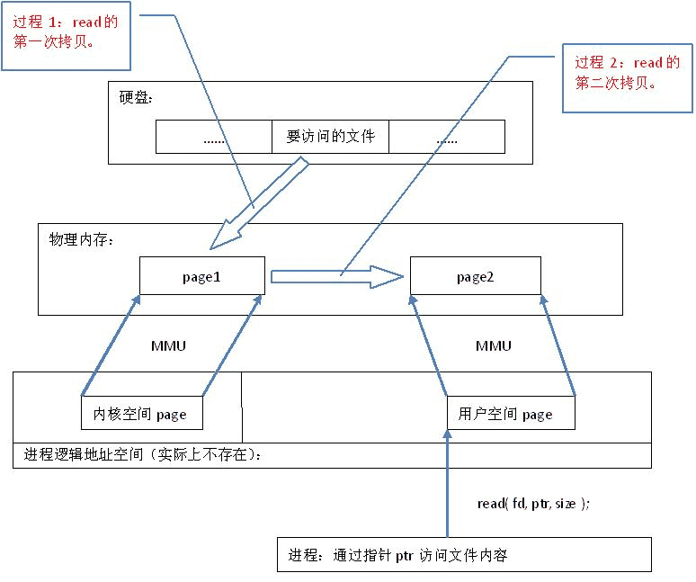

## 目录

* <a href="#日志处理">日志处理</a>
* <a href="#xlog"> xlog </a>
* <a href="#mmap"> mmap </a>

## 日志处理

* 项目dy日志组件内部使用xlog来高效率将日志同步至磁盘
* 制定了一些上传策略
	* 上传间隔十分钟
	* 每次上传会上传最近5天的日志,将最近5天的日志压缩
	* 可上传文件大小由接口指定
	* 如果压缩文件过大,会减少日志天数,再压缩
	* 如果单个文件压缩后还超过限制, 则上传失败
	* 3次上传机会
	* 上传后清除当天之外的所有日志

## xlog

> 相关阅读: [https://zhuanlan.zhihu.com/p/23879436](https://zhuanlan.zhihu.com/p/23879436)

xlog 是mars(微信官方终端基础组件,跨平台) 中一个可独立使用的日志模块

#### 方案总结

   

* 使用流式压缩方式对单行日志进行压缩，压缩加密后写进作为 log 中间 buffer的 mmap 中，当 mmap 中的数据到达一定大小后再写进磁盘文件中
* **流式压缩:** 是一个简单但十分高效的数据压缩算法。 其方式就是把数据中一些可以组织成短语(最 长字符)的字符加入字典，然后再有相同字符出现采用标记来代替字典中的短语，如此通过标记代替多数重复出现的方式以进行压缩。**简单说就是对重复子字符串进行标记替换**
* mmap回写的时机
	* 内存不足
	* 进程退出
	* 调用 msync 或者 munmap
	* 不设置 `MAP_NOSYNC` 情况下 30s-60s(仅限FreeBSD)

## 内存映射 mmap

> 相关阅读: 
> 
> [https://www.cnblogs.com/still-smile/p/12155181.html](https://www.cnblogs.com/still-smile/p/12155181.html)
> [https://juejin.cn/post/6956031662916534279](https://juejin.cn/post/6956031662916534279)

### 使用mmap的过程

* **建立内存映射,mmap**.  **映射** 就是建立一对一的对应关系,  在这里知识硬盘上文件的位置与进程逻辑地址空间中的一块大小相同的区域之间意义对应. 如果过程1,这种映射纯属是逻辑上的概念,物理上是不存在的,原因是逻辑地址空间本身就不存在.  在内存映射的过程中, 没有时机的数据拷贝,文件没有被载入内存,只是逻辑上被放入了内存, 具体到代码就是建立并初始化了相关的数据结构(`struct address_space`), 这个过程有系统调用mmap()实现, 所以建立内存映射的效率很高
* **逻辑地址向物理地址转换**, mmap()会返回一个指针ptr, 指向进程逻辑地址空间中的一个地址,这样以后进程无须调用read或write对文件读写, 而是通过ptr就能够操作文件. 但是ptr是指向一个逻辑地址,要操作其中的数据,必须通过MMU(内存管理单元)将逻辑地址转换物理地址,如果过程2
* **进程第一次访问ptr所指的内存区域,导致缺页中断,由中断处理将硬盘中的数据拷贝到物理内存中**. 上面说的建立内存映射并没有拷贝数据,这时MMU在地址映射表中无法找到ptr相对应的物理地址,也是MMU失败, 产生一个缺页中断, 中断响应函数会在swap中寻找对应的页面,如果找不到(也就是文件从来没有被读入内存的情况),则会通过mmap()建立的映射关系,从硬盘上将文件读取到物理内存中, 如果过程3
* **虚拟内存页面置换**, 如果发现物理内存不够使用,则会通过虚拟内存机制(swap)将暂时不用的物理页面交换到硬盘上,如果过程4

	
	

### 普通read/write过程

* **第一次拷贝到内核区** ,read()是系统调用,其中进行了数据拷贝,它首先将文件内容从硬盘拷贝到内核空间的一个缓冲区, 如过程1
* **从内核区拷贝到用户空间**, 如过程2, 内核区和用户空间都是应用加载到的物理内存(虚拟内存)

	

### mmap和read/write对比

* 首先,从硬盘上将文件读入内存,都要经过文件系统进行数据拷贝,并且数据拷贝操作都是由文件系统和硬件驱动实现
* 由上面可知, mmap将文件直接映射到用户空间,由中断处理函数根据映射关系,将文件从硬盘拷贝到用户空间, 只进行了一次拷贝
* read/write,先将文件拷贝到内核缓冲区,再从内核缓冲区拷贝到用户空间
* read的耗时是mmap的两到三倍

