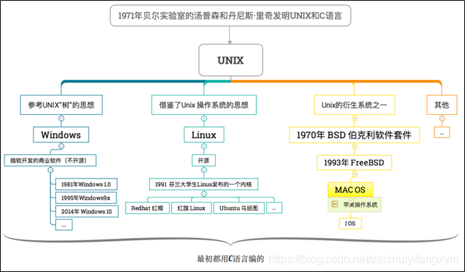
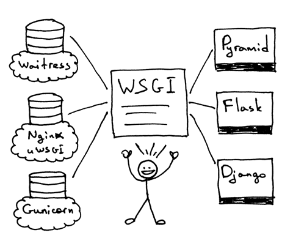

* <a href="#操作系统的关系">操作系统的关系</a>
* <a href="#WSGI">WSGI</a>
* <a href="#配置服务器环境">配置服务器环境</a>
* <a href="#工作过程 & 服务端配置 & 相关代码">工作过程 & 服务端配置 & 相关代码</a>
* 使用项目 [https://gitee.com/LongPF/myflask](https://gitee.com/LongPF/myflask)


<a id="操作系统的关系"></a>
## 操作系统的关系



centeros 也是linux的发行版之一

<a id="WSGI"></a>
## WSGI

### 什么是 Web 服务器

它是一个位于物理服务器上的网络服务器（服务器上的服务器?!），它等待客户端发送请求。当它收到一个请求后，会生成响应并将其发送回客户端

### 什么是wsgi

`Python Web Server Gateway Interface`, 允许开发者自由选择 Web 框架和 Web 服务器。现在你可以任意混搭不同的 Web 服务器和 Web 框架，并选择一个你需要的合适的组合。 比如，你可以用Gunicorn或Nginx/uWSGI或Waitress运行Django,Flask,或Pyramid

你能够在你的 Web 服务器上运行多个 Web 框架，并且不需要修改 Web 服务器或 Web 框架的现有的代码

Interface接口



WSGI ：它允许你混搭你的 Web 服务器和 Web 框架。 WSGI 规定了 Python Web 服务器和 Python Web 框架之间的一些接口。

它的工作原理是这样的：

1. 框架提供了一个 application 可调用对象（WSGI 规范没有规定它应该如何被实现）
2. 每当收到来自 HTTP 客户端的请求的时候，服务器就调用这个 application 可调用对象。 它把一个包含 WSGI/CGI 变量的字典 environ 和一个 start_response 可调用对象作为参数传递给了 application 可调用对象。
3. 框架/应用生成一个 HTTP 状态信息和 HTTP 响应头信息，并把它们传递给了 start_response 可调用对象， 让服务器把它们存起来。框架/应用也返回了一个响应 body 信息。
4. 服务器把状态信息，响应头信息以及响应 body 信息合并为一个 HTTP 响应，然后把它传输给客户端（这一步不是规范的一部分， 但是它是流程中的下一个逻辑步骤，为了清晰可见我把它列在了这里

Web 框架（Pyramid, Flask, Django, 或其他的 Python WSGI 框架）

**如果实现并发访问的?**

> 利用fork,一个子进程处理请求,
> 利用子进程结束的信号,处理收尾工作

* Unix 下写一个并发服务器的最简单的方法是使用 fork() 系统调用
调用了一次 fork 但是它返回了两次：一次在父进程，一次在子进程
fork 一个新的子进程时，子进程获得了一份父进程的文件描述符的拷贝
* 当你的服务器创建一个子进程的时候，子进程获得了父进程的文件描述符拷贝，内核将这些描述符的引用计数也相应的增加了。 在有一个父进程和一个子进程的情况下，关联者客户端 socket 的描述符引用计数就会是 2，
* 当一个子进程退出的时候，内核发送了一个 SIGCHLD 信号。 父进程可以设置一个用于异步接收 SIGCHLD 事件的信号处理器，并且这个处理可以 wait 子进程以便收集它的终止状态，这样就可以阻止僵尸进程的发生了
* 当子进程退出并导致SIGCHLD事件时，父进程在accept调用中被阻塞，SIGCHLD事件又激活了信号处理程序，并且当信号处理程序完成accept系统调用时被中断,你要做到的就是重新开始 accept 系统调用

**参考阅读:** [https://www.biaodianfu.com/python-build-web-server.html](https://www.biaodianfu.com/python-build-web-server.html)

<a id="配置服务器环境"></a>
## 配置服务器环境

服务器一般是centerOS 系统

**安装pyenv管理python环境**

> [http://www.imooc.com/wiki/nginxlesson/nginxpython.html](http://www.imooc.com/wiki/nginxlesson/nginxpython.html)
> 


```
$ yum install git
$ git clone https://github.com/pyenv/pyenv.git ~/.pyenv
# 安装 pyenv-virtualenv
$ git clone https://github.com/pyenv/pyenv-virtualenv.git $(pyenv root)/plugins/pyenv-virtualenv
$ cat ~/.bashrc

# 在~/.bashrc最后加上如下3行
export PATH="~/.pyenv/bin:$PATH"
eval "$(pyenv init -)"
eval "$(pyenv virtualenv-init -)"

# 使配置生效
$ source ~/.bashrc

# 查看pyenv的版本
$ pyenv version

# 查看 pyenv 已经托管了哪些 python 版本
$ pyenv versions

# 安装某个版本的python
$ pyenv install <version>

 # 安装python 3.9.10版本
 $ pyenv install 3.9.10
 # 建立一个虚拟环境，python版本选择3.9.10
 $ pyenv virtualenv 3.9.10 env-3.9.10
 # 激活该虚拟环境
 $ pyenv activate env-3.9.10
 # 查看该环境下python版本
 $ python
```

如果环境 没变过来还是2.几 那么需要在zprofile中添加`"$(pyenv init --path)"` 
参考: [https://stackoverflow.com/questions/69388462/pyenv-virtualenv-python-version-does-not-change-on-env-activation](https://stackoverflow.com/questions/69388462/pyenv-virtualenv-python-version-does-not-change-on-env-activation) 

**遇到的错误**

* 报错 SQLite 3.9.0 or later is required [https://blog.csdn.net/weixin_50467592/article/details/120273460](https://blog.csdn.net/weixin_50467592/article/details/120273460)
* 在centos下启动nginx出现Failed to start nginx.service:unit not found [https://blog.csdn.net/a18827547638/article/details/101362702](https://blog.csdn.net/a18827547638/article/details/101362702)	

**nginx安装** 

```
# 下载nginx安装包
$ wget http://nginx.org/download/nginx-1.17.6.tar.gz  
# 解压安装包
$ tar -xzf nginx-1.17.6.tar.gz

#安装依赖
$ sudo yum install -y zlib zlib-devel
$ sudo yum install -y pcre pcre-devel
$ sudo yum install -y openssl openssl-devel

$ cd nginx-1.17.6

# 编译 检查依赖
$ ./configure  --prefix=/root/nginx          \
--with-http_ssl_module                       \
--with-http_stub_status_module               \
--with-http_gzip_static_module               \
--with-stream                                \
--with-http_realip_module                    \
--with-http_flv_module                       \
--with-http_random_index_module              \
--with-mail                                  \
--with-pcre                                  \

#安装
$ make && sudo make install
```

**nginx相关操作**

```
sudo service nginx reload 
sudo service nginx start	
sudo service nginx stop
pkill -f nginx -9   沙雕进程
```

参考连接: [http://www.imooc.com/wiki/nginxlesson/centosinstall.html](http://www.imooc.com/wiki/nginxlesson/centosinstall.html)


**安装uwsgi和flask**

```
pyenv activate env-3.9.10 
pip install uwsgi -i https://pypi.tuna.tsinghua.edu.cn/simple
pip install flask -i https://pypi.tuna.tsinghua.edu.cn/simple
```

<a id="工作过程 & 服务端配置 & 相关代码"></a>
## 工作过程 & 服务端配置 & 相关代码

过程是 网络中的浏览器 访问到 nginx ,nginx转发到uwsgi服务,uwsgi启动web框架app(flask)


**编写入口文件**

manager.py

```py
# manager.py

from ast import And
from flask import Flask, jsonify
from requests import Response
import sql
import json


app = Flask(__name__)

@app.route("/")
def hello():
    return "Hello longpf"

@app.route("/deviceId=<string:deviceId>")
def search(deviceId):
    succ,levels,lastCommit = sql.search(deviceId=deviceId)
    res = ""
    error = 0
    if succ:
        res += "查找到了deviceId为%s的用户" % deviceId
    else:
        res += "未查找到了deviceId为%s的用户" % deviceId
        error = 1 
    if levels != None:
        res += ", 最高到达%d关卡" % levels
    if lastCommit != None:
        res += ", 最后提交的时间为 %d" % lastCommit
    t = {
        'error':error,
        'msg': res
    }
    return jsonify(t)

@app.route("/update/<string:deviceId>/<int:levels>")
def update(deviceId,levels):
    res = sql.update(deviceId=deviceId,levels=levels)
    t = {}
    if res:
        t = {
            'error':0,
            'msg': '设置成功'
        }
    else:
        t = {
            'error': 1,
            'msg':'更新失败'
        }
    return jsonify(t)

@app.route("/longpf")
def moco():
    return "Hello longpf123"

@app.route("/id=<int:id>")
def api(id):
    reqeust_id = int(id)
    res = "hello world"
    return res
	

if __name__ == "__main__":
    app.run(host='0.0.0.0', port=6000)
    # app.run(port=50001)
```

**同目录下配置uwsgi**

uwsgi.ini

```
[uwsgi]
# uwsgi 启动时所使用的地址与端口,也可以使用.sock文件的方式
socket = :6000
# 指向网站目录
chdir = /root/longpf/myflask
# python 启动程序文件
wsgi-file = manage.py
#module=manage:app
# python 程序内用以启动的 application 变量名
callable = app
# 处理器数
processes = 1
# 线程数
threads = 1
#项目flask日志文件
logto = /root/longpf/myflask/log.log
#pythonpath = /root/.pyenv/shims/
pidfile = ./uwsgi.pid
```

**配置nginx  坑点**

* /usr/local/中有一个nginx       /root/中有一个nginx   
* 修改配置是/usr/local中的
* 环境变量是 /root/nginx/sbin/nginx 
* 要保证uwsgi服务开启用ps指令查看
* 每次修改要 nginx reload
* 修改后先验证 nginx 
* nginx -t 验证语法
* nginx -s reload 验证服务
* 最后的nginx配置

```
…
    server {
        listen       80;
        server_name  49.233.46.38;

        charset      utf-8; 

        #access_log  logs/host.access.log  main;

        location / {
           # root   html;
           # index  index.html index.htm;
		include  uwsgi_params;
		uwsgi_pass  localhost:6000;
		#uwsgi_param UWSGI_SCRIPT manage:app;
		#uwsgi_param UWSGI_PYHOME /root/.pyenv/shims;
		#uwsgi_param UWSGI_CHDIR /root/longpf/myflask;
        }
…
```

## 相关自动部署

我是用git, 本地测试完成后,git推到远程, 服务器拉取代码,自动重启服务, 服务器用的脚本

autoreload.sh

```shell
cd longpf/myflask
echo '####拉取代码####'
git pull
#echo '####重新激活python3 环境####'
pyenv deactivate
pyenv activate env-3.9.10
echo '####重启uwsgi服务####'
pkill -f uwsgi -9
uwsgi -d --ini uwsgi.ini
ps -ef | grep uwsgi
echo '####重启nginx####'
sudo service nginx reload
echo '####完成####'
```

