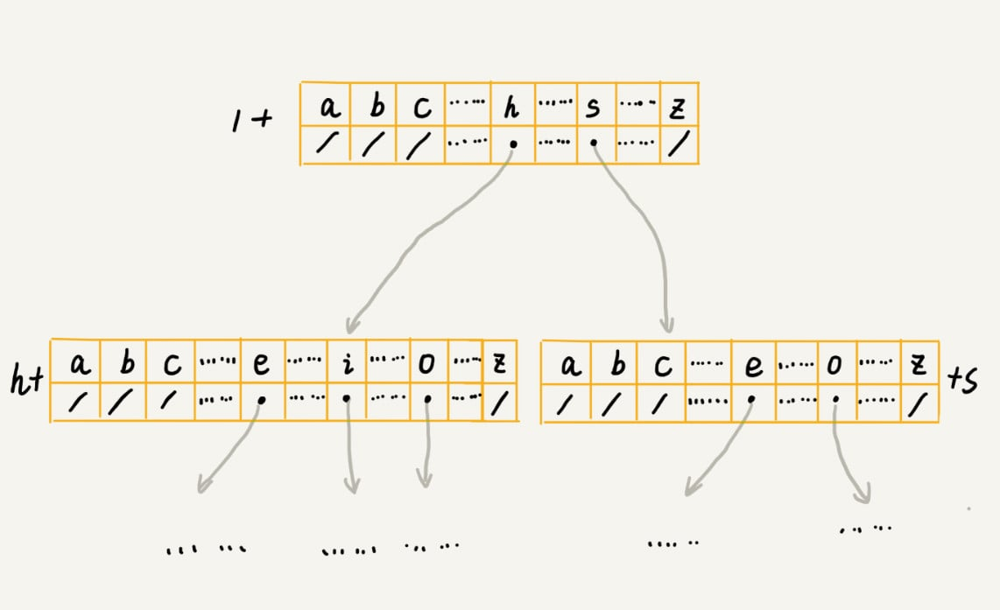

<script type="text/javascript" src="http://cdn.mathjax.org/mathjax/latest/MathJax.js?config=default"></script>


* <a href="#05 数组 栈空间代码问题">05 数组 栈空间代码问题</a>
* <a href="#06 链表,LRU">06 链表,LRU</a>
* <a href="#08 栈">08 栈</a>
* <a href="#09 队列">09 队列</a>
* <a href="#10 递归">10 递归</a>
* <a href="#冒泡">冒泡</a>
* <a href="#插入">插入</a>
* <a href="#选择排序">选择排序</a>
* <a href="#希尔排序">希尔排序</a>
* <a href="#为什么选择插入排序而不是冒泡">为什么选择插入排序而不是冒泡</a>
* <a href="#归并">归并</a>
* <a href="#快排">快排</a>
* <a href="#桶排序">桶排序</a>
* <a href="#计数排序">计数排序</a>
* <a href="#基数排序">基数排序</a>
* <a href="#二分查找">二分查找</a>
* <a href="#17 跳表 为什么redis用跳表实现有序集合">17 跳表 为什么redis用跳表实现有序集合</a>
* <a href="#18&19 散列表">18&19 散列表</a>
* <a href="#20 为什么散列表和链表经常一起使用">20 为什么散列表和链表经常一起使用</a>
* <a href="#哈希算法">哈希算法</a>
* <a href="#23 二叉树基础 什么样的二叉树适合用数组来存储">23 二叉树基础 什么样的二叉树适合用数组来存储</a>
* <a href="#24 二叉树基础 有了如此高效的散列表,为什么还需要二叉树">24 二叉树基础 有了如此高效的散列表,为什么还需要二叉树</a>
* <a href="#25 红黑树(上) 为什么工程中都用红黑树这种二叉树">25 红黑树(上) 为什么工程中都用红黑树这种二叉树</a>
* <a href="#26 红黑树(下)">26 红黑树(下)</a>
* <a href="#28 堆和堆排序 为什么说堆排序没有快速排序快">28 堆和堆排序 为什么说堆排序没有快速排序快</a>
* <a href="#29 堆的应用 TOP 10 搜索关键词">29 堆的应用 TOP 10 搜索关键词</a>
* <a href="#30 图的表示 微博,微信等社交网络中好友关系">30 图的表示 微博,微信等社交网络中好友关系</a>
* <a href="#31 深度和广度优先搜索">31 深度和广度优先搜索</a>
* <a href="#32 字符串匹配基础(上)">32 字符串匹配基础(上) 借助哈希表实现高效匹配</a>
* <a href="#33 字符串匹配基础(中) 如果实现文本编辑器中的查找">33 字符串匹配基础(中) 如果实现文本编辑器中的查找</a>
* <a href="#35 Trie树 搜索引擎搜索关键词提示功能">35 Trie树 搜索引擎搜索关键词提示功能</a>
* <a href="#36 ? | AC自动机：如何用多模式串匹配实现敏感词过滤功能">36 ? | AC自动机：如何用多模式串匹配实现敏感词过滤功能</a>
* <a href="#37 | 贪心算法：如何用贪心算法实现Huffman压缩编码？">37 | 贪心算法：如何用贪心算法实现Huffman压缩编码？</a>
* <a href="#38 | 分治算法：谈一谈大规模计算框架MapReduce中的分治思想">38 | 分治算法：谈一谈大规模计算框架MapReduce中的分治思想</a>
* <a href="#39 | 回溯算法：从电影《蝴蝶效应》中学习回溯算法的核心思想">39 | 回溯算法：从电影《蝴蝶效应》中学习回溯算法的核心思想</a>
* <a href="#40 | 初识动态规划：如何巧妙解决“双十一”购物时的凑单问题？">40 | 初识动态规划：如何巧妙解决“双十一”购物时的凑单问题？</a>
* <a href="#41 | 动态规划理论：一篇文章带你彻底搞懂最优子结构、无后效性和重复子问题">41 | 动态规划理论：一篇文章带你彻底搞懂最优子结构、无后效性和重复子问题</a>
* <a href="#42 | 动态规划实战：如何实现搜索引擎中的拼写纠错功能？">42 | 动态规划实战：如何实现搜索引擎中的拼写纠错功能？</a>
* <a href="#43 | 拓扑排序：如何确定代码源文件的编译依赖关系？">43 | 拓扑排序：如何确定代码源文件的编译依赖关系？</a>
* <a href="#44 | 最短路径：地图软件是如何计算出最优出行路径的？">44 | 最短路径：地图软件是如何计算出最优出行路径的？</a>
* <a href="#45 | 位图：如何实现网页爬虫中的URL去重功能？">45 | 位图：如何实现网页爬虫中的URL去重功能？</a>


<a id="05 数组 栈空间代码问题"></a>

### 05 数组 栈空间代码问题

```cpp
int main(int argc, char* argv[]){
    int i = 0;
    int arr[3] = {0};
    for(; i<=3; i++){
        arr[i] = 0;
        printf("hello world\n");
    }
    return 0;
}

上面代码无限打印hello world. 
当i=3,a[i]地址就是i的地址.
因为i,arr是main函数的栈空间分配的.
从高到低是i,a[2],a[1],a[0] 所以访问a[i]的地址就是i的地址.
```

<a id="06 链表,LRU"></a>

### 06 链表,LRU

* 时间复杂度
	* 链表: 插入,删除O(1)  随机访问O(n)
	* 数组: 输入,删除O(n)  随机访问O(1)
* 数组优点: 简单易用,空间连续,访问高效
* 数组缺点: 大小固定,一经声明占用连续内存空间.内存不足是需要扩容,要将原来的数据拷贝到新的数组,非常耗时
* 链表和数组相比,更适合插入,删除频繁的场景.


<a id="08 栈"></a>

### 08 栈 

* 浏览器前进,后退   (两个栈)
* 表达式的求值  (数值栈+符号栈)
* 括号的匹配
* 为什么用栈来保存临时变量
	* 不一定非要用栈,只不过函数调用符合后进先出的特性
	* 从调用函数进入被调函数,对于数据变化的是作用域,只要能保证每进入一个新的函数都是一个新的作用域就可以.进入被调函数是,分配一段栈空间,函数结束后,栈顶复位,正好回到调用函数的作用域内.

<a id="09 队列"></a>

### 09 队列

* 先进先出.数组实现的为顺序队列,链表实现的是链式队列,还有循环队列
* 数组实现的队列,会有数据搬移的操作
* 循环队列实现重点: 队列为空和队列满了.需要浪费一个数据位,否则队空和队满都是head==tail

	```cpp
	class CircularQueue
	{
		private:
		string *items;
		int n = 0;
		int head = 0;
		int tail = 0;
		public:
		CircularQueue(int capacity){
			items = new string[capacity]{};
			n = capacity;
		};
		bool enqueue(string item){
			if ((tail+1) % n == head) return false;
			items[tail] = item;
			tail = (tail+1) % n;
			return true;
		}
		string dequeue(){
			if (head == tail) return NULL;
			string ret = items[head];
			head = (head + 1) % n;
			return ret; 
		}
		~CircularQueue(){
			if (items != NULL){
				delete[] items;
			}
		};
	};
	```
	
* java中 cas(Compare and Swap即比较并替换)无锁同步.ios中dispatch_once也用到这种cpu级别的无锁同步技术

<a id="10 递归"></a>

### 10 递归

* 递归需要满足的三个条件
	* 一个问题的解可以分解为几个子问题的解
	* 这个问题与子问题除了数据规模不同,求解思路完全一样
	* 存在递归终止条件
* 如何写递归代码
	* 找到如何将大问题分解为小问题的规律,并写出递推公式类似`f(n)=f(n-1)+f(n-2)`
	* 找到终止条件
	* 将公式和终止条件翻译成代码
* 要注意栈溢出
* 要注意重复计算,比如上面的公式f(3)可能被重复计算,可用散列表保存
* 笼统的讲,递归都可以写成迭代循环的方式.但是写成for或while栈空间过大问题还存在
* 避免出现环A-B-C-A
* 递归的调试
	* 打印日志发现,递归值
	* 结合条件断点进行调试
	

<a id="冒泡"></a>

### 冒泡

* 原地排序(空间复杂对为O(1)),稳定排序(相同的不会改变前后顺序)
* 最好O(n),最坏O\\((n^2)\\)
* 有序度:用有序对的个数来标示. 逆序度=满有序度-有序度.
* 一个排好的数组是满有序度,有序对个数为\\(C_n^2\\)=n*(n-1)/2
* 取中间的逆序对个数为n*(n-1)/4,则需要这么多次比较,平均复杂度为O\\((n^2)\\)


	```cpp
	void bubbleSort(int a[],int n){
		if (n<=1) return;
		for (int i = 0; i < n; ++i){
			// 提前退出的标志
			bool flag = false;
			for (int j = 0;j < n - i - i; ++j){
				// 交换
				if (a[j] > a[j+1]){ 
					int tmp = a[j];
					a[j] = a[j+1];
					a[j+1] = tmp;
					// 表示有数据的交换
					flag = true;
				}
			}
			// 如果没有数据交换说明对每个a[j+1]都大于a[j]
			if (!flag) break;
		}
	}	
	```
	
<a id="插入"></a>
	
	
### 插入

* 原地排序,稳定排序
* 最好O(n),在有序数组中,最坏O\\((n^2)\\)在倒叙中
* 平均复杂度是O\\((n^2)\\),因为插入一个数据的平均复杂度为O(n)

	```cpp
	void insertionSort(int a[],int n){
		if (n <= 1) return;
		
		for(int i = 1; i < n;i++){
			int value = a[i];
			int j = i - 1;
			for (;j>=0;j--){
				if (a[j] > value){
					// 数据移动
					a[j+1] = a[j];
				}else{
					break;
				}
			}
			a[j+1] = value;
		}
	}
	```
	
	
<a id="选择排序"></a>
	
### 选择排序

* 有点类似插入排序,区分已排序区间和未排序区间.
* 每次从未排序区间找到最小元素与已排序后面的第一个元素交换,这样就不是稳定的排序
* 找最小元素就对未排序元素的一次遍历
* 原地排序,最好,最坏,平均复杂度都为O\\((n^2)\\)


<a id="希尔排序"></a>

### 希尔排序

对插入排序的分区域优化

[https://zh.wikipedia.org/wiki/希尔排序](https://zh.wikipedia.org/wiki/希尔排序)


<a id="为什么选择插入排序而不是冒泡"></a>

### 为什么选择插入排序而不是冒泡

* 两个算法的复杂度都是O\\((n^2)\\)
* 不管怎么优化,冒泡交换次数都是一个固定值逆序度.
* 插入也一样移动次数也为逆序度
* 但交换操作比移动操作复杂.交换需要三个赋值操作,移动只需要一个

<a id="归并"></a>

### 归并

* 空间复杂度为O(n),稳定排序.
* 最好,最坏,平均时间复杂度都是O(nlogn)

	```
	T(1) = C； n=1 时，只需要常量级的执行时间，...
	T(n) = 2*T(n/2) + n； n>1
	
	T(n) = 2*T(n/2) + n
     = 2*(2*T(n/4) + n/2) + n = 4*T(n/4) + 2*n
     = 4*(2*T(n/8) + n/4) + 2*n = 8*T(n/8) + 3*n
     = 8*(2*T(n/16) + n/8) + 3*n = 16*T(n/16) + 4*n
     ......
     = 2^k * T(n/2^k) + k * n
     ......

	得到T(n) = 2^kT(n/2^k)+kn.当 T(n/2^k)=T(1) 时，
	也就是 n/2^k=1，我们得到k=log2n.将k代入的到T(n)=Cn+nlog2n.
	用大 O 标记法来表示的话，T(n) 就等于 O(nlogn)
	```
	
<a id="快排"></a>

### 快排

* 快排和归并都要到了分治
	* 归并是由下到上,先处理子问题,然后在合并
	* 快排相反,先分区
* 空间复杂度为O(1),非稳定
* 时间大部分情况下为O(nlogn),只有在极端情况下为O\\((n^2)\\),分区不均匀的情况下
* 为什么快排比归并运用的广泛,归并空间复杂度O(n),n很大时候,消耗空间大,快排为原地排序,即使在极端下会为O\\((n^2)\\),但可通过选择合理的分区点避免,比如三点取中.


<a id="桶排序"></a>

### 桶排序

* 不是基于比较的,只分桶,桶之间有顺序
* 为什么时间复杂度是O(n)?

	```
	将n个数据放到m个桶中,每个桶中有k=n/m个元素
	每个桶中使用快排,为O(k*logk)
	m个桶就是O(m*k*logk)
	k = n/m,m接近n时,log(n/m)是一个非常小的常量.
	这时桶排序的时间复杂度接近O(n)
	```
* 桶排序要求的条件非常苛刻.
	* 数据需要很容易划分成m个桶
	* 桶与桶之前有天然的大小顺序
	* 各桶之间分布均匀

* 桶排序比较适合用在外部排序中,就是存储在外部磁盘中,数据比较大
	* 10GB订单排序
	* 100万用户按年龄排序,可以分成120个桶


<a id="计数排序"></a>
	
### 计数排序

* 可以认为是桶排序的一种,当桶的范围并不大时,可以考虑,O(n)
* 对50万考生按分数排序,总分900分,就可以分成901个桶
* 排序的只能是非负整数排序,如果是其他类型要转成非负整数
	* 小数点后一位,乘以10变成整数
	* [-1000,1000],每个数加上1000

	```cpp
	// 桶排序,计数排序
	// a 是数组，n 是数组大小。假设数组中存储的都是非负整数
	void countingSort(int a[],int n){
		if (n<=1) return ;
		    
		// 查找数组中数据的范围
		int max = a[0];
		for (int i = 1; i < n; i++) {
		    if (max < a[i]){
		        max = a[i];
		    }
		}
		    
		// 申请一个计数数组c,下标大小[0,max]
		int *c = new int[max+1]{};
		    
		// 计算每个元素的个数,放入c中
		for (int i=0; i<n; i++) {
		    c[a[i]] ++;
		}
		    
		// 依次累加
		for (int i = 1; i <= max; i++) {
		    c[i] = c[i-1]+c[i];
		}
		    
		//临时数组r,存储排序之后的结果
		int *r = new int[n]{};
		// 计算排序的关键步骤
		for (int i = n-1; i>=0; i--) {
		    int index = c[a[i]] - 1;
		    r[index] = a[i];
		    c[a[i]]--;
		}
		    
		// 将结果拷贝给a数组
		for (int i=0; i<n; i++) {
		    a[i] = r[i];
		}
		    
		// 收尾工作
		delete [] r;
		delete [] c;
	}
	```
	
<a id="基数排序"></a>
	
	
### 基数排序

* 基数排序对数据有要求的
	* 可以分割出独立的'位'来比较,
	* 而且位之间又递进的关系,如果a数据的高位比b数据大,那剩下的位就不用比较了.
	* 每一位的数据范围不能太大,要可以用线性排序法来排序,否在基数排序无法做到O(n)
* 10万个手机号排序,可以低位到高位进行11次通排序
* 牛津字典单词排序
	
<a id="二分查找"></a>


### 二分查找

* O(logn)的查找速度 很快,
	
	```
	被查找的区间大小为 n, n/2, n/4, n/8 ..., n/2^k
	等比数列,其中n/2^k=1,k的值就是总共缩小的次数,
	经过k次的缩小区间
	所以复杂度为O(k), n/2^k=1,k = log2n
	所以复杂度为O(logn)
	```
	
* mid = (low+high) /2 如果low和high比较大,为防止溢出可写成mid =low + (high-low)/2
* 必须是数组才能用二分,链表的话没有索引,需要遍历
* 数据量小不适合不如直接遍历来的快,数据量过大也不行,因为为数组需要在内存中有连续的大内存
* 12万ip查找归属地,可以用最后一个小于等于给定值的元素的变种

	```cpp
	// 标准
	int bsearch(int a[],int n,int value){
		int low = 0;
		int high = n-1;
		while(low<=high){
			int mid = (low+high)/2;
			if (a[mid]==value){
				return mid;
			}else if (a[mid]<value){
				low = mid + 1;
			}else {
				high = mid -1;
			}
		}
		return -1;
	}
	
	// 下面是二分法 变种
	
	// 查找第一个等于给定值的元素
	int bsearch(int[] a, int n, int value) {
	  int low = 0;
	  int high = n - 1;
	  while (low <= high) {
	    int mid =  low + ((high - low) >> 1);
	    if (a[mid] > value) {
	      high = mid - 1;
	    } else if (a[mid] < value) {
	      low = mid + 1;
	    } else {
	      if ((mid == 0) || (a[mid - 1] != value)) return mid;
	      else high = mid - 1;
	    }
	  }
	  return -1;
	}
	// 最后一个等于给定值的元素
	int bsearch(int[] a, int n, int value) {
	  int low = 0;
	  int high = n - 1;
	  while (low <= high) {
	    int mid =  low + ((high - low) >> 1);
	    if (a[mid] > value) {
	      high = mid - 1;
	    } else if (a[mid] < value) {
	      low = mid + 1;
	    } else {
	      if ((mid == n - 1) || (a[mid + 1] != value)) return mid;
	      else low = mid + 1;
	    }
	  }
	  return -1;
	}
	// 第一个大于等于给定值的元素
	int bsearch(int[] a, int n, int value) {
	  int low = 0;
	  int high = n - 1;
	  while (low <= high) {
	    int mid =  low + ((high - low) >> 1);
	    if (a[mid] >= value) {
	      if ((mid == 0) || (a[mid - 1] < value)) return mid;
	      else high = mid - 1;
	    } else {
	      low = mid + 1;
	    }
	  }
	  return -1;
	}
	// 最后一个小于等于给定值的元素
	int bsearch7(int[] a, int n, int value) {
	  int low = 0;
	  int high = n - 1;
	  while (low <= high) {
	    int mid =  low + ((high - low) >> 1);
	    if (a[mid] > value) {
	      high = mid - 1;
	    } else {
	      if ((mid == n - 1) || (a[mid + 1] > value)) return mid;
	      else low = mid + 1;
	    }
	  }
	  return -1;
	}
	```
	
<a id="17 跳表 为什么redis用跳表实现有序集合"></a>
	
### 17 跳表 为什么redis用跳表实现有序集合

* 单纯的链表不支持二分法,改造后的数据结构跳表可实现类似二分法
* 动态数据结构,快速的插入,删除,查找,写起来不复杂.甚至可以替代红黑树
* 为链表加多级索引的结构就是跳表.多级,比如原始元素为n个,没2个去一个索引,则一级索引就有n/2个索引,二级就有4/n个索引,...一直到最上层的索引为2个
* 查找速度为O(logn)

	```
	假设每两个取一个索引
	一级索引为n/2,二级索引为n/4,三级为n/8
	k级索引为n/2^k
	假设有h级的所有,最高级为2个结点.则 n/(2^h) = 2,h = log2n-1
	如果包含原始链表这一层,整个跳表的高度为log2n层
	如果每一层遍历m个结点,那么查询的复杂度就为O(m*logn)
	m在这里,每一层最多为3
	```
	
* 空间问题 O(n),实际开发中,结点存的大多为对象,索引为指针,所以索引的空间基本可以忽略

	```
	如果每两个结点取一个索引的话
	n/2+n/4+n/8+..+8+4+2=n-2,等比数列
	
	如果每两个结点取一个索引的话
	n/3+n/9+n/27+...+9+3+1 = n/2
	```
	
* 插入的为O(logn).先找到O(long),在插入O(1)
* 删除也是O(logn),需要先找到前驱结点,如果索引中有要删除的结点,该索引也要被删除
* 跳表索引动态更新,通过随机函数来维护索引与原始链表大小之间的平衡.比如插入数据6的结点,随机到的数位k=2,那从第一级索引到第二级索引都要加上6这个结点的索引

<a id="18&19 散列表"></a>

### 18&19 散列表

* 对数组的扩展
* 散列冲突解决	
	* 开放寻址法
		* 线性探测,如果被占用就探测下一个,到了数组末尾的话就跳到第一个位置探测
		* 二次探测,第一次为hash(key)+0,第二次为hash(key)+1,第三次为hash(key)+2^2..
		* 双重散列,采用一组散列函数,如果hash1(key)得到的位置被占用则使用hash2(key)..
		* 装载因子 = 填入表中的个数/散列表的长度
		* 删除数据时,需要标记该位置是删除状态,而不是空的状态
	* 链表法
		* 存储大对象,大对象下链表的指针消耗可忽略
* 如何选择解决冲突的方法
	* 开发寻址法: 当数据量比较小,装载因子小,Java 中的ThreadLocalMap
	* 链表法: 存储大对象,大数据量的散列表,更灵活,更多的优化策略,比如将链表替换为红黑树,跳表等
* word中的单词检查,将20万个常用单词读入内存,假设每个单词的平均长度为10,那么平均一个单词为10字节,20万个单词为20M.当输入单词后去表中查找,找到就为正确
* 10万条URL访问日志,按照访问次数排序
	* 1. 遍历存入散列表,key为URL,value为次数
	* 2. 对次数进行排序,次数不大的话用桶排序,大的话用快排
* 两个字符串数组,每个数组大约有10万个字符串,找出相同字符串
	* 1. 将数组1中的字符串全部放入散列表,key为字符串,value为次数
	* 2. 遍历数组2,将每个字符串从散列表中查找,如果字符串对应的次数大于1,则为重复的字符串
* 动态扩容: 一般当装载因子大于一个阈值时,需扩容,一般扩展为原来的2倍.原散列表的内容需要复制到新的散列表中.
	* 为了避免类似1GB的大数据量复制.一般分批复制
	* 每插入一次复制原散列表中的一条数据
	* 查找时候先查找新散列表中,如果没有查找原散列表中
* 工业级的散列表
	* 1. 如果涉及散列函数. 应做到尽量的均匀
	* 2. 如何根据装载因子动态扩容.
	* 3. 冲突解决办法

<a id="20 为什么散列表和链表经常一起使用"></a>

### 20 为什么散列表和链表经常一起使用

* LRU缓存淘汰算法
	* 散列表和双向链表共同协作
	* 散列表的数组中,每个元素为一个链表
	* 链表的每个结点由prev,next,data,hnext组成
		* prev是双向链表的前驱指针
		* next是双向链表的后继指针
		* data是结点的数据
		* hnext是散列表解决冲突中的拉链指针
	* 查找数据: 通过散列表近似O(1)的时间复杂度找到,找到到后还需要将它移动到双向链表的尾部.移动的时候,只是改变prev,next的指向,数据位置并没有改变
	* 删除一个数据: O(1)找到结点,根据prev找到前驱结点
	* 添加一个数据: 如果在散列表中存在,那么移动到链表尾部,并且替换数据.如果不存在的话,先看缓存满了吗,满了,就删除双向链表头部的结点,没满的话就放到双向链表的尾部
* java中的LinkedHashMap也是这种的实现方式.linked指的是双向链表
* YYCache中的YYMemoryCache(内存缓存)用到LRU,结合散列表和双向链表的数据结构


<a id="哈希算法"></a>

### 哈希算法

* 哈希算法: 将任意长度的二进制串映射为固定长度的二进制串.
	* 从哈希值不能反向推到出原始数据
	* 即使原始数据变化1bit,哈希值也大不相同
	* 散列冲突很小,哈希值相同的概率非常小
	* 哈希算法尽量高效.
* 应用: 
	* 安全加密,密码加密,MD5,SHA
	* 唯一标识,以前百度云的秒传,
	* 数据校验, BT下载,基于P2P协议,一个电影被分成很多块从不同的寄主下载,下载后比较是否被篡改
	* 散列函数,应尽量保持均匀和高效
* 2011年CSDN脱库,导致600万注册邮箱和明文密码泄露.密码应用SHA加密(MD5号称已被破解),再使用一个盐(salt)跟用户密码组合在一起.
* 区块链: 区块链是一块块区块组成的,每个区块由区块头和区块体组成.
	* 区块头中保存着自己的区块体和上一个区块头的哈希值
	* 这种链式关系和哈希值的唯一性,只要区块链上任意一个区块被修改过,后面区块保存的哈希值就不对了
	* 区块链用的SHA256哈希算法,计算非常耗时,篡改一个,就必须重新计算该区块后面的所有区块的哈希值,短时间内几乎不可能做到

#### 其他应用

* 负载均衡,将用户的请求尽可能均匀分配到不同的缓存服务器
	* 常见的负载均衡算法有很多,比如轮询,加权轮询,随机
	* 如何实现一个粘滞的负载均衡算法,同一个会话中的所有请求路由到同一个服务器上?
		* 最直接的维护会话id或者ip和服务器的表
		* 但是客户端可能很多,映射表可能很大
		* 客户端的上下线,服务器的扩容,缩容会导致映射失效,维护成本大
		* 可以借助哈希算法,将会话id货值ip的哈希值,对服务器列表取余,得到的就是对应的服务器编号
* 数据分片: 1T的日志文件,统计搜索关键词出现的次数
	* 需要多个机器
	* 遍历,每个关键词取哈希值后,再对机器数量取模得到的值就是改关键词该被分配的机器
	* 这样同一个词就会被分配到同一个机器上
	* 每个机器会分别计算关键词的次数
	* 这也是mapReduce的基本设计思想
* 海量的图片分片也可以参考上面的分片
* 分布式存储: 现在互联网的海量数据,海量用户.为了提高读取,写入能力,一般采用分布式的方式来存储数据,比如分布式缓存.海量数据的存储,要缓存在多个机器上.
	* 如果数据量增加,需要添加服务器缓存的话,按照上面的所讲,所有缓存服务器查找的取模计算就失效了,会直接去数据库查找,这样会压垮数据库
	* 这时候需要用到一致性哈希算法
	* 图解[https://segmentfault.com/a/1190000017847097](https://segmentfault.com/a/1190000017847097)

<a id="23 二叉树基础 什么样的二叉树适合用数组来存储"></a>

### 23 二叉树基础 什么样的二叉树适合用数组来存储

* 满二叉树: 叶子节点全都在底层,除了叶子节点之外,每个节点都有左右两个节点
* 完全二叉树: 叶子节点都在最底两层,最后一层的叶子节点都靠左排列,并且除了最后一层,其他层的节点个数都要达到最大
* 二叉树的储存:
	* 基于指针或者引用的二叉链式存储法
	
		
	* 基于数组的顺序存储法,我们把根节点储存在下标i=1的位置,那左子结点存储在下标`2*i=2`的位置,右子节点存储在`2*i+1=3`的位置.依次类推.反过来`i/2`的位置就是父节点.不过要浪费一个1位置的空间,对于完全二叉树,如下面
	
		
	* 非完全二叉树要浪费更多的空间

				
		
* 前,中,后序遍历,见之前的[atoffer](https://github.com/longpf/AtOffer#二叉树的前中后序遍历)
* 给定一组数据比如1,3,5,6,9,10,可以构建多少种二叉树?
	
	```
	n!种
	
	```

<a id="24 二叉树基础 有了如此高效的散列表,为什么还需要二叉树"></a>

### 24 二叉树基础 有了如此高效的散列表,为什么还需要二叉树

#### 二叉查找树

* 树中任意一个节点,其左子树中的每个节点的值,都要小于这个节点的值,而右子树的值都大于这个节点的值
* 插入,删除,查找跟数的高度正比
* 为什么还要用二叉查找树?
	* 散列表中的数据都是无序存储的,如果要输出有序的数据,需要先进行排序,而对于二叉查找树来说,我们只需要中序遍历,就可以在O(n)的时间复杂度内输出
	* 散列表扩容耗时很多,而且遇到散列冲突时,性能不稳定,在常用的平衡二叉查找树的性能可以稳定在O(logn)
	* 尽管散列表的查找操作时间复杂度是常量级,但是哈希冲突的存在,这个常量不一定比logn小
	* 散列表相对复杂,要考虑设计,冲突解决,扩容等.平衡二叉树只需要考虑平衡,而且这个问题的解决方案比较成熟
	* 因为装载因子不能太大,尤其开放寻址法,所以要浪费更多的空间

	
<a id="25 红黑树(上) 为什么工程中都用红黑树这种二叉树"></a>
	
### 25 红黑树(上) 为什么工程中都用红黑树这种二叉树

* 平衡二叉树: 严格的定义是这样的,二叉树中任意一个结点的左右字数的高度相差不能大于1.完全二叉树,满二叉树都是平衡二叉树
* AVL数满足严格的平衡二叉树
* 平衡二叉查找树中的'平衡'的意思,其实是让整棵树左右看起来比较对称,比较平衡,不要出现左子树很高,右子树很矮的情况,这样就能保证整棵树相对低,插入,删除,查找等操作的效率高一些
* 红黑树: 不是一种严格的平衡二叉查找树
	* 根结点是黑色的
	* 每个叶子节点都是黑色的空结点(NIL),也就是说叶子节点不储存数据,主要为了简化红黑树的代码实现
	* 任何相邻结点都不能同时为红色,也就是说红色结点被黑色结点隔开
	* 每个节点,从该节点到达其可达叶子节点的所有路径,都包含相同数目的黑色结点
* 红黑树的高度简单说明,可以去掉红色结点,黑色结点的高度小于log2n,所以原红黑树的高度小于2log2n,所以插入,删除,查找都是O(logn)
* 为什么用红黑树?近似平衡,解决普通二叉查找树在数据更新的过程中,复杂度退化的问题.复杂度都是O(n),但是实现比较复杂,可以考虑用跳表替代他

<a id="26 红黑树(下)"></a>

### 26 红黑树(下) 
* 红黑树在插入删除的时候会打破定义的第三第四条定义
* 左旋和右旋
	
	
	
* 具体操作要看原文[https://time.geekbang.org/column/article/68976#previewimg](https://time.geekbang.org/column/article/68976#previewimg)

<a id="28 堆和堆排序 为什么说堆排序没有快速排序快"></a>

### 28 堆和堆排序 为什么说堆排序没有快速排序快

* 完全二叉树从n/2+1开始都是叶子节点
* 堆排序分为建堆和排序,建堆为O(n),排序为O(nlogn)所以总的时间为O(nlogn)
* 与快排比较:
	* 快排的数据交换次数不会比逆序度多,堆排建堆的过程会先打乱原有的有序度

```cpp
// 大顶堆
class Heap{
	int *a; // 数组,从下标1开始处处数据
	int n; 	// 堆可以存储的最大个数
	int count; // 堆中已经存储的数据个数
public:
	Heap(int capacity){
		a = new int[capacity+1];
		n = capacity;
		count = 0;
	}

	void insert(int data){
		if (count >= n) return;
		++count;
		a[count] = data;
		int i = count;
		// 自下往上堆化
		while (i/2 > 0 && a[i] > a[i/2]){
			swap(a[i],a[i/2]);
			i = i/2;
		}
	}
	// 自上往下堆化
	void heapify(int a[],int n,int i){
		while(1){
			int maxPos = i;
			if (i*2<=n && a[i]<a[i*2]) maxPos = i*2;
			if (i*2+1 <= n && a[maxPos] < a[i*2+1]) maxPos = i*2+1;
			if (maxPos==i)  break;
			swap(a[i],a[maxPos]);
			i = maxPos;
		}
	}

	int removeMax(){
		if (count ==0) return -1;
		return a[1];
		a[1] = a[count];
		--count;
		heapify(a,count,1);
	}

	void buildHeap(int a[],int n){
		for (int i=n/2;i>=1;--i){
			heapify(a,n,i);
		}
	}

	void sort(int a[],int n){
		buildHeap(a,n);
		int k = n;
		while (k>1){
			swap(a[1],a[k]);
			--k;
			heapify(a,k,1);
		}
	}
};
```

<a id="29 堆的应用 TOP 10 搜索关键词"></a>


### 29 堆的应用 TOP 10 搜索关键词

* 优先级队列

	* 100个小文件合并成一个有序大文件,可用100个小顶堆,每次取堆顶比较后选最小的插入到大文件
	
* 利用堆求top k. [https://github.com/longpf/AtOffer#29-最小的k个数](https://github.com/longpf/AtOffer#29-最小的k个数)
* 利用一个大顶堆,一个小顶堆求中位数 [https://github.com/longpf/AtOffer#63-数据流中的中位数](https://github.com/longpf/AtOffer#63-数据流中的中位数)
* 10亿搜索关键词查找top 10热词.
	* 单词一次性读不下,可分成10个文件,或同时用10台机器
	* 先遍历一次,对单词进行哈希算法后对10取余得到就得到该单词分配到的文件
	* 每个文件分别用散列表存储单词和单词次数
	* 找出每个文件的top 10
	* 再对最后的100个单词求top 10

<a id="30 图的表示 微博,微信等社交网络中好友关系"></a>

### 30 图的表示 微博,微信等社交网络中好友关系

* 图中的元素叫顶点. 连接定点的叫边.边的个数叫度
* 入度: 表示有多少条边指向这个顶点
* 出度: 表示有多少条边表示有多少条边由该顶点指向别的顶点
* 亲密度可用带权图表示,边上有权重数字
* 存储方法: 邻接矩阵

	

	* 无向图: 顶点i,j有边的话,就将A[i][j]和A[j][i]标记为1
	* 有向图: 有一条顶点i指向顶点j的边,将A[i][j]标记为1
	* 带权图: 不是标记为1而是标记为权重值
	* 缺点: 浪费空间
	* 优点: 获取顶点间的关系比较高效.一些图的运算可以转换成矩阵的运算
* 邻接表: 

	

	* 有向图: 数组中元素是一个该顶点指向的顶点
	* 无向图: 与该定点相连的顶点
	* 链表部分可优化为红黑树,跳表,散列表来优化查找边的速度
* 表示粉丝或关注可用一个邻接表和一个逆邻接表
* 海量数据需多个机器存储.

	


<a id="31 深度和广度优先搜索"></a>

### 31 深度和广度优先搜索

* 广度优先搜索(BFS)

	
	
	* 地毯式层层推进搜索策略,先查找离起点最近的,然后次近的.

* 深度优先搜索 (DFS)

	
	
	* 走迷宫, 如下图,走到结点4走不通的话,回退到结点5.回溯思想

	
	```cpp
	// 无向图
	class Graph{
	private:
	    int v; // 顶点个数
	    vector<list<int>> adj{}; // 邻接表
	public:
	    
	    Graph(int k){
	        v = k;
	    }
	    void addEdge(int s,int t){
	        adj[s].push_back(t);
	        adj[t].push_back(s);
	    }
	    
	    void bfs(int s,int t){
	        if (s==t) return;
	        bool *visited = new bool[v]{0};
	        visited[s] = true;
	        queue<int> q{};
	        q.push(s);
	        int *prev = new int[v];
	        for (int i = 0;i < v;i++){
	            prev[i] = -1;
	        }
	        while (q.size() != 0) {
	            int w = q.front();
	            list<int> wl = adj[w];
	            auto iter = wl.begin();
	            while (iter != adj[w].end()) {
	                int wlv = *iter;
	                if (!visited[wlv]){
	                    prev[wlv] = w;
	                    if (wlv == t){
	                        print(prev, s, t);
	                        return;
	                    }
	                    visited[wlv] = true;
	                    q.push(wlv);
	                }
	            }
	            q.pop();
	        }
	    }
	    
	    void print(int prev[],int s,int t){
	        if (prev[t] != -1 && t != s){
	            print(prev, s, prev[t]);
	        }
	        cout << t << " ";
	    }
	    
	    bool found = false;
	    
	    void dfs(int s,int t){
	        found = false;
	        bool *visited = new bool[v]{};
	        int *prev = new int[v]{};
	        for (int i = 0; i < v; i++) {
	            prev[i] = -1;
	        }
	        recurDfs(s, t, visited, prev);
	        print(prev, s, t);
	    }
	    
	    void recurDfs(int w,int t,bool visited[],int prev[]){
	        if (found == true) return;
	        visited[w] = true;
	        if (w == t){
	            found = true;
	            return;
	        }
	        list<int> wl = adj[w];
	        auto iter = wl.begin();
	        while (iter != wl.end()) {
	            int wlv = *iter;
	            if (!visited[wlv]){
	                prev[wlv] = w;
	                recurDfs(wlv, t, visited, prev);
	            }
	        }
	    }
	};
	```
	

<a id="32 字符串匹配基础(上)"></a>
	
### 32 字符串匹配基础(上) 借助哈希表实现高效匹配

* BF(Brute Force)玻璃匹配法,从A长度为n中匹配B长度为m

	* 用有n-m+1个子串,时间复杂度为O(mn)

* PK算法,借助哈希算法对BF的优化
	* 对每一个子串计算哈希值与模式串的哈希值比较
	* 比如a~z的26字母,哈希算法可优化为26进制算法
	* 相邻的两个子串的哈希值在计算上有关联

	
<a id="33 字符串匹配基础(中) 如果实现文本编辑器中的查找"></a>
	
### 33 字符串匹配基础(中) 如果实现文本编辑器中的查找


* BM算法,复杂,匹配效率高,是KMP的3-4倍
* 利用模式串本身的特点,在模式串中某个字符与主串不匹配的时候,将模式串往后多欢动几位.(模式串从后往前比较)
* 坏字符串原则和好后缀原则.
* 好字符串原则可以独立使用.坏字符串原则比较耗内存


<a id="35 Trie树 搜索引擎搜索关键词提示功能"></a>

### 35 Trie树 搜索引擎搜索关键词提示功能
	
* root不储存字符,是一棵多叉树
	
	
	
* 实现一棵Trie树,假设字符为从a-z.


	

	
	```cpp
	struct TrieNode{
	char data;
	TrieNode *children;
	bool isEndingChar = false;
	TrieNode(char c){
	    if (c){
	        this->data = c;
	        this->children = new TrieNode[26]{};
	    }else{
	        // 没有数据的结点,children不必初始化
	        this->data = NULL;
	        this->children = NULL;
	    }
	}
	TrieNode(){
	    this->data = NULL;
	    this->children = NULL;
	}
	};
	
	class Trie {
	private:
	TrieNode *root = new TrieNode('/');
	public:
	void insert(const char *text){
	    TrieNode *p = root;
	    size_t length = strlen(text);
	    for (int i = 0; i < length; i++) {
	        int index = text[i]-'a';
	        if (!p->children[index].data) {
	            TrieNode *newNode = new TrieNode(text[i]);
	            p->children[i] = *newNode;
	        }
	        p = &p->children[index];
	    }
	    p->isEndingChar = true;
	}
	    
	bool find(char *pattern){
	    TrieNode *p = root;
	    size_t length = strlen(pattern);
	    for (int i=0; i<length; i++) {
	        int index = pattern[i] - 'a';
	        if (!p->children[index].data){
	            return false;
	        }
	        p = &p->children[index];
	    }
	    if (p->isEndingChar) {
	        return true;
	    }else{
	        // 只是前缀 不是完全匹配
	        return false;
	    }
	}
	};
	```
	
* 构建一棵Trie树的复杂度为O(n),查找一个数据为O(k),k为字符串的长度
* Trie很消耗内存,每个结点要为持有26子结点,有可能26个子节点中只有3,4个结点被用到.所以在重复前缀不多的情况下, trie数会很消耗内存
* 可以考虑将每个结点数组换成其他数据结构,跳表,散列表,红黑树等.这样牺牲了查询效率,节省了空的子结点.
* trie树不适用于精确查找,比较适合是查找前缀的字符串
* 搜索引擎关键词提示
	
	

<a id="36 ? | AC自动机：如何用多模式串匹配实现敏感词过滤功能"></a>

### 36 ? | AC自动机：如何用多模式串匹配实现敏感词过滤功能

* 单模式串匹配算法是为了快速在主传中查找一个模式串.
* 多模式串匹配是为了快速在主传中查找多个模式串
* ac自动机是基于trie数的一种改进算法,它跟trie树的关系就像是kmp和bf算法的关心.kmp算法有一个next数组,类比到到ac自动机就是失败指针.

<a id="37 | 贪心算法：如何用贪心算法实现Huffman压缩编码？"></a>

### 37 | 贪心算法：如何用贪心算法实现Huffman压缩编码？

* 分糖果问题	
	* 孩子多,糖果少,孩子对糖果的需求量不同.期望更多孩子得到满足
	* 从剩下的孩子中,找到对糖果大小需求最小的,给他剩下糖果中能满足他的最小糖果

* 区间覆盖,选出不相交(两两不相交)区间个数最多
	* 选取的时候,要保证左端点与已经覆盖的区间不重合,又端点又尽量小
	* 这样保证剩下的去交尽量大,可以放置更多的区间

* 霍夫曼编码
	* 1000个字符每个字符1字节(8bits),存储的话需要8000bits
	* 如果1000个字符中只有a,b,c,d,e,f则可以用3bit来表示这6个字符,占用空间就变为3000bits
	* 对出现频次多的用短的编码表示,这样又可以节省空间
	
		
		
	* 如何得到这种编码?
		
		
	
		
		
* 非负整数a中,移除k个数字,得到的数最小
	* 从最高位开始,与右边较低以为比较,如果高位打,移除.如果低位大,向右移动一位,比较.循环移除k次
	* 4556847594546移除5位(k=5)-》455647594546-》45547594546-》4547594546-》4447594546-》444594546

* n个人等待被服务,每个人被服务的时间不同个,服务窗口只有一个,如何让总的等待时间最少
	* 从需要服务时间最少的人开始服务

	
<a id="38 | 分治算法：谈一谈大规模计算框架MapReduce中的分治思想"></a>	
	
### 38 | 分治算法：谈一谈大规模计算框架MapReduce中的分治思想

* 分治和递归有点像.分治算法是一种处理问题的思想,递归是一种编程技巧.分治一般比较适合用递归来实现
* 分治能解决的问题,一般需要满足下面的条件:
	 * 原问题与分解的小问题具有相同的模式
	 * 分解成的小问题可以独立求解.子问题之间没有相关性.这个是他与**动态规划**比较明显的区别
	 * 将子问题合并为原问题的时候不能太复杂
* 求数组的逆序对?[https://github.com/longpf/AtOffer#35-数组中的逆序对](https://github.com/longpf/AtOffer#35-数组中的逆序对)
* 10G订单排序? 先分区间,区间排序,合并.前面的线性排序算法有用到分治思想
* MapReduce其实是任务调度器,底层依赖GFS存储数据,依赖Borg管理及其.它从GFS中拿数据,交给Borg中的机器执行,并监控进度.一旦出现宕机,进度卡壳,则重新重Borg中调度一台执行
* 2维平面的n个点,求最近两个点. 将平面分解成两个平面.....
* 两个`n*n`的矩阵,求`C=A*B`,将A,B分解为子矩阵求矩阵乘积,其中的乘法次数和加法次数减少

<a id="39 | 回溯算法：从电影《蝴蝶效应》中学习回溯算法的核心思想"></a>

### 39 | 回溯算法：从电影《蝴蝶效应》中学习回溯算法的核心思想

* 回溯算法非常适合用递归来实现.实现过程中,剪枝操作是提高回溯的一种高效技巧
* 回溯有点类似枚举搜索,枚举所有的解,找到满足的解.
* 为了枚举所有可能的解,避免以后,我们把问题求解的过程分为多个阶段.每个阶段都会面对一个岔路口,我们先随意选一条路走,当发现这条路走不通的时候就回退到上一个岔路口,另选一种走法继续.
* 回溯算法经典案例:深度优先算法,八皇后,0-1背包,图的着色,数独,全排列,正则等
* [剑指offer的一道正则](https://github.com/longpf/AtOffer#52-正则表达式匹配)

	```cpp
	// 八皇后
	class Cal8queens{
	public:
	    // 下标表示行,值表示列
	    int *result = new int[8]{};
	    void cal8queens(int row){
	        if (row==8){ // 8行棋子都放好了
	            printQueens(result);
	            return;
	        }
	        for (int column=0; column<8; column++) {
	            if (isOk(row, column)){
	                result[row] = column;
	                cal8queens(row+1);
	            }
	        }
	    }
	
	    // 判断row,column放置是否合适
	    bool isOk(int row,int column){
	        int leftup = column-1,rightup = column+1;
	        // 逐行往上考察每一行
	        for (int i = row-1; i >= 0; i--) {
	            if (result[i]==column) return false; // 第i行的column有棋子
	            if (leftup >= 0){ // 考察左上对角线;第i行leftup有棋子吗
	                if (result[i]==leftup) return false;
	            }
	            if (rightup < 8){ // 考察右上对角线,第i行rightup列有棋子吗
	                if (result[i]==rightup) return false;
	            }
	            --leftup;++rightup;
	        }
	        return true;
	    }
	    
	    void printQueens(int result[]){ // 打印出一个二维矩阵
	        for (int row=0; row<8; row++) {
	            for (int column=0; column<8; column++) {
	                if (result[row]==column) cout << "Q ";
	                else cout << "* ";
	            }
	            cout << endl;
	        }
	        cout << endl;
	    }
	};
	```

	```cpp
	//0-1背包
	int maxW = INT_MIN; // 背包中物品总重量的最大值
	//cw 当前已经装进去的物品的重量和
	//i 表示考察到哪个物品
	//w 背包重量,items每个物品的重量,n物品的个数
	// 假设背包的可承重100,物品个数为10,物品重量存在数组a中那调用如下f(0,0,a,10,100);
	void f(int i,int cw,int items[],int n,int w){
	    if (cw==w||i==n){
	        if (cw>maxW) maxW = cw;
	        return;
	    }
	    f (i+1,cw,items,n,w); // 第i个不装
	    if (cw+items[i]<=w){
	        f(i+1,cw+items[i],items,n,w);
	    }
	}
	```
	
<a id="40 | 初识动态规划：如何巧妙解决“双十一”购物时的凑单问题？"></a>
	
### 40 | 初识动态规划：如何巧妙解决“双十一”购物时的凑单问题？

* 动态规划比较适合用来求解最优问题.比如求最大值,最小值,可以提高时间复杂度
* 0-1背包问题
	* 回溯法时间复杂度为O(2^n),动态规划为O(w*n),w为最大承重,n为物品数量
	
	* 假设有5个物品,最大承重为9

	
	
	```java
	weight: 物品重量，n: 物品个数，w: 背包可承载重量
	public int knapsack(int[] weight, int n, int w) {
	  boolean[][] states = new boolean[n][w+1]; // 默认值 false
	  states[0][0] = true;  // 第一行的数据要特殊处理，可以利用哨兵优化
	  if (weight[0] <= w) {
	    states[0][weight[0]] = true;
	  }
	  for (int i = 1; i < n; ++i) { // 动态规划状态转移
	    for (int j = 0; j <= w; ++j) {// 不把第 i 个物品放入背包
	      if (states[i-1][j] == true) states[i][j] = states[i-1][j];
	    }
	    for (int j = 0; j <= w-weight[i]; ++j) {// 把第 i 个物品放入背包
	      if (states[i-1][j]==true) states[i][j+weight[i]] = true;
	    }
	  }
	  for (int i = w; i >= 0; --i) { // 输出结果
	    if (states[n-1][i] == true) return i;
	  }
	  return 0;
	}	
	
	//优化空间复杂度的解法
	public static int knapsack2(int[] items, int n, int w) {
	  boolean[] states = new boolean[w+1]; // 默认值 false
	  states[0] = true;  // 第一行的数据要特殊处理，可以利用哨兵优化
	  if (items[0] <= w) {
	    states[items[0]] = true;
	  }
	  for (int i = 1; i < n; ++i) { // 动态规划
	    for (int j = w-items[i]; j >= 0; --j) {// 把第 i 个物品放入背包
	      if (states[j]==true) states[j+items[i]] = true;
	    }
	  }
	  for (int i = w; i >= 0; --i) { // 输出结果
	    if (states[i] == true) return i;
	  }
	  return 0;
	}
	```

* 0-1背包问题升级版,每个物品有不同的价值,求最大价值

	* 回溯法
	
	```java
	private int maxV = Integer.MIN_VALUE; // 结果放到 maxV 中
	private int[] items = {2，2，4，6，3};  // 物品的重量
	private int[] value = {3，4，8，9，6}; // 物品的价值
	private int n = 5; // 物品个数
	private int w = 9; // 背包承受的最大重量
	public void f(int i, int cw, int cv) { // 调用 f(0, 0, 0)
	  if (cw == w || i == n) { // cw==w 表示装满了，i==n 表示物品都考察完了
	    if (cv > maxV) maxV = cv;
	    return;
	  }
	  f(i+1, cw, cv); // 选择不装第 i 个物品
	  if (cw + weight[i] <= w) {
	    f(i+1,cw+weight[i], cv+value[i]); // 选择装第 i 个物品
	  }
	}
	```
	
	* 动态规划法

	```cpp
	int knapsack3(int weight[],int value[],const int n,const int w){
	    vector<vector<int>> states(n,vector<int>(w+1));
	    for (int i=0; i<n; i++) { // 初始化states
	        for (int j=0; j<w+1; j++) {
	            states[i][j] = -1;
	        }
	    }
	    states[0][0] = 0;
	    if (weight[0]<w) {
	        states[0][weight[0]] = value[0];
	    }
	    
	    for (int i=1; i<n; i++) {
	        for (int j=0; j<=w; j++) { // 不选中第i个物品,将上一层的数据挪到第i层
	            if (states[i-1][j]>=0) states[i][j] = states[i-1][j];
	        }
	        for (int j=0; j<=w-weight[i]; j++) { // 选择第i个物品
	            if (states[i-1][j] >= 0){
	                int v = states[i-1][j]+value[i];
	                if (v > states[i][j+weight[i]]) {
	                    states[i][j+weight[i]] = v;
	                }
	            }
	        }
	    }
	    // 找出最大值
	    int maxvalue = -1;
	    for (int j=0; j<=w; j++) {
	        if (states[n-1][j]>maxvalue) maxvalue = states[n-1][j];
	    }
	    return maxvalue;
	}
	```
	
* 双十一凑单问题,满200减50

	```cpp
	// items 商品价格，n 商品个数, w 表示满减条件，比如 200
	void double11advance(int items[], int n, int w) {
	    vector<vector<bool>> states(n,vector<bool>(3*w+1));// 超过3倍就没有薅羊毛的价值了
	    states[0][0] = true;
	    if (items[0]<=3*w) {
	        states[0][items[0]] = true;
	    }
	    for (int i=1; i<n; i++) { // 动态规划
	        for (int j=0; j<3*w; j++) { // 不购买第i个商品
	            if(states[i-1][j]==true) states[i][j] = true;
	        }
	        for (int j=0; j<=3*w-items[i]; j++) { // 购买第i个物品
	            if (states[i-1][j]==true) states[i][j+items[i]] = true;
	        }
	    }
	    int j;
	    for (j=w; j<3*w+1; j++) {
	        if (states[n-1][j]==true) break; // 输出大于等于w的最小值
	    }
	    if (j==3*w+1) return; // 没有可行解
	    for (int i=n-1; i>=1; i--) {
	        if (j-items[i]>=0&&states[i-1][j-items[i]]==true){
	            cout << items[i] << " ";//购买这个商品
	            j = j-items[i];
	        }
	    }
	    if (j!=0) cout << items[0];
	}
	```
	
<a id="41 | 动态规划理论：一篇文章带你彻底搞懂最优子结构、无后效性和重复子问题"></a>
	
### 41 | 动态规划理论：一篇文章带你彻底搞懂最优子结构、无后效性和重复子问题


* 什么样的问题适合用动态规划,可以概括为一个模型三个特征
	* 一个模型:多阶段决策最优解模型
	* 三个特征:

		* 最优子结构: 可以通过子问题的最优解推倒出问题的最优解
		* 无后效性: 子问题不受其他阶段的影响
		* 重复子问题

* 状态转移表法: 回溯算法实现-定义状态-画递归树-找重复子问题-画状态转移表-根据递推关系填表-填表过程翻译成代码
* 状态方程法: 找最优子结构-写状态转移方程-将状态转移方程翻译成代码


例题: 求起点到终点的最短路径


* 状态转移表法

第一步: 回溯法求解

```java
private int minDist = Integer.MAX_VALUE; // 全局变量或者成员变量
// 调用方式：minDistBacktracing(0, 0, 0, w, n);
public void minDistBT(int i, int j, int dist, int[][] w, int n) {
  // 到达了 n-1, n-1 这个位置了，这里看着有点奇怪哈，你自己举个例子看下
  if (i == n && j == n) {
    if (dist < minDist) minDist = dist;
    return;
  }
  if (i < n) { // 往下走，更新 i=i+1, j=j
    minDistBT(i + 1, j, dist+w[i][j], w, n);
  }
  if (j < n) { // 往右走，更新 i=i, j=j+1
    minDistBT(i, j+1, dist+w[i][j], w, n);
  }
}
```

第二步: 画递归树. (i,j,dist)


第三步: 填写状态转移表


第四步: 填表过程翻译成代码

```java
public int minDistDP(int[][] matrix, int n) {
  int[][] states = new int[n][n];
  int sum = 0;
  for (int j = 0; j < n; ++j) { // 初始化 states 的第一行数据
    sum += matrix[0][j];
    states[0][j] = sum;
  }
  sum = 0;
  for (int i = 0; i < n; ++i) { // 初始化 states 的第一列数据
    sum += matrix[i][0];
    states[i][0] = sum;
  }
  for (int i = 1; i < n; ++i) {
    for (int j = 1; j < n; ++j) {
      states[i][j] = 
            matrix[i][j] + Math.min(states[i][j-1], states[i-1][j]);
    }
  }
  return states[n-1][n-1];
}
```


* 状态转移方程法:

第一步: 找出递推公式

`min_dist(i, j) = w[i][j] + min(min_dist(i, j-1), min_dist(i-1, j))
`

第二步: 翻译成代码

```java
private int[][] matrix = 
         {{1，3，5，9}, {2，1，3，4}，{5，2，6，7}，{6，8，4，3}};
private int n = 4;
private int[][] mem = new int[4][4];
public int minDist(int i, int j) { // 调用 minDist(n-1, n-1);
  if (i == 0 && j == 0) return matrix[0][0];
  if (mem[i][j] > 0) return mem[i][j];
  int minLeft = Integer.MAX_VALUE;
  if (j-1 >= 0) {
    minLeft = minDist(i, j-1);
  }
  int minUp = Integer.MAX_VALUE;
  if (i-1 >= 0) {
    minUp = minDist(i-1, j);
  }
  
  int currMinDist = matrix[i][j] + Math.min(minLeft, minUp);
  mem[i][j] = currMinDist;
  return currMinDist;
}
```

<a id="42 | 动态规划实战：如何实现搜索引擎中的拼写纠错功能？"></a>

### 42 | 动态规划实战：如何实现搜索引擎中的拼写纠错功能？


纠错例题: [https://time.geekbang.org/column/article/75794](https://time.geekbang.org/column/article/75794)

* 求最常递增子序列. [2,9,3,6,5,1,7]他的最常递增子序列为[2,3,5,7]长度为4

```cpp
// 假设nums[i]位置的的递增序列长度为L[i],那L[i]={max(L[j]+1),当j<i,a[j]<a[i]}
void maxOrderSeq(vector<int> &nums){
    vector<int> maxLens(nums.size(),1);
    for (int i=1; i<nums.size(); i++) {
        for (int j=i-1; j>=0; j--) {
            if (nums[j] < nums[i] && maxLens[i]<maxLens[j]+1){
                maxLens[i]=maxLens[j]+1;
            }
        }
    }
    // print
    for (int i=0; i<maxLens.size(); i++) {
        cout << maxLens[i] << " " ;
    }
}
```

<a id="43 | 拓扑排序：如何确定代码源文件的编译依赖关系？"></a>

### 43 | 拓扑排序：如何确定代码源文件的编译依赖关系？

* 拓扑排序适用于有向无环图

```cpp
class Graph {
public:
    int v; // 顶点的个数
    vector<vector<int>> adj{}; //邻接表
    
    Graph(int k){
        v = k;
        for (int i=0; i<v; i++) {
            vector<int> l{};
            adj.push_back(l);
        }
    }
    
    void addEdge(int s,int t){ // s优先于t, 边s->t
        adj[s].push_back(t);
    }
    
    
    /**
     Kahn算法实际上用的是贪心思想,先找到一个入度为0的顶点,将其删除(将这个顶点可达的顶点的入度数减1.循环这个过程)
     */
    void topoSortByKahn(){
        int *inDegree = new int[v]{}; // 统计每个顶点的入度
        for (int i = 0; i < v; i++) {
            for (int j = 0; j < adj[i].size(); j++) {
                int w = adj[i][j]; // i->w
                inDegree[w]++;
            }
        }
        queue<int> queue;
        for (int i = 0; i < v; i++) {
            if (inDegree[i] == 0) queue.push(i);
        }
        while (!queue.empty()) {
            int i = queue.front();
            queue.pop();
            cout << i << ",";
            for (int j = 0; j < adj[i].size(); j++) {
                int k = adj[i][j];
                inDegree[k]--;
                if (inDegree[k]==0) queue.push(k);
            }
        }
    }
    
    void topoSortByDFS(){
        // 先构建逆邻接表,边 s->t表示,s依赖t,t优先于s
        vector<vector<int>> inverseAdj{};
        for (int i = 0; i < v; i++) {
            vector<int> l{};
            inverseAdj.push_back(l);
        }
        for (int i = 0; i < v; i++) { // 通过邻接表生成逆邻接表
            for (int j = 0; j < adj[i].size(); j++) {
                int w = adj[i][j]; // i->w
                inverseAdj[w].push_back(i); // w->i
            }
        }
        bool *visited = new bool[v]{};
        for (int i = 0; i < v; i++) {
            if (visited[i] == false) {
                visited[i] = true;
                dfs(i, inverseAdj, visited);
            }
        }
    }
    
    void dfs(int vertex,vector<vector<int>> inverseAdj,bool *visited){
        for (int i = 0; i < inverseAdj[vertex].size(); i++) {
            int w = inverseAdj[vertex][i];
            if (visited[w]== true) continue;
            visited[w] = true;
            dfs(w, inverseAdj, visited);
        } // 先把vertex这个顶点可达的所有顶点都打印出来之后,再打印自己
        cout << vertex << ",";
    }
};
```

<a id="44 | 最短路径：地图软件是如何计算出最优出行路径的？"></a>

### 44 | 最短路径：地图软件是如何计算出最优出行路径的？

* 数据结构是有向有权图,权重为每个顶点的路长
* 最短路径法,一个顶点到另一个顶点
* dijkstra算法

<a id="45 | 位图：如何实现网页爬虫中的URL去重功能？"></a>
	
### 45 | 位图：如何实现网页爬虫中的URL去重功能？

* 1千万个整数,整数范围在1到1亿之间.如果快速查找某个整数是否在这1千万个整数中?
	 * 用一个大小为1亿的数组,类型为bool类型.将这1千万个整数作为下标将对应的数组值设置成true.比如整数5对应的下标为5的值为ture.`array[5] = true`


```java
public class BitMap { // Java 中 char 类型占 16bit，也即是 2 个字节
  private char[] bytes;
  private int nbits;
  
  public BitMap(int nbits) {
    this.nbits = nbits;
    this.bytes = new char[nbits/16+1];
  }

  public void set(int k) {
    if (k > nbits) return;
    int byteIndex = k / 16;
    int bitIndex = k % 16;
    bytes[byteIndex] |= (1 << bitIndex);
  }

  public boolean get(int k) {
    if (k > nbits) return false;
    int byteIndex = k / 16;
    int bitIndex = k % 16;
    return (bytes[byteIndex] & (1 << bitIndex)) != 0;
  }
}
```

* 上面的问题,通过位图的话,则需要1亿个二进制位.大概12MB. 如果数字的范围是1到10亿呢. 那就需要120MB. 这就需要布隆过滤器了
* 布隆过滤器: 使用K个哈希函数,对同一个数字进行求哈希值,得到K个哈希值.将这K个数字作为位图的下标,将对应的K个位图的对应下标设置为true. 这样就用K个二进制位来标示一个数字的存在
* 查询某个数字存在的话, 需要查询这个K个哈希值对应的位置是否都为ture
* 上述的存在很小的误判率
