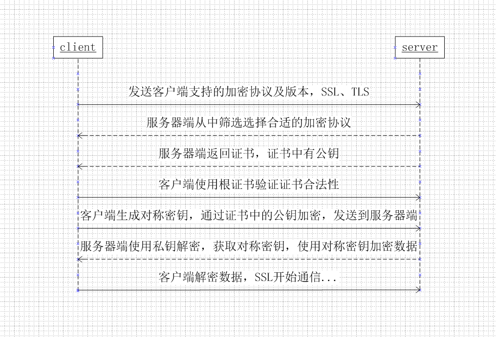
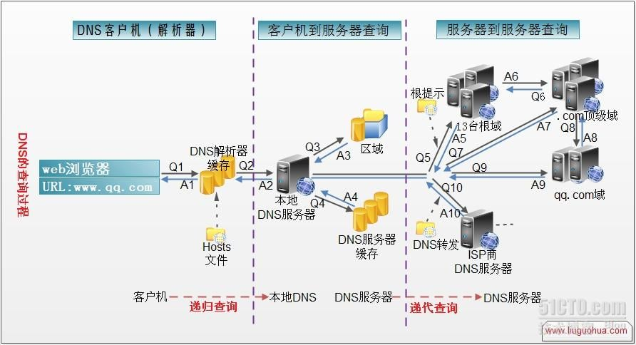
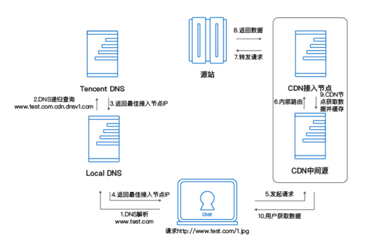
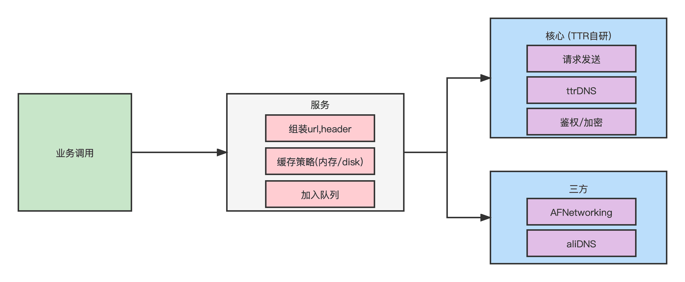
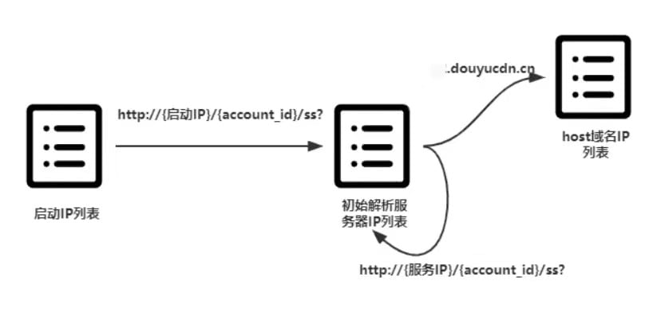
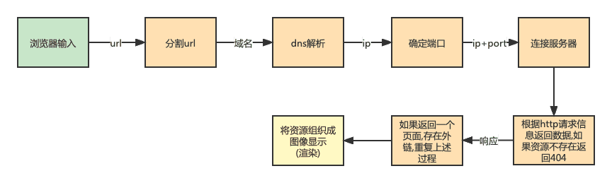

## 网络相关:

* 网络分层简述[https://zhangferry.com/2019/08/31/diagram_tcpip_concepts/#网络基础知识](https://zhangferry.com/2019/08/31/diagram_tcpip_concepts/#网络基础知识)
* <a href="#https相关">https相关</a>
* <a href="#dns解析过程">dns解析过程及相关问题</a>
* <a href="#CDN的基本工作过程">CDN的基本工作过程</a>
* <a href="#项目dy中的网络库">项目dy中的网络库</a>
* <a href="#aliHttpdns"> aliHttpdns </a>
* <a href="#dns优化/其他">dns优化/其他</a>
* <a href="#从输入url到页面返回都经历了什么">从输入url到页面返回都经历了什么</a>

### https

* 过程如下图

* 服务端的证书如何来的?
 
  * 服务端S向CA(证书机构)提交公钥,组织信息,域名等申请证书
  * CA通过线上/线下多种手段验证申请者提供信息的真实性,如果通过则向S签发认证文件-证书

* 证书: 包括申请者S公钥,S的组织信息,个人信息,CA信息,证书序列号等明文,同时包含一个签名
* 签名: 先对上面的明文信息使用散列函数得到摘要1,再用CA私钥对摘要1加密,密文就是签名
* 验证证书: 客户端对公开信息和公钥使用散列函数,得到摘要2,用CA的公钥解密签名,得到摘要1,对比摘要1和2

* 客户端如何拿到CA公钥?
	* 客户端一般会内置CA公钥,如果没有浏览则会弹出警告信息
	
* 客户端如何验证服务端S证书的合法性质
	* 对证书中的明文信息进行散列函数得到摘要2
	* 对证书中的签名使用CA公钥解密得到摘要1
	* 对比摘要1和摘要2,相同即S的公钥合法

* 抓包过程原理
	1. 连接抓包电脑ip
	2. 抓包工具充当CA
	3. 手机安装根证书,根证书里面包含CA的公钥
	4. 手机发起请求的时候,抓包工具相当于服务端s
	5. 抓包工具s与真正的服务端S通信是, 相当于客户端
	6. 抓包工具可能将手机传来的请求修改或者透传给服务端,相当于中间人攻击

* 都有哪些中间人攻击方式?
	* 以SSL剥离（SSLStrip）类型的中间人攻击为例。SSL剥离或SSL降级攻击是MiTM攻击的一种十分罕见的方式，但是也是最危险的一种。众所周知，SSL/TLS证书通过加密保护着我们的通讯安全。在SSL剥离攻击中，攻击者使SSL/TLS连接剥落，随之协议便从安全的HTTPS变成了不安全的HTTP
	* 伪造证书

### dns解析过程

* ip查询过程如下图:

	

1. 在浏览器输入www.qq.com域名的时候, 系统会先检查本地hosts文件是否有这个网址的映射关系,如果有,返回对应ip完成解析
2. 如果hosts文件没有,则查找dns解析器缓存,是否有网址映射关系,如果有,返回,结束
3. 如果没有,会找tcp/ip参数中设置的首选dns服务器,在这我们叫**本地dns服务器**,如果查询的域名包含在本地配置区域资源中,则返回给客户机,此解析具有权威性
4. 如果要查询的域名,不由本地dns服务器区域解析,但改服务器已缓存了此网址映射关系,则返回该ip,此解析不具有权威性
5. 如果缓存解析和本地dns服务器都失效,则根据本地dns服务器的设置(是否设置转发器)进行查询
	* 如果未用转发,本地dns就把请求发至13台根dns,,根dns服务器收到请求后会判断这个域名(.com)是谁来授权管理,并返回一个负责改顶级域名服务器的一个ip.本地dns服务器收到ip信息后,将会联系负责.com域的这台服务器.这台负责.com域的服务器收到请求后,如果自己无法解析,他会找一个管理.com域的下一级dns服务器地址(qq.com)给本地dns服务器.当本地服务器收这个地址后就会找qq.com域服务器.重复上面的动作,进行查询,知道找到www.qq.com
	* 如果用的是转发模式,此dns服务器就会把请求转发至上一级dns服务器,有上一级服务器进行解析.如果不能解析,或找根dns或把请求转至上上级.不管是否为转发模式,最后都把结果返回给本地dns,本地dns服务器再返回给客户机

**相关问题:**

* dns为啥不采用集中式设计方式,而是分布式集群?
	* 单点故障(嗝屁一个,全球着急) 
	* 通信容量(上亿台主机发送dns查询,http,电子邮件报文服务器,tcp长连接) 
	* 远距离时间延迟 
	* 维护成本大(所有映射都在一个服务点更新)

* 一个域名对应一个ip,一个ip可对应多个域名. 比如: 买一个服务器一个ip地址,可以建多个站点(多个域名)
* dns是应用层协议,client(一般指浏览器)构建dns查询请求,依次被传输层,网络层,数据链路层等封装传到dns服务器端
* dns主要基于udp(无连接)传输层协议.
	* 一次udp名字服务器交换可以短到两个包:一个查询宝,一个响应包,一次	* tcp交换至少要9个包:三次握手初始化会话,一个查询包,一个响应包及四次分手的包交换.
	* udp效率高,这也是只有13台根服务器的一个原因.只有在udp报文中表明有截断的时候才会使用tcp查询.
* 本地dns,可以提供上网效率20%提高左右,越是网络不好的环境越能体现本地dns的作用.还能保证上网过程平稳无故障.谷歌浏览器还采用预先进行dns查询来提高浏览器的性能.本地化dns后,所有浏览器都是平等的,都可以获得更快的网络浏览速度

### CDN的基本工作过程

CDN,内容分发简言之将静态资源文件缓存到用户最近的位置的服务器上,用户访问网络时,可以快速访问.解决跨运营商,跨地区,带宽小,ip路由转发,cpu负载小引起的响应慢的问题

* A记录和CNAME别名记录
	* A(Address)记录是用来指定主机名(或域名)对应的ip地址记录.用户可以将该域名下的网站服务器指向到自己的web server上,同时也可设置你域名的二级域名. 在dns解析时,告诉该域名对应的ip
	* NAME别名记录,将多个名字映射到一个域名.例如，有一台计算机名为`host.mydomain.com`（A记录）。它同时提供WWW和MAIL服务，为了便于用户访问服务。可以为该计算机设置两个别名（CNAME）：WWW和MAIL。这两个别名的全称就`http://www.mydomain.com/`和`mail.mydomain.com`。实际上他们都指向`host.mydomain.com`。

* cdn中实现原理:

	* 给源站域名添加CNMAE,别名为加速节点的域名。
	* 当用户向源站发起请求时，dns服务器解析源站域名时会发现有CNMAE记录
	* 这时dns服务器会向CNAME域名发起请求，请求会被调度至加速节点的域名

* cdn工作过程, 以腾讯云cdn为例,如下图

	假设业务源站域名为 `www.test.com` ，当域名接入 CDN 开始使用加速服务后，用户发起 HTTP 请求，实际的处理流程如图所示：

		
	
	* 用户向 www.test.com 下的某图片资源，如 1.jpg 发起请求，先要向 Local DNS 发起域名解析请求；
	* 当 Local DNS 解析 www.test.com 时，会发现已经配置了 CNAME
www.test.com.cdn.dnsv1.com，解析请求会发送至 Tencent DNS（GSLB全局负载均衡），GSLB 为腾
讯云自主研发的调度体系，会为请求分配最佳节点 IP；
	* Local DNS 获取 Tencent DNS 返回的解析 IP；
	* 用户测获取解析 IP；
	* 用户向获取的 IP 发起对资源 1.jpg 的访问请求；
	* 若该 IP 对应的节点缓存有 1.jpg，则会将数据直接返回给用户（10），此时请求结
束。若该节点未缓存 1.jpg，则节点会向业务源站发起对 1.jpg 的请求（6、7、8），
获取资源后，结合用户自定义配置的缓存策略（可参考用户指南中缓存时间设置章
节内容），将资源存储（9），并返回给用户（10），此时请求结束。

	

### 项目dy中的网络库

  	
  
* dy项目中网络库可分为调用层,服务层,核心/三方层
* 服务层提供拼装地址,header,加入队列等
* 核心层包括鉴权设置,数据加密等,c++实现,静态库内,不可见
* 底层网络请求发送分为自研的TTR(通天河)和AFNetworking,根据配置, 现在全走的自研
* DNS服务分为 : 自研TTRDNS 和 aliDNS. 根据配置用哪个,  现在全走的自研的DNS, ali的有崩溃

### aliHttpdns

 	
 
上图为httpdns获取初始解析服务器IP列表和解析域名IP列表的示意图.
 
 * 启动IP列表是硬编码到代码中, 
 * 应用启动时,根据启动列表中的任意一个IP连接阿里云服务器,得到初始解析服务器IP列表
 * 按序选择服务IP列表中的IP连接阿里服务器,获取应用域名的IP列表, 网络库(阿里的sdk)会记录使用情况,成功率高的优先使用
 * 同时每隔一段时间,会使用服务IP去更新服务IP
 * 当服务IP列表中的IP都不可用时,会重新使用启动IP,来获取服务IP

 

### dns优化/其他

**优化:**

* 先请求localDNS
* 对当前网络环境检查,是否支持ipv6,不支持则只请求ipv4的ip 提供成功率
* 预请求一些域名的ip
* 自研DNS服务/aliDNS

**其他:**

* 使用ali或者自研的DNS服务会更快
*  不使用的话会通过运营商的dns服务走全部的dns解析过程

### 从输入url到页面返回都经历了什么

* 大致流程如下图:

	
	
* 1 **把url分割成几个部分: 协议,网络地址,资源路径**.其中网络地址只是该链接网络上哪一台计算机,可以使域名或者ip地址,可以包括端口号;协议是从该计算机获取资源的方式,常见的HTTP,FTP,不同的协议有不同的通讯内容格式;资源路径指示从服务器上获取哪一项资源.
	* 例如: [http://www.guokr.com/question/554991/](http://www.guokr.com/question/554991/)
	* 协议部分 http
	* 网络地址 www.guokr.com
	* 资源路径 /question/554991/

* 2 如果地址不是一个ip地址,通过DNS(域名系统)将该地址解析成ip地址.ip地址对应着网络上一台计算机,DNS服务器本身也有IP,你的网络设置包含DNS服务器的ip.
	* 例如 www.guokr.com不是一个ip,向DNS询问请求www.guokr.com对应的ip: 111.13.57.142. dns过程可看上文

* 3 如果地址不包括端口号,根据协议的偶人端口号确定一个.端口号之于计算机就想窗口号之于银行.
	* 例如www.guokr.com不包括端口号,http协议默认端口号是80.如果输入的url是http://www.guokr.com:8080/那表示不适用默认的端口号,

* 4 向第2和第3步确定的ip和端口号发起网络连接
	* 列入向111.13.57.142的80端口发起连接

* 5 根据http协议要求,组织一个请求的数据包,包含大量请求信息.包括请求的资源路径,你的身份.
	* 例如: 用自然语言来表达这个数据包,大概就是:请求/question/554991/d我的身份是xxxxx
	
* 6 服务器响应请求.将数据返回给浏览器.数据可能是页面,页面的布局,文字,图片,脚本等.如果资源路径只是的资源不存在,服务器就会返回注明的404错误.
* 7 如果第6步返回的是一个页面,根据页面里的一些外链的URL,例如图片的地址,按照1~6再次获取.
* 8 根据资源的类型,将资源组织成屏幕上显示的图像.这个过程叫渲染.
* 9 将渲染好的页面图像显示出来,并开始响应用户的操作.

### HTTP1.0,1.1,2.0,3.0

> 参考阅读: [https://linxianqin.com/2021/06/11/http10112030#16-http-30](https://linxianqin.com/2021/06/11/http10112030#16-http-30)
> 	[https://juejin.cn/post/6987282696913289253](https://juejin.cn/post/6987282696913289253)

* TCP协议主要解决如何在IP层智商可靠的传递数据,保证发送端和接收端的所有包和顺序,TCP是可靠的,面向连接的
* HTTP是无状态的
	* cookie, 请求1的响应中set cookie,请求2的请求中传这个cookie
	* session, 服务端将sid通过cookie发给客户端,下次请求在cookie中携带这个sid,就能找到对应session
* 1.0的问题
	* 无重复复用,无连接的特性是的网络利用率低
	* 一个HTTP和它对应的一个TCP连接,TCP存在队头阻塞的问题，这是因为TCP在收到数据包时需要进行整合排序后再给上层使用（TCP传输的有序性），利用一个队列来维护这些数据包

* 1.1起,默认使用长连接,请求头中`Connection:keep-alive`,请求后连接不会立马断开,维持一段时间,仅限同一文件. 采用管道式请求,可以多发,但是必须有序,前一个没响应,后一个需等候

* 1.x的问题:
	* tcp的三次握手消耗时间
	* 对头阻塞
* 2.0的优势:
	* 采用二进制传输数据,将请求/响应分割成更小的帧,采用二进制编号
	* 链接共享,真并行. 一个tcp连接上可以完成所有通信,这个连接可以承载任意双向流量,可以乱序,根据流标识重装数据

* 3.0的优势:
	* 传输层基于UDP没有了三次握手
	* 加密验证的传输层